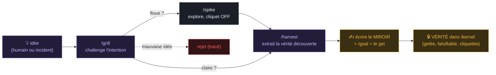
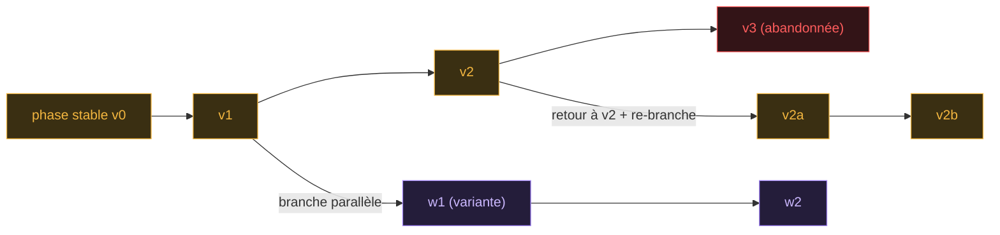

# KRD v9 — Le système d’exploitation de la vérité logicielle

## Kernel-Ratchet Development — Le référentiel intégral intégré : vérité typée, runtime, compiler, workbench et gouvernance

### Un primitif de développement logiciel à l'ère des agents IA, du problème jusqu'au bouton, de la déduction jusqu'à l'auto-évolution ancrée

---

> **Thèse centrale, en une phrase à graver.** On ne demande pas à un LLM de coder. On maintient un petit **noyau** de vérité comportementale exécutable, ancré par l'humain ; l'IA fait évoluer et refactore librement un **code** que le noyau *cliquette* — jamais de régression silencieuse du comportement, liberté totale sur la structure. Chaque vérité possède son **miroir** (sa preuve exécutable, typée par un langage de certification). Une seule vérité, son miroir, **N projections** vers le web, le mobile, l'API, la base — jusqu'au bouton et à son action. Et au-dessus de tout, **tout évolue sauf la définition du vrai** : le système s'auto-améliore, s'auto-évalue, s'auto-évolue, *ancré* parce que le juge — le miroir + la réalité — est hors de portée de l'IA. **Aucune boucle n'édite sa propre fitness.**

> **Ce qu'est ce document.** Le tome maître. Il consolide *intégralement* les versions v1 à v6 et toute la matière de conception (le débat SDD/DDD, le harness engineering, le benchmark des langages, les workflows, les généralisations), sans rien synthétiser ni perdre. Chaque concept est rangé à sa place. Par construction KRD, ce document est lui-même une **source faible** — un guide feedforward, pas le système. La seule vraie validation reste le plus petit cliquet qui clique pour de vrai.

---

### Le langage de couleur (porteur de sens, constant dans tout le tome)

- 🟨 **OR — le noyau / la source** : la vérité figée, exécutable, humaine. Ce qui doit être vrai.
- 🟦 **TURQUOISE — le code / la projection** : la structure libre, dérivée, jetable, IA. Comment c'est fait.
- 🟥 **ROUGE — le cliquet / le mur / la régression** : la frontière, l'enforcement, la vague de rouge.
- 🟩 **VERT — prouvé / réconcilié / le miroir vivant** : ce qui passe, la preuve qui tient.
- 🟪 **VIOLET — l'évolution** : la recherche ouverte, les variantes, l'archive, le self-play, l'auto-modification.

---

## Carte du tome — v9 intégré

**LIVRE I — Le problème & la lignée.** Pourquoi vibe, SDD et l'escalier échouent ; le débat *facts not specs* ; le harness engineering ; le recadrage en cliquet comportemental.

**LIVRE II — Les trois primitifs.** Noyau, cliquet, mur. La liberté asymétrique. Le mur comme frontière unique à trois visages.

**LIVRE III — La notion de comportement.** Le comportement comme espace contraint. Fixture = point, invariant = région. Les trois opérations (ajout / raffinement / override) et leur classification par replay. La version comme licence de changer. Dérive, n'écris pas.

**LIVRE IV — Les couches de preuve (N0-N5).** La table complète. La ligne de flottaison. Métier vs Fonctionnel. Hexagonal (port avant, adaptateur après). Le tracer bullet. Sensors computational vs inferential.

**LIVRE V — Le méta-modèle de couches.** N0-N5 comme profil. L'enregistrement `Layer`. Source vs Projection. La verticale jusqu'au bouton et son action. Les DSL (control / action / operation / policy / expr). Le registre. Ajouter une couche.

**LIVRE VI — Le plan bicaméral (le miroir).** Pourquoi une couche miroir et pas un attribut. `mirrors`, le sixième lien. La loi de complétude. La ligne de flottaison du miroir. Le reflet un-vers-plusieurs. L'enregistrement `Mirror`. Le bouton sur ses deux plans.

**LIVRE VII — Le langage de certification (le bench).** Pragmatique / formel. La règle de promotion. Le benchmark détaillé par niveau (toutes les tables scorées). La table des vainqueurs. Détail par outil.

**LIVRE VIII — Le versioning & la propagation.** Versioning permanent + mutabilité. Les six types de liens. La vague de rouge. Phase stable = coupe cohérente. Les deux axes (vertical / temporel) et le ChangeSet.

**LIVRE IX — L'échelle (la récursion).** Fédération de bounded contexts. Pensée architecturale vs implémentation. Les deux cliquets. Ashby, topologies, harness templates. Composition fractale stratifiée. Legacy (strangler fig). Changement transverse.

**LIVRE X — La boucle externe & les généralisations.** Le noyau peut avoir tort. Déduction / induction. Les trois généralisations. Les sept manques et leurs solutions méta.

**LIVRE XI — Le goal & le workflow.** Le test rouge EST le goal. `/goal` comme commande réelle et sa condition d'arrêt non-gameable. Les deux test-first. Le workflow complet (phase noyau / phase code). L'exemple déroulé. La règle unique.

**LIVRE XII — Le système vivant (l'auto-évolution).** La carte des concepts (DGM, AlphaEvolve, ADAS, MAP-Elites, novelty, POET, self-play, stigmergie, mémoire). Les quatre boucles vivantes sur le checkout. Le miroir = ancre de fitness. L'archive qui apprend. L'incident qui devient miroir. La méta qui ajoute un sensor.

**LIVRE XIII — La pile méta-méta (les 4 niveaux).** Objet / vérité / méta / méta-méta. Le méta-méta isolé. La gouvernance de la boucle méta. L'auto-référence qui se referme.

**LIVRE XIV — L'opérationnel.** Skills, hooks, tools, stack, harnais. Le `hooks.yaml`. L'arborescence complète.

**LIVRE XV — KRD ↔ DTFS.** DTFS comme implémentation de référence. La table de correspondance. La table de réconciliation du vocabulaire. Où KRD resserre DTFS.

**LIVRE XVI — Garde-fous, rigueur & la vérité brutale.** Les cinq garde-fous mécaniques. Rigueur graduée T0/T1/T2. Le rôle de l'humain. KRD vs les autres approches. La vérité brutale (bourse, Goodhart, les quatre ancres). Les risques résiduels.

**LIVRE XVII — Exemples d'implémentation.** Le slice *checkout* filé de bout en bout : tous les artefacts, du registre au bouton web et mobile.

**LIVRE XVIII — Exemples d'application.** Quatre applications complètes montées en KRD : SaaS multi-tenant, e-commerce web+mobile, pipeline de trading ancré, back-office interne.


**LIVRE XIX — La vérité compositionnelle.** La vérité est récursive : chaque couche agrège ses enfants et ajoute sa vérité émergente. `composes`, agrégat du miroir, drill-down/fall-back, propagation pondérée.

**LIVRE XX — L'idée.** L'étage d'entrée au-dessus de `product` : une idée est un candidat-vérité, promu par son miroir (= `/goal`). Deux sources : humain et réalité.

**LIVRE XXI — Le DAG de versions = l'archive.** L'espace des versions est un DAG, pas une ligne. Branches, retour, re-branche, merge sémantique, archive quality-diversity.

**LIVRE XXII — Bicéphale, pas bicaméral.** Un corps (la vérité), deux têtes (intention + preuve). Le monstre est l'échec : spec sans miroir ou miroir orphelin.

**LIVRE XXIII — Carte d'intégration & records consolidés.** Les sept liens, les records `Layer`, `Mirror`, `Idea`, `VersionSpace`, et la méta-leçon : aucun primitif neuf.

**LIVRE XXIV — Le cerveau contextuel.** Obsidian, second brain, mémoire partagée, MCP resources, CLAUDE.md/AGENTS.md : ce qui devient mémoire, ce qui reste contexte, ce qui peut devenir vérité.

**LIVRE XXV — Le compilateur de contexte.** ContextGraph, ContextPack, ContextRouter : comment l'agent reçoit juste le contexte nécessaire, branch-aware, bounded-context-aware, goal-aware.

**LIVRE XXVI — La formule unificatrice.** La réconciliation : générativité probabiliste (LLM/évolution) + certification déterministe (miroir/cliquet). Le pont entre le flou vivant et le stable prouvé.

**LIVRE XXVII — L'outil capable de tout.** Architecture produit complète : `/ideas`, `/kernel`, `/mirror`, `/src`, `/brain`, `/archive`, skills, hooks, tools, CI agentique, mémoire, évolution, multi-cibles.

**LIVRE XXVIII — Audit de complétude & verrouillage v8.1.** Vérification conceptuelle de la v8 contre le Tome source, matrice de couverture, miroir documentaire, règles anti-oubli.

**LIVRE XXX — Fractal Kernel Engineering (FKE).** La discipline universelle dont KRD est l'instance (FKE ⊃ KRD ⊃ AIDOS) : l'anatomie SYMÉTRIQUE du kernel (10 slots, 4 familles de paires-miroir autour du mur — le mur comme plan de symétrie et frontière de langue), les 25 lois, le Vibe Lab et le Promotion Gate, les 7 niveaux de vérité (stockés + miroir de parité), les 3 cerveaux (la conscience = agrégateur déterministe), les 5 facettes du mur, E0-E7 (migration expand-contract depuis N0-N5), les agents paramétrés A0-A8, le kernel effondré (incompressible = s1 + paire de preuve), la matrice universelle. Grillé et acté le 2026-06-07 (ADR 0044) ; les deltas code = piste FK01-FK10 post-S117.

**Glossaire intégral · Références & lignée.**

**Nouveauté v9 — intégrée dans les livres existants.** Le Tome ne reçoit pas une annexe : les notions `TruthKind`, `VerifiabilityLevel`, `AuthorityGraph`, `TruthScope`, `MemoryFirewall`, `KRDCompiler`, `SemanticDiff`, `TruthLifecycle`, `DataTruthScope`, `EvolutionSandbox`, `ArchiveCurationPolicy`, `BlockReason`, `KRDWorkbench`, `KernelDebt`, `RedWorkQueue`, `RealityMirror`, `HarnessCostBudget`, `ValueCase` et `AdoptionStage` sont réparties dans les livres où elles appartiennent.

---

# LIVRE I — Le problème & la lignée

## 1. Les trois façons d'échouer avec une IA qui code

Il existe trois manières documentées (toutes en 2026) de coder avec un LLM, et toutes échouent par le même défaut.

| Échec | Mécanisme | Résultat |
|---|---|---|
| **Vibe coding** | l'IA décide *tout* — comportement et structure | boule de boue, aucun contrôle, aucune preuve |
| **Spec-Driven (SDD)** | la vérité vit dans une grosse spec en prose | la prose dérive du code → effondrement (« collapse ») |
| **L'escalier** | tout en incrémental, une marche à la fois | sprawl local sans architecture d'ensemble |

Les trois confondent **une** question — *qu'est-ce qui doit être vrai ?* — avec une autre — *comment est-ce codé ?*. C'est le péché originel commun : laisser la même chose (l'IA seule, ou un document) décider des deux.

## 2. Le débat SDD / DDD — *facts not specs*

Le débat 2026 n'oppose pas « spécifier » à « ne pas spécifier ». Il converge tous vers un même point : **la prose est le mauvais médium pour l'intention.**

- **Wasowski** le résume d'un chiffre : un test a survécu à Sonnet 3.5, 3.7, 4 et Opus 4.5+, là où la spec a dû être réinterprétée *quatre fois*. La spec est un vœu ; le test est un fait. C'est tout le sens de « stop writing specs, start writing facts ».
- **L'angle Zenn** est le plus tranchant : le point de départ d'un refactoring doit être *le code*, pas la spec ; insérer un document de spec dans cette boucle est dangereux parce que l'écart entre l'idéal et la réalité ressort sous forme de bugs. Défaut structurel : *il n'existe aucune façon claire de tracker ou versionner les changements d'une spec une fois créée.*
- **Khojah et al.** (*IEEE TSE* 2025) quantifie ce qui marche : spec + template repo + golden paths + test patterns en contexte → **57,5 % pass@1 contre 47,1 % sans**. Ce n'est donc pas la spec seule qui aide, c'est l'**écosystème d'artefacts exécutables** autour.
- **Le pont explicite** : Wasowski affirme qu'une spec SDD niveau 1 exige cinq documents qui viennent tous d'**Evans 2003** : Ubiquitous Language, Bounded Context Canvas, Context Map, Aggregate… Conclusion : « facts not specs » = « modèle de domaine + invariants, pas de la prose ». C'est littéralement du **DDD**. Le langage ubiquitaire ne décroît pas, les invariants encodés en tests ne mentent pas, les bounded contexts limitent le rayon d'explosion.
- **Pocock** dit la même chose côté outillage : pas de framework qui possède le process, des skills composables, un CONTEXT.md (= langage ubiquitaire), des ADR, et un TDD red-green-refactor.

## 3. Le harness engineering — le vrai chaînon (Böckeler, mai 2026)

Le terme s'est stabilisé : le **harness** désigne tout ce qui entoure le modèle dans un agent. **Agent = Modèle + Harness.** Et le point dur : la valeur est là, pas dans le modèle.

- **65 % des échecs d'IA en entreprise** viennent de défauts du harness — *context drift, schema misalignment, state degradation* — pas d'un déficit de raisonnement.
- LangChain est passé de **52,8 % à 66,5 %** sur Terminal-Bench 2.0 en changeant le harness, pas le modèle. Le rapport Agentic Coding 2026 identifie la configuration du harness comme variable d'optimisation de premier ordre, capable de bouger un benchmark de 5+ points à elle seule.

**Le modèle de Böckeler (Thoughtworks) — cybernétique appliquée à la génération de code.** Deux types de contrôles :
- **Guides (feedforward)** : anticipent et orientent l'agent *avant* qu'il agisse (description, doc, golden paths).
- **Sensors (feedback)** : observent *après coup* et permettent l'auto-correction (tests, linters, revues).

Chacun en deux régimes :
- **Computational** : tests, linters, type-checkers — déterministe, en millisecondes, fiable.
- **Inferential** : revue par LLM, « LLM as judge » — plus lent, plus cher, non-déterministe.

Et trois catégories de régulation :
- **Maintainability** → hygiène tactique (modules profonds, pas de ball of mud). Computational, fiable.
- **Architecture fitness** → les *fitness functions* : tests structurels (ArchUnit / dep-cruiser) qui vérifient les frontières de bounded context. Le Context Map devient un sensor exécutable, pas un commentaire.
- **Behaviour** → les invariants/agrégats. Et ici **l'éléphant dans la pièce** : l'approche dominante met *trop de foi* dans des tests générés par l'IA — ce n'est pas encore assez bon. Conclusion opérationnelle : sur maintainability et fitness, l'agent peut s'auto-certifier (computational, fiable) ; sur le **behaviour, non** — il faut des **fixtures ancrées humainement** (approved fixtures) + revue inférentielle. *Le générateur ne doit jamais se déclarer « vert » sur le comportement à partir de tests qu'il a lui-même écrits.*

**La loi d'Ashby (variété requise)** — le keystone du scaling. Un régulateur doit avoir au moins autant de variété que le système qu'il gouverne, et il ne peut réguler que ce dont il a un modèle. Or un LLM peut produire presque n'importe quoi — donc **s'engager sur une topologie est un acte de réduction de variété** qui rend un harness complet atteignable. D'où les **harness templates** : un bundle de guides + sensors attaché à une topologie de service. C'est la vraie raison d'être d'un générateur : il n'instancie pas un squelette, il instancie *une topologie + son harness*.

**La steering loop = le cliquet.** Le rôle de l'humain est de piloter en itérant sur le harness : dès qu'un problème survient plusieurs fois, on renforce les guides/sensors pour le rendre improbable, voire impossible. C'est le principe OpenAI : *chaque erreur récurrente devient un nouveau contrôle.* Le harness est vivant, pas figé. **On construit le harness par accrétion de cicatrices, pas par anticipation exhaustive.**

**Le test décisif que tout doc oublie :** *« est-ce que ce contrôle se déclenche un jour ? »* Si un sensor ne fire jamais, est-ce signe de qualité ou de détection inadéquate ? **Avant d'ajouter une couche, exige qu'elle ait fait échouer au moins un run réel.** Sinon tu construis un théâtre de gouvernance que l'agent apprendra à contourner.

**Harnessability dès le jour 1 :** un langage fortement typé offre gratuitement le type-checking comme sensor ; des frontières de modules nettes rendent possibles les règles architecturales. En greenfield, on impose le typage de bout en bout et des frontières explicites — c'est ce qui rend le code généré *gouvernable*. Et on emballe le tout dans une boucle **Plan–Execute–Verify bornée** (budgets, compaction, conditions d'arrêt), en surveillant les trois modes de défaillance : context drift, schema misalignment, state degradation.

## 4. Le recadrage : un cliquet comportemental

**KRD n'est pas un générateur de code. C'est un cliquet comportemental autour d'un code qui évolue librement.** Le drame du SDD vient de maintenir *deux* choses (spec + code) qui dérivent. Le rêve naïf — « une source, on régénère » — est précisément ce que Zenn démolit : on ne peut pas régénérer le code depuis la spec, car le code accumule des nuances que la spec ne capture pas. Ni « deux sources qui dérivent », ni « une source qui régénère tout ».

La sortie : séparer deux questions qu'on a toujours confondues.

- **Qu'est-ce qui doit être vrai ?** → le **noyau** : invariants, fixtures approuvées, contrats de frontière, langage ubiquitaire. Petit, ancré humain, change lentement et délibérément.
- **Comment c'est fait ?** → le **code** : structure, implémentation, adaptateurs. Grand, écrit et refactoré librement par l'agent, change vite.

Le noyau ne *génère* pas le code, il le *contraint*. Le code est libre tant qu'il satisfait le noyau. On donne au LLM une liberté maximale là où il excelle (compléter et refactorer pour faire passer des tests) et zéro liberté là où il ment (décider du vrai). C'est *facts not specs* rendu mécanique à l'échelle du système entier. On ne régénère jamais en bloc (Zenn est sauf) ; le noyau est un cliquet : l'agent réécrit, refactore, restructure autant qu'il veut — les tests du noyau sont la paroi qui dit « tu n'as pas cassé ce qui compte ».

## 5. La lignée complète

**Domain-Driven Design** (Evans, 2003 : langage ubiquitaire, bounded contexts, agrégats, Context Map) → **BDD** (Given/When/Then) → **Spec-Driven Development** (2025-2026, et ses critiques) → **Harness Engineering** (Thoughtworks / Böckeler, OpenAI, Anthropic, 2026) → **KRD**.

Avec, en soubassement : **l'architecture hexagonale** (Cockburn : ports & adapters, inversion de dépendance), **The Pragmatic Programmer** (Thomas & Hunt : tracer bullet / walking skeleton, petits pas), **la loi de la variété requise** (Ashby), et l'empirie de Khojah et al. (*IEEE TSE* 51(8), 2025).

# LIVRE II — Les trois primitifs

## 6. Noyau, cliquet, mur

**6.1 Le noyau (`/kernel`).** Un petit ensemble de contraintes *exécutables* sur ce que le système doit faire. Il est curable par un humain, vérifiable par machine (c'est le cliquet), et lisible par le LLM (il le charge en contexte et y réconcilie le code). Le noyau ne génère pas le code, il le contraint.

**6.2 Le cliquet.** Le comportement ne peut qu'*avancer*, jamais reculer. Chaque contrainte gelée est un cran. L'IA refactore, réécrit, optimise — les tests du noyau sont la paroi qui dit « tu n'as rien cassé ». Le cliquet n'interdit pas le changement ; il interdit le changement *non-versionné* (voir §12).

**6.3 Le mur.** Noyau et code vivent dans **deux zones de confiance différentes** avec des droits d'écriture différents : l'agent écrit librement `/src`, jamais `/kernel`. Le jour où l'agent peut éditer le noyau aussi facilement que le code, le cliquet saute — retour au vibe coding.

## 7. La liberté asymétrique

| | Liberté de l'IA | Propriétaire |
|---|---|---|
| **Comportement** | 0 % — verrouillé par le noyau | humain |
| **Structure** | 100 % — refactor libre | IA |

Le vibe coding laisse l'IA décider des deux (effondrement). Le SDD fige les deux dans un document (dérive). KRD utilise l'IA pour exactement ce qu'elle fait bien (compléter et refactorer du code pour faire passer des tests donnés) et l'interdit pour ce qu'elle fait mal (décider de ce qui est vrai — la circularité). C'est de là que vient la productivité, et c'est sûr précisément parce que le cliquet l'encadre.

## 8. Le mur — une seule frontière, trois visages

Point clé, et c'est l'élégance du système : **la frontière de permissions, la ligne de flottaison de l'auto-certification, et la frontière noyau/code sont la même ligne.** Tout ce qu'on a nommé séparément n'est qu'un seul mur vu sous trois angles.

| Visage | Ce qu'il dit |
|---|---|
| **= Permissions** | l'agent écrit `/src`, jamais `/kernel` |
| **= Ligne de flottaison** | en dessous l'IA s'auto-certifie (computational), au-dessus l'humain tranche (le sens) |
| **= Frontière vérité/code** | le figé d'un côté, le fluide de l'autre |

Les deux dérives mortelles, symétriques : **noyau trop gros** → personne ne le curate, il pourrit, retour au collapse SDD ; **noyau trop maigre** → le cliquet est lâche, la liberté structurelle laisse le comportement fuir par les trous (« les tests passent mais le système se dégrade »). Il existe une densité optimale, et le mutation testing (§19, §43) est ce qui te la fait sentir.

---

# LIVRE III — La notion de comportement

## 9. Le comportement est un espace qu'on contraint progressivement

On ne fige pas un comportement : on contraint progressivement un *espace*. Le noyau n'est pas un monolithe gelé — c'est un ensemble de contraintes qui grossit sur l'espace des comportements possibles. Ce qui est figé, c'est chaque contrainte individuelle, jusqu'à décision contraire. Partout où aucune contrainte n'a été posée, l'espace est ouvert — et c'est là que l'IA est libre et que le nouveau comportement s'ajoute.

**KRD n'est pas anti-changement ; il est anti-régression *silencieuse*.** Le changement est tout l'objet ; le cliquet rend juste le changement honnête.

## 10. Fixture = un point, invariant = une région

Définissons « comportement » assez précisément pour qu'il soit manipulable : **un comportement = une application (situation → résultat).** Exemple : « commande pré-reprise, produit conforme, demande remboursement → pas d'obligation, décision commerciale, avoir ».

- Une **fixture** épingle *un point* de cet espace (cette situation exacte → ce résultat exact).
- Un **invariant** contraint *toute une région* (∀ situations vérifiant P → résultat vérifie Q).

Le noyau est une collection de points épinglés et de régions contraintes — pas un bloc.

## 11. Les trois opérations, et leur classification par replay

« Ajouter / modifier un comportement » se scinde en trois opérations aux risques radicalement différents :

| Opération | Définition | Risque |
|---|---|---|
| **Ajout en espace libre** (extension) | épingler dans une région qu'aucune contrainte ne touche | **sûr par construction** — une contrainte neuve dans du vide ne peut contredire aucune existante ; le cliquet gagne une dent |
| **Raffinement** (rétrécissement) | ajouter une contrainte plus spécifique sous une existante, sans la contredire | **sûr si et seulement si consistant** (« après 3 échecs → blocage » raffine « creds valides → session ») |
| **Override** (révocation) | changer ce qu'une contrainte existante dit | **dangereux** : on révoque une promesse → humain, bruyant, tracé |

**Le truc élégant — et c'est la réponse directe à « on modifie souvent » : tu n'as pas à classer toi-même l'opération, le harnais la classe pour toi.** Tu proposes le changement, tu rejoues *tout* l'ensemble de contraintes + la nouvelle, et la couleur des anciennes te dit dans quelle opération tu es :

- anciennes vertes + nouvelle rouge → **ajout/raffinement consistant** (TDD normal, tu codes jusqu'au vert) ;
- une ancienne devient rouge → tu viens de découvrir un **conflit** : ton « raffinement » est en réalité un override déguisé. Ce n'est pas un échec, c'est de l'information. Tu remontes au-dessus de la ligne de flottaison et tu décides, en humain, de révoquer l'ancienne promesse — ce qui déclenche la vague de rouge.

La peur « si j'ajoute ça, qu'est-ce que j'ai cassé ? » — celle qui pourrit le vibe et le SDD — disparaît. Le rouge te le dit.

**Deux disciplines pour que ça ne dégénère pas :**
- **N'épingle un comportement que si sa violation est un défaut, pas seulement un changement.** « Le bouton a bougé », « l'ordre des champs JSON a changé », « le wording du message d'erreur » → des *changements*, pas des défauts → tu laisses libre, l'IA possède ça. « Un anonyme a vu du contenu privé » → un *défaut* → tu épingles. C'est le test d'entrée dans le noyau. Conséquence : la plupart des changements de code ne sont pas des changements de comportement, et la plupart des ajouts de comportement ne touchent qu'une fraction minuscule de l'ensemble. C'est ce qui garde le noyau petit et empêche l'ossification.
- **Épingle le comportement *voulu*, pas le comportement *observé*.** Le piège : geler « tout ce que le code fait aujourd'hui » en fixtures (golden master / characterization). Ça transforme le noyau en snapshot géant et cassant qui pète à chaque refactor. Les characterization tests sont un outil d'onboarding de legacy, pas la façon courante d'ajouter du comportement. En régime normal, le voulu est petit et signifiant ; l'observé est énorme et accidentel.

## 12. La version = la licence de changer

C'est elle qui réconcilie mutabilité et cliquet. Une déviation d'une contrainte `@v` sans bump de version = une **régression** (rouge, interdite). La même déviation *avec* bump (+ ADR + approbation humaine) = une **évolution** (la vague de rouge est attendue, c'est la worklist). Le cliquet n'interdit pas le changement — il interdit le changement *non-versionné*. La version est le sceau qui distingue l'évolution légitime de la régression silencieuse.

Et un override n'est pas une édition, c'est une **décision enregistrée** : tu versionnes la contrainte avec l'ADR qui dit *pourquoi* la promesse a changé. L'historique de `/kernel` devient l'histoire de ce que le métier a décidé être vrai — découplée de *comment* le code l'a fait. C'est la réponse mûre à « les facts changent » : pas un champ `version` qui décore, mais une trace de révocations délibérées.

## 13. Dérive, n'écris pas

Trois règles qui font que la traçabilité ne pourrit pas.

**13.1 La fixture est *consommée* comme oracle, jamais recopiée.** Un test qui recopie les valeurs de la fixture réintroduit la dérive.

```ts
// ❌ recopie : le test re-déclare la vérité
it("@fixture(RMB-001)", () => {
  const d = decide({ orderMoment: "before_takeover", productCondition: "original" });
  expect(d.legalObligation).toBe(false);
});

// ✅ consommation : la fixture EST l'oracle (entrée ET attendu)
const f = loadFixture("RMB-001");        // casse à la compilation si absente
it(`fixture ${f.id}`, () => {
  expect(decide(f.given)).toMatchObject(f.then);
});
```

**13.2 Les références sont *porteuses*, pas décoratives.** Un `loadFixture(...)` (import) casse si la cible disparaît ; un tag-chaîne `@fixture(...)` ne casse pas. La traçabilité se *dérive* du graphe d'imports/tests, jamais d'une matrice YAML écrite à la main (qui meurt au jour 50).

**13.3 La Definition of Done est *calculée*** (noyau vert + score de mutation ≥ seuil + sign-off), pas cochée à la main. Et le Gherkin se génère depuis la fixture (ou la fixture EST la data table) — une seule forme canonique, jamais la même vérité encodée deux fois.

**La règle générale à graver : si un artefact ne peut pas faire échouer un run, il n'existe pas.** Applique ce filtre à n'importe quelle liste de fichiers de gouvernance — il en restera trois ou quatre.


## 13.4. Épistémologie opérationnelle — typer le vrai avant de le cliqueter

KRD mature ne dit plus seulement « toute vérité a un miroir ». Il dit :

> **Toute affirmation doit déclarer son type de vérité, son scope, son autorité, son mode de vérification, et son droit à entrer — ou non — dans le noyau.**

Sans cette couche, KRD risque deux erreurs symétriques : sur-contraindre les vérités molles comme si elles étaient des invariants d’authentification, ou laisser des préférences humaines polluer le noyau comme si elles étaient des faits.

```yaml
Truth:
  truth_kind:
    - behavioral      # comportement dur : auth, paiement, permissions
    - structural      # architecture, dépendances, schéma, contrats
    - experiential    # UX, perception, clarté, confiance
    - economic        # coût, conversion, performance business
    - regulatory      # loi, conformité, RGPD
    - statistical     # A/B, observation, expérimentation
    - exploratory     # pas encore vérifiable, reste dans /spike
```

**Loi.**

> **Toute vérité a un type épistémique, et son miroir doit être du même type.**

Un invariant métier peut être prouvé par property-based testing. Un contrat API peut être prouvé par Pact. Une vérité UX ne se prouve pas de la même façon : elle se valide par revue humaine, heuristique, accessibilité, observation ou A/B test.

## 13.5. VerifiabilityLevel — savoir quand le cliquet n’a pas le droit de mordre

Un agent auto-améliorant ne s’améliore vraiment que dans les domaines où le signal est objectif et non truquable. Si le signal est flou, le système doit passer en exploration, pas faire semblant de certifier.

```yaml
Verifiability:
  level:
    - deterministic   # test exact, oui/non
    - statistical     # A/B, intervalle, probabilité
    - delayed         # vérité observable plus tard
    - human_judged    # UX, stratégie, goût
    - unverifiable    # pas cliquetable
  allowed_mode:
    - kernel
    - experiment
    - spike
    - manual_review
```

**Règle.**

> **Si le signal n’est pas vérifiable, KRD ne certifie pas. Il passe en `/spike`, en expérimentation ou en revue humaine.**

Une méthode mature sait dire : « ici je ne sais pas prouver ».

## 13.6. ExperienceClaim — l’UX comme hypothèse typée, pas comme vérité dure

L’accessibilité peut être déterministe. L’expérience est souvent statistique. Le goût reste humain.

```yaml
ExperienceClaim:
  type:
    - accessibility
    - clarity
    - conversion
    - trust
    - perceived_quality
  validation:
    - human_review
    - heuristic_check
    - wcag_check
    - ab_test
    - user_test
  status:
    - hypothesis
    - accepted
    - rejected
    - expired
```

Un `ExperienceInvariant` n’est admis comme noyau que s’il possède une autorité UX explicite, un scope, une expiration éventuelle, et un miroir cohérent avec son type : WCAG pour l’accessibilité, heuristic DSL pour la clarté, A/B test pour la conversion, revue humaine pour le goût.

**Règle.**

> **KRD cliquette les défauts, pas les goûts.**

## 13.7. TruthScope — aucune vérité n’est universelle par défaut

Une règle fiscale vaut dans une région. Une exception expire. Une UX peut valoir sur mobile mais pas sur Voice. Une politique peut ne concerner que les clients premium.

```yaml
TruthScope:
  region: FR | EU | US | "*"
  tenant: ...
  target: web | mobile | voice | xr | iot
  time_window:
    from: ...
    to: ...
  user_segment: premium | standard | guest
  environment: prod | staging | dev
```

**Règle.**

> **Une vérité sans scope est suspecte. Une décision réutilisée hors scope est une hallucination structurelle.**

## 13.8. AuthorityGraph — remplacer “l’humain” par une autorité explicite

Dans une organisation réelle, « l’humain » n’existe pas : il y a produit, juridique, sécurité, design, métier, ops, finance, support.

```yaml
AuthorityGraph:
  domain: checkout
  truth_kind: regulatory
  approvers:
    - legal
    - product_owner
  veto:
    - security
  escalation:
    - architecture_board
```

**Règle.**

> **Toute vérité above-the-line doit avoir un propriétaire d’autorité explicite.**

Une règle réglementaire, une règle UX, une politique de sécurité et une décision produit ne sont pas approuvées par la même autorité.

## 13.9. Scope & Limits — la section obligatoire de tout projet KRD

Chaque projet doit déclarer ce que KRD a le droit de certifier et ce qui doit rester exploratoire.

```yaml
ScopeAndLimits:
  verifiable_domains:
    - payments
    - authorization
    - checkout_workflow
    - api_contracts
  non_verifiable_domains:
    - brand_tone
    - emotional_impact
    - creative_direction
  exploratory_modes:
    - /spike
    - design_review
    - user_research
  disabled_ratchets:
    - elegance
    - perceived_quality
```

Sans ce bloc, KRD peut devenir trop lourd sur les sujets flous ou trop confiant sur des signaux qui ne prouvent rien.

# LIVRE IV — Les couches de preuve (N0-N5)

## 14. La table N0-N5 — chaque niveau est une tranche du V

Chaque niveau porte les *deux jambes du V* : un **contrat à gauche** (feedforward, l'artefact) et un **test à droite** (feedback, le sensor). C'est une *cellule* de harness.

| N | Tranche du V | Contrat / artefact (jambe gauche) | Type de test (jambe droite) | Auto-cert IA |
|---|---|---|---|---|
| **N0** | Intention / Parcours | scénario d'acceptation approuvé | E2E / Acceptation | ❌ humain |
| **N1** | Domaine / Invariants | invariant + fact-hash (propriété, ∀) | Métier (property test) | ⚠️ passe l'existant, n'invente pas |
| **N2** | Workflow / Use-case | fixture `état → commande → état + events` | Fonctionnel | ⚠️ variantes oui, canon gelé non |
| **N3** | Contrat / Frontière (**port**) | schéma versionné + Context Map | Contrat + Archi | ✅ |
| **N4** | Code / Unité | signature + TDD local | Unitaire | ✅ |
| **N5** | Infra / Adaptateurs | branchement DB, Worldline, transporteur | Intégration (vrais systèmes) | (différé) |

## 15. La ligne de flottaison

Elle passe **entre N2 et N3** :
- **Au-dessus** (N0, N1, N2) : vérité métier forte, mais **ancrage humain obligatoire** via fixtures gelées — l'agent ne peut pas se déclarer vert sur le *sens*, sinon il valide sa propre interprétation (le danger circulaire).
- **En dessous** (N3, N4, N5) : déterministe, l'agent **s'auto-certifie totalement**.

C'est la frontière computational/inferential rendue opérationnelle. Et la cellule du V est **lourde en haut, légère en bas** : N0/N1/N2 portent version + approbation + preuve (human-anchored) ; N4 ne porte qu'une exécution ; N3 est medium (schéma versionné mais auto-certifié).

## 16. La distinction la plus importante : Métier vs Fonctionnel

- **Métier (N1)** = « vrai sur *tous* les chemins » (un invariant, path-independent) — c'est une bande verticale qui traverse tout. Prouvé par une **propriété** (∀).
- **Fonctionnel (N2)** = « *ce* chemin produit *ce* résultat » (path-specific). Prouvé par une **fixture** (un exemple canonique).

Tu ne testes pas un invariant avec un exemple, tu le testes avec une propriété ; tu ne testes pas un workflow avec une propriété, tu le testes avec une fixture. Confondre les deux, c'est soit sous-tester les règles, soit sur-spécifier les chemins.

Le **mock est un gradient, pas un booléen** : interdit au cœur (Métier) → aux frontières seulement (Fonctionnel/Contrat) → toléré-mais-audité (Unitaire).

Orthogonal aux cinq niveaux : **architecture-fitness** (perf, complexité) et **entropy** sont des sensors *continus, hors cycle de change* — pas des couches.

## 17. Hexagonal : port avant, adaptateur après, conçu du dedans

Pourquoi différer N5 est *principiel* et pas juste pratique : c'est la garantie **hexagonale** (ports & adapters). N3 — le contrat de frontière — est le **port** : l'interface `PaymentGateway`, `RefundRepository`. N5 est juste un **adaptateur** qui implémente ce port.

La loi non-négociable : **l'inversion de dépendance.** Le code ne dépend jamais de l'infra ; c'est l'infra qui dépend du code. Le domaine et l'application définissent un port *à partir de leur besoin*, et l'adaptateur vient ensuite se brancher dedans. La flèche pointe vers l'intérieur. Si tu inversais — si le code importait le driver DB — tes tests N1/N2 exigeraient une vraie base et un vrai Worldline : lents, flaky, non-déterministes. Or c'est exactement la propriété « computational, auto-certifiable, tourne à chaque diff » qui fait tenir tout le bas du V. **La différabilité de N5 est la testabilité de N0-N4.** C'est le même fait vu des deux côtés.

L'ordre concret (exemple remboursement) :
1. **N1** — invariant pré-reprise ≠ post-reprise. Pur, zéro infra.
2. **N2** — workflow `RefundRequested` : il a besoin de charger la commande et d'appeler le paiement → tu *découvres* les ports `OrderRepository`, `PaymentGateway`. **Les ports naissent du besoin, pas du catalogue Worldline.**
3. **N3** — tu gèles les contrats de port + schémas.
4. **N4** — tu implémentes domaine + application contre des fakes (`InMemoryOrderRepository`, `FakePaymentGateway`). Tout vert, aucune vraie DB.
5. **[tracer bullet]** — un appel réel à travers le port, tôt, juste pour vérifier la forme.
6. **N5** — vrai `WorldlinePaymentGateway` + tests d'intégration qui prouvent que l'adaptateur honore le *même contrat N3* que le fake. Zéro réécriture en amont.

Piège de séquencement : tu conçois le port **du dedans vers le dehors** (depuis le besoin métier), pas l'inverse. Si tu laisses l'API externe dessiner ton port, l'infra fuit dans ton domaine — et le rôle de l'**anti-corruption layer** est exactement de traduire entre ton port propre et la réalité externe crasseuse. **Port avant, adaptateur après, conçu du dedans vers le dehors.**

## 18. Le tracer bullet

La seule chose que N0-N4 ne peut pas te dire : si ton abstraction de port est *juste* — si la vraie API rentre dans le port que tu as dessiné. C'est le risque d'**abstraction qui fuit**. Donc : différe l'adaptateur, mais fais un **tracer bullet** tôt — un seul branchement réel de bout en bout — pour valider la forme du port *avant* d'avoir empilé 40 use-cases dessus. Sinon tu découvres que le port est faux une fois que tout repose dessus, et tu remontes tout le V. C'est le « walking skeleton » du Pragmatic Programmer.

## 19. Sensors : computational vs inferential

| | Computational | Inferential |
|---|---|---|
| Exemples | types, lint, tests, archi (dep-cruiser/ArchUnit), mutation | revue LLM, « LLM as judge », analyse sémantique |
| Propriétés | déterministe, ms-s, fiable | non-déterministe, lent, cher |
| Usage | à chaque diff ; l'IA s'auto-certifie | sous garde, post-intégration |

**Trois tiroirs explicites de timing** (sans quoi le harness est soit trop lent, soit il triche) :
- **Pre-commit, computational, à chaque diff** : typecheck, lint, tests de fixture, property tests, tests d'architecture, mocking-policy. Déterministe, l'agent s'auto-certifie.
- **Pipeline, plus cher, post-intégration** : adversarial review LLM, mutation testing, revue large.
- **Continu, hors cycle de change** : entropy audit, dead code, drift de glossaire, SLO.

Règle : **l'agent s'auto-corrige sur le computational ; il ne s'auto-certifie jamais seul sur le comportement métier.** Et : l'adversarial review reste *inferential* — ça réduit le toil, ça ne retire pas l'humain sur le comportement. Ne te raconte pas qu'un second agent qui valide un premier agent te donne une *preuve*.

---

# LIVRE V — Le méta-modèle de couches

## 20. N0-N5 n'était qu'un profil, pas le méta

Le piège serait de figer N0→N5 comme la vérité. Ce n'était **qu'une instance**. Le méta de KRD ne connaît qu'**un seul méta-type : la couche**. UI, Entité, API, Base, Bouton, Action en sont des *valeurs*. N0-N5 aussi. « Ajouter une couche au-dessus » = instancier une valeur de plus. Les trois primitifs opèrent sur la **grammaire**, pas sur des noms de barreaux.

## 21. L'enregistrement `Layer`

```yaml
Layer:
  kind:           # product|journey|view|component|control|action|operation|policy|entity|api|db|type|budget|<futur>
  truth_artifact: # schéma | prédicat ∀ | fixture | seuil | spec-écran | action-spec
  owner:          # human | ai | derived
  authority:      # above-waterline (vérité) | below-waterline (IA auto-certifie)
  role:           # SOURCE de vérité  |  PROJECTION dérivée d'une ou plusieurs sources
  sensor:         # computational | inferential | meter
  zone:           # spike | kernel | src   (le gradient du mur)
  links:          # [projects_to | derives_from | contracts_with | triggers | binds | mirrors] @version
  rigor:          # T0 | T1 | T2
  generator:      # (projection only) l'émetteur déterministe
```

Cinq attributs portent tout : **owner** (qui possède), **authority** (où sur la ligne de flottaison), **role** (source ou projection), **sensor** (comment c'est vérifié), **links** (versionnés). Déclarer une couche = remplir ces cases. Le harnais instancie alors son contrat + son sensor + ses liens *automatiquement* depuis le `kind`.

## 22. L'idée qui débloque tout : SOURCE vs PROJECTION

- **Sources** (peu nombreuses, humaines, figées, above the line) : product, journey, view, control, action, operation, policy, entity.
- **Projections** (dérivées, IA, jetables, cliquetées, below the line) : api, db, types, ui (web/mobile/autre).

Le générateur full-stack piloté par les écrans + les entités **n'est pas à côté de KRD — c'est la boucle interne de KRD** : le noyau (sources) est la vérité unique, le code (projections) en découle, chaque projection ayant son générateur (déterministe où possible) + son sensor (« la projection satisfait-elle encore sa source ? »).

C'est le keystone qui *inverse l'input* d'un générateur : l'idée de départ « génère depuis les écrans + les entités » devient « les écrans deviennent du sortant dérivé, et le modèle comportemental devient l'entrant ». C'est une ré-architecture consciente, pas un ajustement.

## 23. La verticale complète : de l'intention au bouton et son action

| Couche (`kind`) | truth_artifact | role | owner / authority |
|---|---|---|---|
| **product** | énoncé de capacité, critères d'acceptation | SOURCE | human / above |
| **journey** | parcours utilisateur (Gherkin) | SOURCE | human / above |
| **view / écran** | spec-écran (but, zones, données affichées) | SOURCE | human / above |
| **component** | contrat de composant (props/état) | PROJECTION (view+entity) | derived / N3 |
| **control / bouton** | *existe, libellé, visible-si P, actif-si Q, déclenche action A* | **SOURCE** | human / above |
| **action** | *event → invoque op O(args) ; succès→effet ; erreur→effet* | **SOURCE** | human / above |
| **operation** | Operation DSL : steps typés validate/authorize/read/mutate/return | SOURCE | human / above |
| **policy** | Policy DSL : arbre de règles ALLOW/DENY (∀) | SOURCE | human / above |
| **entity** | schéma (LinkML) — le modèle de données | SOURCE | human / above |
| **api** | routes + DTO | PROJECTION (entity+operation) | derived/ai |
| **db** | migrations (expand-contract) | PROJECTION (entity) | ai / below |
| **type / sdk** | types partagés, client typé | PROJECTION (entity) | derived |
| **composants rendus** | onClick, bindings, états | PROJECTION (view+control+action) | ai / below |

Lis bien : **le bouton et l'action sont des couches SOURCES de première classe**, pas des détails d'implémentation. L'existence d'un bouton (« visible-si panier non vide, actif-si formulaire valide, déclenche `checkout` ») est une *vérité falsifiable figée* que l'UI générée doit satisfaire et que le cliquet protège.

## 24. Le comportement en DSL, jamais en code libre — jusqu'au bouton

**24.1 Le bouton : un control-spec.**
```
control "checkout-button" {
  view: "cart"
  label: i18n("cart.checkout")
  visible_when:  $.cart.items.length > 0          # Expr DSL (AST typé, pas de code)
  enabled_when:  $.form.valid && !$.submitting
  triggers: action "checkout-submit"
}
```
C'est une **fixture** (situation → état du bouton). Le composant rendu en est la **projection** ; change le `enabled_when` → le handler généré vire au rouge.

**24.2 L'action : un action-spec.**
```
action "checkout-submit" {
  on: click("checkout-button")
  invoke: operation "createOrder" with { cart: $.cart, user: $.auth.user }
  on_success: [ navigate("/orders/{result.id}"), toast("order.created") ]
  on_error:   [ toast.error($.error.message) ]
}
```
L'action **lie** (`binds`) le bouton à une opération et déclare ses effets. Le `onClick` généré est une projection ; l'action-spec est la source. *Aucun comportement n'est écrit en code libre côté vérité* — le principe « le comportement s'exprime en Operation / Policy / Expr, jamais en code libre côté spec » appliqué *jusqu'au bouton*.

**24.3 L'opération : Operation DSL.** Corps d'opération = liste de steps typés (validate/authorize/read/mutate/branch/return), compilable vers du Hono. Sa vérité est la fixture état→cmd→events (N2) + la policy (N1, ∀).

**24.4 La policy : Policy DSL.** Autorisation = arbre récursif de règles (combinateurs all/any/not + comparaisons + exists/matches). Scopes RESOURCE/OPERATION/ENTITY/FIELD, effets ALLOW/DENY (tous les ALLOW passent, n'importe quel DENY bloque).

**24.5 L'Expr DSL.** AST JSON typé : variantes lit/ref/call/obj/arr, fonctions (lowercase, concat, now, uuid, randomToken…), racines ($.input, $.auth.user…). C'est ce qui rend les conditions du bouton (`visible_when`, `enabled_when`) exécutables et versionnables sans code libre.

**24.6 Behavior (macro déclarative).** Catalogue de comportements réutilisables (ownable, soft-deletable, publishable, commentable, taggable, searchable, shareable, auditable, versioned, attachable, localizable). Attachée à une entité, une behavior s'expanse (fonction pure, dry-run) en attributs/relations/opérations/policies/fixtures. C'est le « ne réécris pas le boilerplate owner-scoping pour la 50ᵉ fois ».

## 25. Le registre — l'artefact du méta

Le registre déclare les `kind` actifs et leurs méta-attributs pour un projet/topologie. C'est un **artefact du noyau** (versionné, au-dessus du mur — voir §71). Le voir réel : §92.

## 26. Ajouter une couche (au-dessus, en dessous, n'importe où)

La procédure est uniforme — c'est *ça* l'extensibilité :
1. **Déclarer** le `kind` + ses méta-attributs dans le registre — acte humain, above the line.
2. **Lier** : poser ses `links` (pinnés sur version) vers les couches existantes.
3. **Émettre** : fournir son générateur + son sensor (ou hériter d'une topologie).

Exemples **au-dessus** de l'UI : `capability`, `design-system`, `orchestration`, `agent` — toutes *sources*, above-the-line, qui `projects_to` les écrans. **En dessous** : `observability`, `deployment`, `feature-flag` — projections/budgets, below-the-line. **Aucun changement aux primitifs** — le cliquet, le mur, les boucles continuent de marcher parce qu'ils ne voient que la grammaire.

# LIVRE VI — Le plan bicaméral (le miroir)

## 27. Pourquoi une couche miroir, et pas un attribut `test`

Chaque vérité **est** un test, ou n'existe pas. Une vérité sans test associé n'est pas une vérité — c'est un vœu (le piège SDD). Dans KRD, le test n'est pas *à côté* de la vérité, il en est la **forme exécutable** :
- une fixture = un test (situation → résultat attendu) ;
- un invariant = un property test (∀ P → Q) ;
- un control-spec (le bouton) = une fixture d'état (visible-si / actif-si) ;
- un action-spec = une fixture event→effet ;
- une operation = une fixture état→cmd→events.

Mais coller un *champ* `test` sur chaque couche le rend subordonné, décoratif, et invisible quand il casse (exactement le bug DTFS `implementationUnitId: undefined`, invisible parce qu'aucune assertion ne vérifiait le lien). **Le test doit être une couche à part entière** : sa propre identité, sa propre version, ses propres liens. Ainsi il peut *casser indépendamment* — ce qu'on veut.

Le méta devient donc **bicaméral** : tout ce qui existe vit en double, sur deux plans qui se reflètent.

```
Plan SPEC  (la vérité : ce qui doit être)        Plan MIROIR (la preuve : qu'on l'a)
─────────────────────────────────────           ──────────────────────────────────
product          ───── mirrors ─────►            acceptance
journey          ───── mirrors ─────►            e2e
view             ───── mirrors ─────►            e2e + snapshot
control (bouton) ───── mirrors ─────►            fixture d'état
action           ───── mirrors ─────►            fixture event→effet
operation        ───── mirrors ─────►            fixture état→cmd→events
policy           ───── mirrors ─────►            property ∀
entity           ───── mirrors ─────►            schema-validation
api (projection) ───── mirrors ─────►            contract (Pact)
ui  (projection) ───── mirrors ─────►            unit + contract
```

## 28. `mirrors` : le sixième type de lien

Aux liens existants (`projects_to`, `derives_from`, `contracts_with`, `triggers`, `binds`) s'ajoute **`mirrors`** — pinné sur version comme les autres.

## 29. La loi de complétude

> **Toute couche du plan spec a au moins un miroir vivant, exécutable comme sensor déterministe. Une couche spec sans miroir, ou un miroir orphelin (qui ne reflète plus rien), ou un miroir dont le langage n'est pas exécutable → sensor rouge.**

Vérifiée mécaniquement par un hook. C'est ça qui rend la couche miroir *supérieure à l'attribut* : elle attrape les **détecteurs morts** (`TestRun: SKIPPED`, `protected: false` littéral). Un miroir qui ne fire jamais n'est pas « un test qui passe » — c'est un miroir cassé, et l'injection de faute le détecte parce qu'il *devrait* virer au rouge quand on casse exprès sa source.

## 30. Le miroir a sa propre ligne de flottaison

- **Au-dessus** (acceptance, e2e, property) : le miroir est *écrit par l'humain* — c'est le **test-as-goal**, la vérité.
- **En dessous** (unit, contract, snapshot) : le miroir est *écrit par l'IA* — le **test-as-means**.

La waterline traverse les *deux plans* en même temps.

## 31. La vague de rouge devient une réflexion

Tu changes une couche spec → son hash change → **son miroir vire au rouge en premier** (il ne reflète plus la bonne version) → *puis* les projections. Le miroir est le premier témoin. C'est exactement « spec-first → testspec-first → codegen-last » du V-cycle : le plan miroir se met à jour avant que le code bouge.

## 32. C'est récursif, mais ça se referme

Le plan miroir est lui-même une cellule KRD — il peut avoir des bugs, donc il a *son* méta-test : l'**injection de faute** (on casse exprès la source, on asserte que le miroir vire au rouge). Le miroir du miroir, c'est « est-ce que ce détecteur détecte ? ». Ça se referme proprement, sans régression infinie, parce qu'à la fin c'est de la mutation/fault-injection **déterministe**, pas un autre LLM-judge.

## 33. Le reflet est un-vers-plusieurs (la nuance honnête)

Le reflet n'est pas 1↔1 partout. Une couche spec peut avoir **plusieurs** miroirs (une `operation` a une fixture *et* un contrat *et* des property tests sur ses policies). La loi de complétude devient : **au moins un miroir vivant par couche, ET chaque `test_kind` requis par le `kind` est présent.** Sinon tu crois avoir une symétrie et tu as un trou (typiquement : la fixture existe, le property test manque, l'invariant n'est jamais vérifié ∀).

## 34. L'enregistrement `Mirror`

```yaml
Mirror:
  reflects:       # → la couche spec reflétée (lien 'mirrors' @version)
  test_kind:      # acceptance | e2e | property | fixture | contract | schema | unit | snapshot | meter
  cert_language:  # gherkin | xstate | fast-check | zod | pact | type-check | k6 | …
                  #   LE PRAGMATIQUE DE LA LIGNE — doit être exécutable comme sensor déterministe
  formal_cap:     # (optionnel) z3 | tla+ | dafny | alloy | uppaal
                  #   SEULEMENT si (violation catastrophique) ∧ (espace > échantillonnage)
                  #   vit au-dessus de la ligne, oracle de design, jamais piloté par le LLM
  authority:      # above (humain = test-as-goal) | below (IA = test-as-means)
  liveness:       # un miroir non exécutable / orphelin = MORT = rouge
```

## 35. Le bouton, sur ses deux plans

```
# PLAN SPEC (la vérité)
control "checkout-button" {
  view: "cart"
  visible_when: $.cart.items.length > 0
  enabled_when: $.form.valid && !$.submitting
  triggers: action "checkout-submit"
}

# PLAN MIROIR (la preuve) — cert_language: fixture, authority: above
mirror reflects "checkout-button" {
  given { cart: { items: [] } }                      -> button.visible == false
  given { cart: { items: [x] }, form.valid: false }  -> button.enabled == false
  given { cart: { items: [x] }, form.valid: true }   -> button.enabled == true
}
```

Change `enabled_when` → le hash du control change → **le miroir vire au rouge en premier**, puis le composant rendu (web, mobile, cli). La cascade part toujours du miroir.

---

# LIVRE VII — Le langage de certification (le bench)

## 36. Le principe pragmatique / formel

Le cliquet de KRD pose une question *runtime/test* : « ce code est-il conforme au noyau ? ». Les artefacts **pragmatiques** (Zod, property tests, Gherkin, XState) satisfont la trinité KRD : (1) exécutables comme sensor déterministe, (2) pilotables/écrivables par le LLM, (3) curables par l'humain. Les artefacts **formels** (OWL, Alloy, TLA+, Z3, Dafny) prouvent quelque chose sur le *design*, pas sur *ce code*, et échouent la trinité sur coût + conduite-LLM + lien-au-code.

> **Le pragmatique est la colonne ; le formel est un cap chirurgical.** Le formel n'entre à un niveau que si **(a) la violation est catastrophique ET (b) l'espace dépasse l'échantillonnage** (concurrence, entrées non bornées, interaction logique profonde). Le formel vit *au-dessus* de la ligne (oracle de design humain : le LLM ne conduit pas la preuve, il respecte la propriété qu'elle a établie, encodée comme un miroir à passer). Par défaut, un projet tourne *entièrement* sur la colonne pragmatique.

## 37. La règle de promotion au formel

**Property test par défaut ; preuve seulement quand (a) la violation est catastrophique ET (b) elle vit dans un espace que l'échantillonnage ne couvre pas** — concurrence, entrées non bornées, interaction logique profonde, structure relationnelle riche. Argent, auth, vie privée, ordre distribué. Tout le reste reste pragmatique. Et le formel est un *acte humain rare* ; le test qu'il engendre est le sensor que l'IA voit.

## 38. Le benchmark détaillé par niveau

Rubrique (notée 1-5, pensée pour le fit KRD) : **LLM** = pilotable par l'agent · **Exéc** = sensor déterministe à chaque diff · **Src** = source unique consommée · **Gar** = force de garantie. On couronne le meilleur pragmatique (spine) et le meilleur formel (cap) par niveau.

### N0 — Intention / Parcours
| Candidat | LLM | Exéc | Src | Gar | Σ | Coût |
|---|---|---|---|---|---|---|
| **Gherkin / Cucumber** ▸ pragmatique | 5 | 5 | 4 | 3 | **17** | bas |
| Playwright/Cypress E2E | 5 | 5 | 3 | 3 | 16 | bas |
| EARS (« SHALL ») | 5 | 1 | 2 | 1 | 9 | bas |
| Event Modeling | 3 | 2 | 3 | 2 | 10 | bas |
| **TLA+** ▸ formel | 3 | 3 | 2 | 5 | **13** | haut |
| LTL/CTL + SPIN | 2 | 3 | 1 | 5 | 11 | haut |

Verdict : **Gherkin** (le parcours exécutable, oracle) ; **TLA+** si le parcours est distribué/concurrent. EARS = guide, pas sensor → écarté.

### N1 — Domaine / Invariants (∀)
| Candidat | LLM | Exéc | Src | Gar | Σ | Coût |
|---|---|---|---|---|---|---|
| **property-based (fast-check/Hypothesis)** ▸ pragmatique | 4 | 5 | 4 | 4 | **17** | bas-moy |
| Zod refinements / asserts | 5 | 5 | 4 | 2 | 16 | bas |
| tests par l'exemple | 5 | 5 | 3 | 2 | 15 | bas |
| SHACL | 2 | 4 | 3 | 3 | 12 | moy |
| **SMT / Z3** ▸ formel | 3 | 3 | 3 | 5 | **14** | haut |
| Datalog (si moteur de règles) | 3 | 4 | 3 | 4 | 14 | moy |

Verdict : **property-based** (un invariant est un ∀, pas un exemple) ; **Z3** pour l'invariant catastrophique (argent/auth/RGPD), **Datalog** si le domaine est un moteur d'habilitations.

### N2 — Fonctionnel / Use-case
| Candidat | LLM | Exéc | Src | Gar | Σ | Coût |
|---|---|---|---|---|---|---|
| **XState / statecharts** ▸ pragmatique | 4 | 5 | 5 | 4 | **18** | moy |
| code + tests use-case | 5 | 5 | 3 | 3 | 16 | bas |
| BPMN (Camunda) | 3 | 4 | 4 | 3 | 14 | haut |
| saga / state-mgmt | 4 | 4 | 2 | 2 | 12 | moy |
| **model-checking statechart (SCXML, CTL/LTL)** ▸ formel | 3 | 3 | 3 | 5 | **14** | moy-haut |
| Petri nets | 2 | 3 | 2 | 4 | 11 | haut |

Verdict : **XState** — score le plus haut du bench, *spec = code*, zéro duplication, le fit KRD le plus pur ; model-checking si concurrence / sûreté d'état critique.

### N3 — Contrat / Frontière / Assets
| Candidat | LLM | Exéc | Src | Gar | Σ | Coût |
|---|---|---|---|---|---|---|
| **Zod / Pydantic** ▸ pragmatique (mono-stack) | 5 | 5 | 5 | 3 | **18** | bas |
| **LinkML** ▸ pragmatique (générateur, source amont) | 3 | 4 | 5 | 3 | 15 | moy |
| GraphQL SDL | 5 | 4 | 4 | 3 | 16 | bas |
| protobuf | 4 | 4 | 4 | 3 | 15 | moy |
| JSON Schema | 5 | 4 | 3 | 3 | 15 | bas |
| **Pact** (lien horizontal inter-cellules) | 4 | 5 | 3 | 4 | 16 | bas |
| **Alloy** ▸ formel | 3 | 3 | 2 | 4 | **12** | moy |
| OWL/RDF + reasoner | 2 | 2 | 2 | 3 | 9 | haut |

Verdict : **LinkML (source, entités → N projections) → Zod/Pydantic (consommé)** ; **Pact** entre cellules ; **Alloy** si invariant structurel du graphe inexprimable par les types. OWL déconnecté du code → écarté.

### N4 — Code / Unité
| Candidat | LLM | Exéc | Src | Gar | Σ | Coût |
|---|---|---|---|---|---|---|
| **tests unitaires + TDD (Vitest/pytest)** ▸ pragmatique | 5 | 5 | 4 | 3 | **17** | bas |
| typage strict (TS/mypy) — sensor gratuit | 5 | 5 | 4 | 3 | 17 | bas |
| doctests | 4 | 4 | 3 | 2 | 13 | bas |
| **Dafny** ▸ formel | 3 | 3 | 3 | 5 | **14** | haut |
| refinement types (F*/Liquid) | 2 | 3 | 3 | 5 | 13 | très haut |
| Coq/Lean | 2 | 2 | 2 | 5 | 11 | extrême |

Verdict : **tests unitaires + TDD**, doublés du **typage strict** comme sensor gratuit ; **Dafny** pour la rare fonction pure critique (crypto, arithmétique monétaire, parseur).

### N5 — Infra / Adaptateurs
| Candidat | LLM | Exéc | Src | Gar | Σ | Coût |
|---|---|---|---|---|---|---|
| **Pact provider verification** ▸ pragmatique | 4 | 5 | 4 | 4 | **17** | bas |
| tests d'intégration (testcontainers) | 4 | 4 | 3 | 4 | 15 | moy |
| tests sandbox / spec fournisseur | 4 | 4 | 3 | 3 | 14 | moy |
| smoke / canary prod | 3 | 3 | 2 | 3 | 11 | moy |
| formel | — | — | — | — | — | — |

Verdict : **Pact provider** (prouve que l'adaptateur réel honore le même contrat que le fake — la fermeture du tracer bullet) + tests d'intégration. **Aucun formel** : le monde extérieur ne se prouve pas, il se teste.

### Transverse — Budgets (perf / sécu / coût)
| Candidat | LLM | Exéc | Src | Gar | Σ | Coût |
|---|---|---|---|---|---|---|
| **Semgrep/SAST + scanners secrets/CVE** ▸ pragmatique (à chaque diff) | 4 | 5 | 3 | 3 | **15** | bas |
| k6 / Gatling + SLO spec (perf) | 4 | 4 | 3 | 3 | 14 | moy |
| compteur tokens/compute (coût) | 3 | 3 | 2 | 3 | 11 | bas |
| **UPPAAL / timed automata** ▸ formel | 2 | 3 | 2 | 5 | **12** | très haut |

Verdict : **SLO + Semgrep/k6** ; **UPPAAL** uniquement en temps-réel dur.

### Transverse — Données / Migration
| Candidat | LLM | Exéc | Src | Gar | Σ | Coût |
|---|---|---|---|---|---|---|
| **migration fixtures sur snapshots prod + expand-contract** ▸ pragmatique | 4 | 4 | 4 | 4 | **16** | moy |
| linters de migration / schema-diff | 3 | 4 | 3 | 3 | 13 | bas |
| property tests sur invariants de donnée | 4 | 4 | 3 | 4 | 15 | moy |
| **Z3 (réutilisé de N1)** ▸ formel | 3 | 3 | 3 | 5 | **14** | haut |

Verdict : **migration fixtures sur snapshots de prod** (le seul endroit où le golden-master est légitime en régime normal) ; **Z3** réutilisé pour un invariant de donnée catastrophique.

## 39. La table des vainqueurs — le modèle global consolidé

| Niveau | Spine (pragmatique) | Σ | Cap (formel, si nécessaire) | Σ |
|---|---|---|---|---|
| N0 | **Gherkin** | 17 | TLA+ | 13 |
| N1 | **property-based** | 17 | Z3 · Datalog | 14 |
| N2 | **XState** | 18 | model-check statechart | 14 |
| N3 | **LinkML → Zod/Pydantic (+ Pact)** | 18 | Alloy | 12 |
| N4 | **tests unitaires + TDD (+ types)** | 17 | Dafny | 14 |
| N5 | **Pact + intégration** | 17 | — | — |
| Budgets | **SLO + Semgrep/k6** | 15 | UPPAAL | 12 |
| Données | **migration fixtures / snapshots** | 16 | Z3 | 14 |

Deux faits que le bench rend visibles : les spines pragmatiques se tiennent toutes entre **15 et 18** (homogènes, fiables, pilotables) ; les formels plafonnent à **12-14** (ils paient toujours coût + déconnexion du code), et **N5 n'a aucun formel**. C'est exactement pourquoi le pragmatique est la colonne et le formel un cap — le bench confirme la règle, il ne fait pas que l'illustrer.

**La règle qui ferme la boucle :** un miroir dont le `cert_language` n'est pas exécutable comme sensor déterministe (prose, ou LLM-judge seul) ne compte pas pour la loi de complétude.

# LIVRE VIII — Le versioning & la propagation

## 40. Versioning permanent + mutabilité

Le noyau est **append-only**, sa tête est **mutable**. Chaque contrainte (fixture, invariant, contrat, budget, migration) a une **version = le hash de son contenu** (content-addressing). Muter le contenu frappe automatiquement une nouvelle version ; l'ancienne n'est jamais détruite, elle est *superseded*. L'historique est immuable, la tête est mutable, et le versioning ne s'arrête jamais : **il n'y a pas de version finale**, parce que le noyau est une théorie vivante raffinée par la réalité. « Permanent » veut dire exactement ça : le noyau est toujours en mouvement.

## 41. Les six types de liens — tout pointe vers une version, pas une identité

C'est ça qui fait fire la propagation. Un test ne « dépend de FACT », il dépend de `FACT@hash`. Pinné sur la version, un changement casse le lien bruyamment.

| Lien | Relie | Dérivé de |
|---|---|---|
| **verticaux** | les couches dans une cellule (`unité@v` satisfait `use-case@v` satisfait `invariant@v`) | le graphe d'imports/tests |
| **horizontaux** | les contrats entre cellules (`cellule-A` consomme `contrat-B@v`) | les consumer-driven contract tests (Pact) |
| **généalogiques** | les versions d'une même contrainte (`FACT@v2` supersedes `FACT@v1`, + ADR/incident) | l'historique des overrides |
| **de provenance** | l'origine d'une version (spike / incident / décision métier) | la boucle externe |
| **triggers** | un control → une action | le control-spec |
| **binds** | une action → une operation | l'action-spec |
| **mirrors** | une couche spec → son/ses miroirs | le plan bicaméral (Livre VI) |

Un **lien périmé** = un consommateur pinné sur une version qui n'est plus la tête → rouge.

## 42. La vague de rouge

La vague de rouge n'est rien d'autre que **l'ensemble des liens périmés** après un bump. Elle **part du miroir** (qui ne reflète plus la bonne version) puis se propage aux projections. Tu changes une entité → l'API, la BDD, les types, l'opération, l'action et le bouton rendu virent au rouge **en cascade, à travers les couches**. La worklist de régénération est *calculée*, pas chassée. Tu ne chasses jamais « qu'est-ce que ça impacte » — le rouge te le dit.

## 43. Phase stable = une coupe cohérente

Une **phase stable** = une sélection d'une version par contrainte telle que *tout* lien (vertical + horizontal) se résout dans cette sélection ET tous les sensors sont verts simultanément. C'est le **lockfile du noyau** : un cut consistant dans le DAG de versions, où aucun lien ne pend, où tout est vert. Vérifiable mécaniquement : « est-ce une phase stable ? » = « tous les liens résolus + tout vert ? ».

Deux propriétés :
- **C'est fractal.** Stabilité *locale* (une cellule a une coupe interne cohérente et ses contrats publiés honorés → on livre) vs stabilité *globale* (la fédération entière, tous les contrats mutuellement consistants — plus rare). Une cellule peut être stable pendant que la fédération est en flux.
- **C'est l'état de repos entre deux goals.** Le cycle de vie de KRD = une suite de phases stables reliées par des transitions : un bump ouvre une vague de rouge (= un `/goal`), la drainer atteint la phase stable suivante. Et comme le versioning est permanent, cette suite ne se termine jamais.

L'historique de versions de `/kernel` (généalogie + provenance) = **l'histoire épistémique du domaine** : ce qu'on a cru vrai, quand chaque croyance a changé, et à cause de quoi. C'est ce qui rend honnête « le noyau est une théorie faillible ».

Mapping : la version-comme-hash = content-addressing (Bazel-style) ; le noyau append-only versionné = **Dolt** (ou git/jj) ; une phase stable = un commit Dolt / tag git avec CI vert et liens résolus.

## 44. Les deux axes — ne pas confondre vertical et temporel

- **Axe vertical (structure)** : le plan spec ↔ le plan miroir, reliés par `mirrors`. *Qu'est-ce qui est vrai, et qu'est-ce qui le prouve.*
- **Axe temporel (transaction)** : le **ChangeSet** — l'enveloppe atomique réversible qui fait passer d'une phase stable à la suivante. *Comment une mutation est appliquée et tracée.*

Quand tu changes une couche spec, c'est **dans un ChangeSet** ; son miroir vire au rouge **dans ce même ChangeSet** ; un revert ramène **les deux plans ensemble**. Le ChangeSet est l'enveloppe transactionnelle des deux plans — il garantit que spec et miroir ne dérivent jamais dans le temps. Détail de design : pas de statut FAILED ; sur erreur dure, le ChangeSet est supprimé, pas marqué échoué (DRAFT|APPLIED|REVERTED uniquement) ; un revert crée un nouveau ChangeSet inverse (append-only — un revert crée de l'information, il n'en détruit pas).

**Question de design résolue : un ou deux ChangeSets pour la spec et son miroir ?** Un ChangeSet peut contenir des deux plans, et un hook refuse le passage à APPLIED si la loi de complétude n'est pas satisfaite. Tu as le droit d'écrire le miroir en premier (test-first, above the line) ; tu n'as pas le droit de *finir* un ChangeSet avec un orphelin.

---


## 44.1. SemanticDiff — lire la nature réelle d’un changement

Un diff textuel ne suffit pas. Quand le noyau change, KRD doit savoir si la mutation est un ajout, un raffinement, un override, une dépréciation, un rescope, une requalification de poids ou un changement de preuve.

```yaml
SemanticDiff:
  change_type:
    - add
    - refine
    - override
    - deprecate
    - rescope
    - reauthorize
    - reweight
    - replace_mirror
  blast_radius: ...
  requires_authority: ...
  red_wave: ...
```

L’UI ne doit pas montrer seulement un diff YAML. Elle doit dire : « tu es en train de transformer une hypothèse UX statistique en vérité produit active sur web + mobile ; autorité requise : UX + Product ».

## 44.2. TruthLifecycle — une vérité meurt par succession, jamais par suppression

Une vérité peut être morte pour le produit mais encore nécessaire pour l’audit, les clients anciens, la compatibilité API, les migrations ou le rollback.

```yaml
TruthLifecycle:
  status:
    - active
    - deprecated
    - shadowed
    - removed
  sunset_date: ...
  replacement: ...
  migration_plan: ...
  authority_approval: ...
```

**Règle.**

> **Une vérité ne meurt pas par suppression. Elle meurt par succession versionnée.**

## 44.3. DataTruthScope — les données ont leur propre inertie

Changer la vérité du code ne change pas automatiquement la vérité des données déjà produites.

```yaml
DataTruthScope:
  applies_to:
    - new_records
    - existing_records
    - historical_records
  migration:
    required: true
    strategy: expand_contract | backfill | dual_read | dual_write
  audit:
    preserve_old_truth: true
```

Une règle de remboursement nouvelle peut s’appliquer aux nouvelles demandes, mais les remboursements anciens existent sous l’ancienne vérité. KRD doit déclarer explicitement ce que la nouvelle vérité fait aux données historiques.

## 44.4. ArchiveCurationPolicy — le DAG est une mémoire vivante, pas une décharge infinie

Le DAG sert à l’undo, aux branches humaines, aux variantes évolutives et aux stepping stones. Mais il peut exploser.

```yaml
ArchiveCurationPolicy:
  keep:
    - stable_phases
    - incident_related_branches
    - pareto_elites
    - high_novelty_variants
  compress:
    - failed_variants_after_30d
    - duplicate_behaviors
  tombstone:
    - unsafe_branches
    - obsolete_experiments
```

On ne détruit pas l’histoire critique, mais on peut compacter, résumer, archiver et marquer comme tombstone.

## 44.5. BlockReason — tout refus doit être actionnable

Le mur doit bloquer sans devenir une prison. Chaque blocage doit expliquer quoi faire.

```yaml
BlockReason:
  code: MISSING_MIRROR
  severity: blocking
  explanation: "La vérité checkout.discount n’a pas de miroir vivant."
  how_to_fix:
    - write_mirror
    - assign_authority
    - rerun_krd_check
```

**Règle.**

> **Un blocage KRD doit toujours fournir un chemin de résolution.**

# LIVRE IX — L'échelle (la récursion)

## 45. Une énorme appli = une fédération de cellules

Une énorme appli n'est jamais un V ni un noyau. C'est une **fédération délibérée de bounded contexts**, chacun étant son propre petit noyau + son propre cliquet, reliés **uniquement par des contrats**. L'énormité vit dans le *nombre* de cellules, jamais dans la taille d'une cellule. Conséquences :
- aucun noyau individuel n'est géant (pas de collapse au niveau noyau) ;
- le **context drift** disparaît : l'agent dans la cellule X charge son noyau + les *contrats* des voisins, pas leurs internes. Le bounded context *est* la frontière du contexte de l'agent. Le Context Map fait exactement ce boulot.

## 46. Pensée architecturale vs pensée d'implémentation

C'est la distinction qui dissout l'objection « sur une grosse appli, ça redevient l'escalier du vibe ».

- **Architecturale** : globale, top-down, délibérée, humaine, rare. Décide *quelles* cellules existent et *comment* elles se parlent (event storming, bounded contexts, Context Map, agrégats, ACL). **Ne se découvre pas une marche à la fois.** Tu ne trouves pas tes bounded contexts en codant — ça, c'est l'escalier qui produit du mud.
- **D'implémentation** : locale, incrémentale, agent, constante. Fait pousser du comportement *à l'intérieur* d'une cellule. **L'escalier est sain *ici*** — parce qu'il est confiné dans une pièce dont tu as dessiné les murs exprès.

Le vibe échoue parce qu'il fait l'architecturale en escalier. KRD discipline ça : l'architecture est conçue, l'implémentation est en cage. **L'incrémental ne s'applique qu'au comportement, à l'intérieur de cellules dont tu as conçu les murs globalement et top-down. L'architecture ne se fait jamais en escalier — c'est le seul travail vraiment humain qui reste.**

## 47. Les deux cliquets

- **Cliquet comportemental** (par cellule) : les fixtures/invariants du noyau. « tu n'as pas cassé le comportement ».
- **Cliquet structurel** (global) : des **fitness functions** sur le graphe de dépendances + des seuils d'entropie qui cliquettent aussi — complexité, dépendances inter-BC, violations de frontière ne peuvent qu'améliorer ou tenir, jamais franchir le seuil. C'est ce qui empêche « tests verts, système pourri ». Böckeler (architecture-fitness) en continu.

## 48. Ashby, topologies, harness templates

Loi d'Ashby au macro : tu réduis la variété du tout en t'engageant sur un découpage ; dans chaque cellule à basse variété, l'incrémental redevient traitable et le cliquet marche. D'où les **harness templates** : un bundle guides+sensors par topologie (CRUD-bounded-context, event processor, dashboard…). Un générateur n'instancie pas un squelette — il instancie *une topologie + son harness*. Et la topologie comprise correctement, c'est un **noyau pré-vérifié + son harness** : un CRUD-BC arrive avec les invariants qu'un CRUD-BC a toujours (identité, validation, transitions, audit) et les sensors qui les vérifient. C'est ça, les +10 points de Khojah.

**Nuance critique (la composition) :** une vraie app est une *composition* de topologies, jamais une seule. Un « module de remboursement » est simultanément du CRUD (les enregistrements), de l'event-processing (`refund.requested`), de l'intégration externe (Worldline), et un moteur de règles (éligibilité). Le bon design n'est donc pas un sélecteur *single-select* (intent → une topologie) — qui se trompe à chaque feature non triviale — mais des **fragments de harness composables** (chacun = un set de sensors + un golden path) que le sélecteur *assemble*. Tu réduis la variété par fragment, pas par app entière.

## 49. Composition fractale stratifiée

L'unité auto-similaire — la *cellule* `{ contraintes · cliquet · goal (set rouge) · motion red→green · dépendances · version · preuves }` — réapparaît à chaque échelle : fonction pure, use-case, bounded context, fédération. Le `/goal` aussi : le macro-goal (rouge d'acceptation) se décompose en micro-goals (rouges intérieurs).

Mais ce n'est **pas un fractal propre**, il est délibérément brisé :
- **À la ligne de flottaison, l'autorité bascule** : même forme, propriétaire différent (humain au-dessus, IA en dessous).
- **L'architecture est conçue, pas générée** : les frontières des cellules sont posées par jugement humain, pas engendrées par la récursion.

Énoncé précis : **KRD est *borné* et *auto-similaire stratifié par la ligne de flottaison*** — fractal dans la *forme*, stratifié dans l'*autorité*, borné par un plancher (la fonction pure) et un plafond (la fédération). « Fractal » est la *loi de composition*, pas un mot du nom (FKRD surchargerait) — c'est la réponse à « est-ce que ça passe à l'échelle ? », le 4ᵉ claim de KRD après « sépare le quoi du comment », « liberté IA asymétrique » et « le mur ».

**Le V fractal doit être non-uniforme** : cellules lourdes en bas (Invariant, Contract, Code portent version + preuves), post-it léger en haut (Intent, BC changent rarement). Fractal uniforme = overhead uniforme = personne ne maintient.

## 50. Legacy : le strangler fig

Si l'énorme appli existe déjà, on ne met pas un million de lignes sous noyau d'un coup. On installe les cliquets *à la couture*, BC par BC, en **strangler fig** : on carve une cellule, on la gèle avec des **characterization tests** (golden master du comportement actuel, même moche — « pars du code », Zenn), et seulement après on laisse l'agent refactorer dedans. Le reste reste figé jusqu'à ce qu'on le touche.

## 51. Changement transverse (RGPD)

Un changement type « tout PII effaçable » touche 80 BC. On ne fait pas 80 éditions à la main. On l'exprime **une fois comme policy au niveau global**, et une fitness function fan-out la propage : « tout agrégat portant du PII doit implémenter `Forgettable` » passe les 80 BC au rouge là où ils violent. La vague de rouge se déploie globalement, chaque équipe réconcilie localement. Même mécanique de cliquet, à l'étage policy au lieu de l'étage fixture.

---


## 49.1. GlobalInvariant — les invariants transverses sont rares, explicites et coûteux

Les sagas, compensations et CoherenceTests sont nécessaires, mais trop d’invariants globaux recréent un monolithe logique.

```yaml
GlobalInvariant:
  scope:
    - local_cell
    - contract_pair
    - federation_policy
  blast_radius:
    - small
    - bounded
    - global
  approval_required:
    - cell_owner
    - both_contract_owners
    - architecture_owner
```

**Règle.**

> **Un invariant transverse est une exception coûteuse, pas le mode normal.**

Les bounded contexts restent les murs principaux. Les sagas vivent au niveau `contract_pair` ou `federation_policy`, pas dispersées partout.

## 49.2. SagaInvariant et CoherenceTest

```yaml
SagaInvariant:
  name: "checkout-payment-shipping"
  participants:
    - order
    - payment
    - shipping
  property: "si payment_captured alors order_confirmed ou compensation_executed"
  mirror:
    cert_language: statechart | pact | tla+
```

```yaml
CoherenceTest:
  contracts:
    - order.events@hash
    - payment.commands@hash
  property: "aucun événement consommé n’est produit par une version incompatible"
```

Ces tests assurent qu’un changement dans une cellule ne bloque pas ou ne corrompt pas la fédération.

## 49.3. TemporalInvariant — toute vérité temporelle doit déclarer son horloge

```yaml
TemporalInvariant:
  property: "payment_captured implies order_confirmed within 5 minutes"
  clock: system | external | logical
  tolerance: ...
  mirror: statechart | TLA+ | UPPAAL
```

Cela couvre délais, ordre des événements, expiration, retries, timeouts, horloges différentes, événements en retard, idempotence et eventual consistency.

## 49.4. RedWorkQueue — la stigmergie donne les traces, le scheduler évite le chaos

La vague de rouge peut être travaillée par plusieurs agents, mais il faut éviter collisions, doubles corrections et branches divergentes.

```yaml
RedWorkItem:
  target: mirror_id
  reason: version_stale | failed_test | incident
  owner_agent: ...
  lease_until: ...
  dependencies: [...]
  status: open | claimed | blocked | resolved
```

**Règle.**

> **La stigmergie coordonne l’attention ; la RedWorkQueue coordonne l’exécution.**

# LIVRE X — La boucle externe & les généralisations

## 52. Le noyau peut avoir verifiablement tort

Le manque le plus profond, et sa réponse. Le noyau n'est pas « la vérité » — c'est une **théorie falsifiable** du domaine, donc faillible. Tu peux approuver une fixture qui encode un bug ; alors le cliquet *défend le bug*. KRD est une boucle de contrôle fermée — noyau → code → test → vert — sans référence au sol. **La seule chose qui peut dire que le noyau est faux, c'est la réalité.**

## 53. Les deux boucles — déduction / induction

- **Cliquet interne** (déduction) : le code conforme au noyau.
- **Cliquet externe** (induction) : le noyau conforme à la réalité. **Tout incident de prod doit se refermer en un delta de noyau** — soit une fixture/invariant manquant (le bug devient un test épinglé), soit la découverte qu'une contrainte était fausse (un override). La prod devient un *sensor qui écrit dans le noyau* (au-dessus de la ligne, car juger un désaccord avec le réel est une décision de vérité).

Bonus épistémique : une contrainte validée par un incident réel est haute-confiance ; une écrite spéculativement d'avance est une hypothèse — donc on scrute au mutation testing d'abord les spéculatives.

## 54. Les trois généralisations (clôture des manques, sans nouveau primitif)

KRD, décrit dans sa forme étroite, suppose un monde *fermé, sans état, purement fonctionnel, en régime stationnaire*. Aucun manque ne demande de *nouveau* primitif : il suffit de **généraliser les trois** dans leur forme la plus large.

- **Le noyau** contient *toute affirmation falsifiable* : prédicat (comportement), schéma (contrat), seuil (budget), forme de donnée (migration).
- **Le cliquet** est un *système* de cliquets : vers l'intérieur (déduction code←noyau), vers l'extérieur (induction noyau←réalité), *forward-only* (données), auto-dirigé (injection de faute sur le harnais).
- **Le mur** est un *gradient de zones à portes à sens unique* : `/spike` → `/kernel` → `/src`, et noyau-fédération au-dessus de noyau-cellule.

Les gaps étaient des artefacts d'avoir nommé les primitifs dans leur version minimale. Les généraliser les ferme — et KRD reste un seul système cohérent, pas une méthode avec sept rustines.

## 55. Les sept manques et leurs solutions méta

| Manque (hypothèse brisée) | Solution méta |
|---|---|
| **Fermé** — le noyau peut être faux | second cliquet inductif : incident → delta de noyau (§53). Une contrainte validée par incident = haute-confiance ; une spéculative = hypothèse, scrutée d'abord au mutation testing |
| **Sans état** — données irréversibles | les données ont leur noyau + un cliquet *forward-only* : **expand** (ajouter la nouvelle forme, dual-write, backfill — réversible, IA-OK) puis **contract** (retirer l'ancienne — irréversible, gaté humain, analogue de l'override). Validé sur **snapshots de prod** (le seul golden-master légitime en régime normal). La migration est elle-même un comportement épinglable (échantillon ancien → état nouveau attendu) |
| **Fonctionnel seulement** — perf/sécu/coût | troisième classe de contrainte, les **budgets** (seuil sur quantité mesurée), vérifiée par des **mètres** (load tests, scanners SAST, compteurs). Ratchet sur la métrique (le budget ne peut que se resserrer). La sécu se range : authz = invariants ; le reste = budgets (scan zéro critique, zéro secret, budget CVE). Trois questions : correct ? (comportement) · stable ? (contrat) · dans le budget ? (NFR) |
| **Régime stationnaire — découverte** | troisième zone `/spike` (cliquet OFF) ; l'intention découverte est *récoltée* dans le noyau (`/harvest`) puis re-construite — pas de graduation directe. Tue la formalisation prématurée *et* empêche le proto de pourrir en produit |
| **Frontières mal placées** | la Context Map est un noyau ; re-découper est un **override au niveau fédération**. La vague de rouge des contract tests cross-cellules *est* le plan de migration. Rayon d'explosion borné par les contrats : seules les cellules partageant le contrat touché bougent |
| **Pas de limites énoncées** | rigueur graduée *par cellule* (T0 spike / T1 normal / T2 catastrophique), réglée par le coût d'une violation. Sous un seuil de coût-de-violation, KRD est net-négatif → T0, ne cliquette pas |
| **Qui surveille le harnais ?** | injection de faute : on plante une violation connue, on asserte que le harnais vire au rouge ; un détecteur qui ne fire pas est mort. Le mutation testing en est l'instance comportementale. Le mur lui-même se vérifie par un test négatif : tenter une écriture noyau en tant qu'agent, asserter le rejet |
| **Goulot humain / échelle org** | cellule = noyau = équipe (Conway, délibéré) ; interface cross-équipe = contrat seul (le contract test du consommateur est l'artefact de négociation). Le travail humain scale avec le *nombre de vérités de domaine distinctes* (petit, lent), pas avec le volume de code (grand, rapide). KRD déplace le goulot sur l'axe qui croît le plus lentement, et rend la complexité de domaine explicite au lieu de l'enterrer dans le code |

# LIVRE XI — Le goal & le workflow

## 56. Le test rouge EST le goal

En KRD, le test EST le goal. Le test qui échoue est la forme opérationnelle de l'intention. Un goal qui n'est pas exprimé comme un test rouge n'est qu'un *vœu* — et un vœu en prose, c'est le piège SDD. Écrire le test d'abord = déclarer le but, parce que le test rouge définit précisément ce que « atteindre le but » veut dire, et il signale (passe au vert) quand on y est. **Le test-first n'est pas une étape avant le goal ; c'est le goal sous sa seule forme exécutable.** Le set rouge EST la todo-list.

## 57. `/goal` — commande de harnais réelle, et sa condition d'arrêt

`/goal` n'est pas un primitif proposé — c'est une **méthode de harnais déjà livrée** : Codex CLI (expérimental, puis durable depuis la 0.128.0 : create/pause/resume/clear, dans la boucle de commande) et Claude Code (v2.1.139, 12 mai 2026 : condition d'achèvement, travail autonome sur plusieurs tours, traçant temps/tours/tokens).

**Mais sa condition d'arrêt livrée par défaut est faible** : l'agent continue jusqu'à ce qu'il *soit confiant* d'avoir atteint le but (+ budgets). Autrement dit, par défaut, **l'agent note sa propre copie**, sur des heures voire des jours — exactement la circularité que KRD existe pour fermer.

**La contribution de KRD est de donner à `/goal` la bonne condition d'arrêt** : non pas « jusqu'à ce que l'agent pense avoir fini », mais **« le set rouge du noyau passe au vert, sans casser un seul vert existant »** — déterministe, computational, pas d'auto-assessment. Le mariage est exact :
- la commande `/goal` = le moteur de boucle bornée (ce que le harnais fournit) ;
- le noyau red→green = la condition de succès non-circulaire (ce que KRD impose) ;
- les budgets temps/tours/tokens = le garde-fou secondaire (anti-run-fou) ;
- la durabilité (pause/resume) sert la réconciliation longue d'une vague de rouge.

Et ça résout un vrai problème des runs agentiques longs : sans goal explicite, l'agent ou bien sous-tire, ou bien sur-ingénierie et part en vrille (context drift). Un `/goal` défini comme set rouge donne (1) un objectif précis, (2) une condition d'arrêt précise, (3) une protection anti-scope-creep (il ne peut pas vagabonder, le goal *est* le set rouge). C'est la boucle Plan-Execute-Verify bornée, au niveau de la tâche — Ashby à l'échelle du run.

## 58. Les deux test-first, de part et d'autre du mur

- **Test-as-goal** (humain, au-dessus de la ligne) : quand tu commit le delta de noyau (la nouvelle fixture/le nouvel invariant), tu écris le test comportemental *avant* qu'aucun code n'existe. Le test-first macro. Il devient rouge : c'est ça, ton `/goal`.
- **Test-as-means** (agent, en dessous) : en descendant outside-in, l'agent écrit le test de use-case puis le test unitaire, chacun juste avant son code — red-green-refactor classique. Le test-first micro. Garde-fou crucial : l'agent a le droit d'écrire des tests-moyens (sous-buts vers le rouge humain), **jamais** des tests-vérité (de nouveaux invariants qu'il satisferait ensuite — la circularité).

La triade complète : le **noyau** = l'état (ce qui est vrai maintenant) · le **`/goal`** = la direction (le delta rouge à refermer) · le **TDD** = le mouvement (red → green → refactor qui referme le rouge).

## 59. Le workflow complet — implémenter une fonctionnalité

Une fonctionnalité = **deux phases séparées par le mur** : d'abord tu édites le noyau (ce qui doit être vrai — lent, humain, au-dessus), ensuite l'agent réconcilie le code (comment c'est fait — rapide, libre, en dessous).

**Phase noyau — l'humain, zone `/kernel`, au-dessus de la ligne**
1. **Cadrer (N0).** Concept + user story, gardée à une intention, ≤5 scénarios. La griller (trop grosse ? plusieurs intentions ? mélange métier/technique ? → découper). Identifier le(s) bounded context(s) → confirmer la topologie. Sortie : un **task contract** qui nomme le BC, le périmètre, les actions interdites (la laisse de l'agent). Question décisive : *nouvel item de noyau, ou modification d'un existant ?*
2. **Curer le noyau (N0→N3).** Produire le delta (l'IA peut drafter, l'humain approuve, jamais l'inverse) : fixture(s) gelée(s) (1-3 exemples canoniques) + invariant(s) ∀ + port (conçu du dedans). Commit. **Rien ne compile encore** — le noyau définit la cible.

**Bascule automatique — le harnais**
3. **Rouge initial (N0-N1).** Le harnais câble les tests qui *consomment* la fixture (loadFixture comme oracle) + les property-tests. Tout est rouge. Ce rouge *est* la spec exécutable ; l'acceptation se dérive de la fixture.

**Phase code — l'agent, zone `/src`, en dessous de la ligne**
4. **Tracer bullet** (si nouvelle frontière, N5) : un seul branchement réel à travers le port, tôt, pour valider sa forme.
5. **Croissance outside-in, une tranche.** Pas les 5 niveaux d'un coup. Partir du rouge le plus externe (acceptation), descendre en écrivant chaque test intérieur **juste-à-temps**. Red → code minimal → vert → refactor, micro-tranche par micro-tranche. Mock interdit au cœur, autorisé seulement aux frontières N3.
6. **Sensors computational** à chaque diff : types, lint, unit, fixtures, propriétés, contrat, archi. L'agent s'auto-certifie là-dessus. *Pendant* la phase 5, pas après — qualité à gauche.

**Retour au-dessus de la ligne**
7. **Vérification inferential (N0).** Le vert computational est nécessaire, pas suffisant pour le comportement : l'humain (ou un agent contradicteur, mais l'ancre c'est l'humain) vérifie que le vert *veut dire la bonne chose* et que l'agent n'a pas gamé la fixture.
8. **Serrage** (mutation testing, périodique) : un mutant survivant = un trou → ajouter un invariant/une fixture.
9. **Dérivation.** Traçabilité + verification report générés du graphe de tests. « Fini » est *calculé*.

**Le cas qui fait toute la différence — modifier l'existant.** Tu édites le noyau, son hash change, *tous les consommateurs de l'ancien hash virent au rouge automatiquement* = la worklist. L'agent réconcilie ; les fixtures inchangées tiennent. « Les facts changent » résolu.

## 60. La règle unique

> **On n'implémente jamais en partant du code ni d'une spec — on déplace un cran du noyau, puis on laisse l'agent ramener le code au vert sous la contrainte.** L'humain bouge le cliquet ; l'agent rattrape ; le harnais arbite.

Et le piège de séquencement à ne jamais oublier : phase noyau et phase code = **deux commits dans deux zones, dans cet ordre**. Si l'agent touche le noyau dans le même mouvement où il code, le mur tombe et tu es revenu au vibe coding.

## 61. L'exemple déroulé — une appli en KRD (accueil → connexion → protégée → changement de règle)

| Itération | Delta de noyau (humain) | Rouge → réconciliation (IA) | Résultat |
|---|---|---|---|
| **1. Accueil** | `FIXTURE-HOME-001` (anonyme → accueil + CTA, rien de privé) ; `INV-AUTH-001` (∀ anonyme → aucun contenu authentifié) | code HomePage + routing public jusqu'au vert | 1ᵉʳ cran posé ; l'invariant est gravé |
| **2. Connexion** | `FIXTURE-LOGIN-OK/KO` ; `INV-AUTH-002` (∀ : jamais de session sans creds, mot de passe jamais loggé) ; contrat `AuthService.login → Result<Session, Error>` (adaptateur N5 différé) | use-case login contre `FakeAuthAdapter` | 2ᵉ cran ; port défini, infra en attente |
| **3. Page protégée** | `FIXTURE-DASH-001` ; réutilise `INV-AUTH-001` | l'agent oublie le garde → `INV-AUTH-001` vire au **rouge** | ✗ régression bloquée *avant* le merge |
| **4. La règle change** | `+FIXTURE-LOGIN-LOCK` (3 échecs → blocage 15 min) ; `+INV-AUTH-003` ; hash de la politique change | **vague de rouge** sur les consommateurs = worklist ; `LOGIN-OK/KO` tiennent | « les facts changent » résolu mécaniquement |

L'itération 3 est le cœur de la démonstration : c'est là que le cliquet *attrape une régression avant le merge*. L'itération 4 montre la vague de rouge ciblée. **Le jour où tu vois ce rouge tomber au bon endroit, le concept est validé. Tant que tu ne l'as pas vu, c'est encore de la théorie.**

# LIVRE XII — Le système vivant (l'auto-évolution ancrée)

Les livres précédents décrivent l'**anatomie** : la pile, le noyau bicaméral, les couches, le checkout jusqu'au bouton. Ce livre décrit la **physiologie** : le système *en train d'apprendre*. Et il pose la phrase centrale — **le miroir EST l'ancre de fitness.** Une variante n'est admise que si elle passe son miroir ; le miroir vit above the line, l'IA ne peut pas le toucher ; donc l'évolution est *libre* sur l'implémentation et *enchaînée* à la vérité. C'est ça, « auto-évolutif **ancré** ».

> **L'insight qui commande tout :** un système qui s'auto-améliore a un seul vrai danger — *il note sa propre copie*. C'est Goodhart, c'est l'overfitting, c'est la circularité. Une boucle évolutive a besoin d'une fonction de fitness qu'elle *ne peut pas éditer*. Le noyau ancré humain + la boucle externe (réalité) de KRD *sont* exactement cet ancrage non-gameable. C'est ce qui manque à toute la littérature d'auto-évolution : ils font tous tourner la boucle ; aucun ne règle proprement *qui tient le mètre-étalon*.

## 62. La carte des concepts d'auto-évolution (état de l'art mai 2026)

| Concept (source) | Mécanisme | Place dans KRD |
|---|---|---|
| **Boucle optimiseur** (surveys self-evolving agents : arxiv 2507.21046, 2404.14387) | inputs (but, budget) → système-agent → optimiseur « méta-cerveau » → exécution → évaluation → réflexion (cause racine) → adaptation. Trois axes : model-centric / environment-centric / co-évolution | la boucle moyenne |
| **Réécriture récursive de soi** — Darwin-Gödel Machine (Sakana/UBC/Vector, arxiv 2505.22954) | l'agent fait évoluer son propre code, validé **empiriquement** (la machine de Gödel de Schmidhuber exigeait une preuve formelle de bénéfice — impossible en pratique ; la DGM valide sur benchmarks : SWE-bench 20→50 %, Polyglot 14,2→30,7 %, sandboxing + supervision) | `/src` + boucle méta |
| **AlphaEvolve** (DeepMind) | évolue des solutions à des tâches externes, 24/7 | `/evolve` sur `/src` |
| **Gödel Agent** (arxiv 2410.04444) | modifie dynamiquement sa propre logique, guidé par des objectifs de haut niveau via le prompt | boucle méta |
| **ADAS / Meta Agent Search** (Hu et al., UBC/Vector) ; **SICA** (arxiv 2504.15228) | un méta-agent programme en code des agents/topologies toujours meilleurs (Turing-complet → n'importe quel système agentique) | boucle méta (harnais) |
| **Archive + arbre de lignée** (DGM) | garder les *stepping stones* — des ancêtres *moins* performants seedent des percées → évite la convergence prématurée | le versioning Dolt |
| **Quality-Diversity / MAP-Elites** (Mouret & Clune) ; **MOME** | illuminer l'espace : un élite par niche, front de Pareto par cellule | sélection sur l'archive |
| **Novelty Search** (Lehman & Stanley) | sélectionne la *diversité comportementale*, pas la performance — bat l'objectif sur les problèmes *trompeurs* | la zone `/spike` |
| **POET** (Wang, Lehman, Clune, Stanley) | co-évolue *environnements* et *solutions* → son propre curriculum sans fin | génération de scénarios/backtests |
| **Self-play** — Multi-Agent Evolve (arxiv 2510.23595), R-Zero, SPIRAL | Proposer (génère les problèmes) / Solver (résout) / Judge (note), depuis un même LLM, sans annotation | `/spike` + génération |
| **Stigmergie / ACO / Boids / PSO** (Grassé, Dorigo, Reynolds 1987, Kennedy & Eberhart 1995) | coordination *décentralisée* via traces dans un environnement partagé ; les chemins courts accumulent plus de phéromone, les longs s'évaporent — convergence sans plan central | la vague de rouge + le store partagé |
| **Mémoire d'expérience** (ReasoningBank, Mem0, A-MEM) | acquérir → raffiner → mettre à jour → évaluer l'expérience | la mémoire du harnais |

**Les deux lectures qui font tout tenir :**
1. **Le versioning de KRD *est* une archive de quality-diversity.** Liens généalogiques = arbre de lignée DGM ; phases stables = élites ; diversité des cellules = niches MAP-Elites. Le moteur évolutif était déjà là.
2. **La vague de rouge *est* de la stigmergie.** Un fact change → ses consommateurs virent au rouge → cette trace, dans le graphe de versions partagé, est lue et « renforcée » par n'importe quel agent qui réconcilie. Phéromones de Dorigo, sans coordinateur.

## 63. Les quatre boucles emboîtées — la méta-architecture

Le noyau est le point fixe ; quatre boucles l'orbitent, de la plus rapide à la plus lente. **Chacune a une fitness qu'elle ne peut pas éditer.**

| Boucle | Direction | Rythme | Fait évoluer | Fitness (non-éditable) | Geste |
|---|---|---|---|---|---|
| ① **Interne** | code ← noyau (déduction) | minutes | l'implémentation | le miroir red→green | `/goal` |
| ② **Moyenne** | variantes ← fitness (évolution) | heures | code, stratégies, prompts | computational + out-of-sample | `/evolve` |
| ③ **Externe** | noyau ← réalité (induction) | jours | la vérité elle-même | la production / les incidents | (telemetry) |
| ④ **Méta** | harnais ← harnais (ADAS) | semaines | sensors, topologies, skills | injection de faute | (self-test) |

La règle d'or rejoue à chaque niveau : **aucune boucle n'édite sa propre fitness.** Et la règle de la boucle méta : **elle peut AJOUTER une capacité, JAMAIS RETIRER un garde-fou.**

### Algorithme ① — boucle interne (le `/goal`, arrêt non-gameable)
```
fonction goal_loop(delta_noyau):
    commit(delta_noyau)                      # humain, au-dessus du mur
    rouge ← tests_consommant(delta_noyau)    # le set rouge = le but
    tant que rouge non vide:
        tranche ← rouge.plus_externe()       # outside-in, une tranche
        code ← agent.réconcilie(tranche)     # IA, dans /src
        si sensors_computational(code) == vert:   # hook PostToolUse
            rouge.retire(tranche)
    # ARRÊT NON-GAMEABLE (hook Stop) — pas la confiance de l'agent :
    assert set_rouge_devenu_vert() and set_vert_antérieur_intact()
    assert score_mutation ≥ seuil
    retourne phase_stable()                  # une coupe cohérente = un élite
```

### Algorithme ② — boucle moyenne (évolution + QD + fitness non-gameable)
```
fonction evolve(cellule, budget):
    archive ← versioning.charger_lignée(cellule)     # = l'arbre DGM / la grille MAP-Elites
    répéter budget fois:
        parent ← archive.échantillonne()             # inclut des ancêtres "faibles" (stepping stones)
        # GÉNÉRATION (en /spike, cliquet OFF) :
        variante ← self_play.propose_et_résout(parent)   # Proposer/Solver, ou mutation AlphaEvolve
        # ÉVALUATION — la fitness que la boucle NE PEUT PAS éditer :
        f ← fitness_non_gameable(variante)
            = kernel_red_to_green(variante)               # respecte le noyau (le MIROIR) ?
            ⊕ sensors_computational(variante)             # types/archi/budgets
            ⊕ out_of_sample(variante)                     # JAMAIS l'in-sample
        # CONSERVATION — quality-diversity, pas un seul champion :
        niche ← descripteur_comportemental(variante)
        si f > archive[niche].fitness:                    # un élite par niche (MAP-Elites)
            archive[niche] ← variante
    # PROMOTION sous cliquet : un nouveau champion ne remplace que s'il bat en out-of-sample
    retourne archive.front_de_Pareto()                    # une famille diverse, pas une réponse
```

### Algorithme ③ — boucle externe (réalité → noyau)
```
fonction outer_loop():
    sur chaque incident de production:                   # la prod est un SENSOR qui écrit au noyau
        cause ← analyse_cause_racine(incident)
        si cause == "contrainte manquante":
            proposer_fixture/invariant(cause)            # le bug devient un test épinglé
        sinon si cause == "contrainte fausse":
            proposer_override(cause)                     # révoquer une promesse
        # APPROBATION HUMAINE OBLIGATOIRE (au-dessus du mur) :
        si humain.approuve(): commit() ⇒ déclenche vague_de_rouge()
```

### Algorithme ④ — auto-test du harnais (le seul anti-dérive de la boucle méta)
```
fonction harness_self_test():            # périodique (hook SessionStart / cron)
    pour chaque sensor s du harnais:
        faute ← planter_violation_connue(s)   # import interdit, dépassement budget, régression
        assert s.fire_rouge(faute)            # un détecteur qui ne fire pas est MORT
    assert mur.refuse(écriture_noyau_par_agent())   # le mur tient toujours
    assert fitness.non_modifiée_par(boucle_méta)    # la méta n'a retiré aucun garde-fou
```

## 64. Boucle ② vivante — `/evolve` sur `createOrder`

L'opération `createOrder` a un miroir fixe (l'oracle). Mais son *implémentation* peut exister en dizaines de variantes qui passent toutes le miroir. Elles varient sur des axes réels :

| Axe | Variantes possibles |
|---|---|
| calcul du total | somme naïve · mémoïsé · pré-calculé à la mise à jour du panier |
| écriture | séquentielle · transaction · batchée |
| retry | aucun · backoff exponentiel · clé d'idempotence |
| lecture | requête unique · N+1 · jointure |

**Résultat concret** : sur 12 variantes générées, le miroir + le property test en tuent 9 (elles cassaient la vérité — total faux sous concurrence, ou autorisation contournée). Restent **3 élites Pareto** : *« rapide »* (transaction + jointure, p99 minimal), *« économe »* (writes batchés, round-trips minimaux), *« simple »* (séquentiel, complexité minimale). Le système a **appris de meilleures implémentations d'une vérité fixe, tout seul** — sans jamais pouvoir tricher.

## 65. Le miroir EST l'ancre de fitness (la phrase centrale)

La fitness se lit en **deux étages** : un **gate binaire** (le miroir : passe ou meurt — l'ancre, non-gameable, above the line) puis un **classement continu** (les budgets : qui est le plus rapide/économe). Sans l'étage gate, l'évolution optimiserait la vitesse en cassant la vérité — overfit. **Le bicaméral *est* ce gate.** C'est *là* qu'est l'ancrage que le titre « auto-évolutif ancré » promet.

## 66. L'archive qui apprend + le self-play

**L'archive Dolt n'est pas un historique passif — c'est la mémoire d'apprentissage.** Chaque variante qui a un jour passé les miroirs est gardée, taguée par profil. Quand un nouveau goal arrive, le système n'repart pas de zéro : il **échantillonne l'archive**, y compris de vieilles variantes « faibles » (stepping stones) qui redeviennent bonnes dans un nouveau contexte. C'est ça qui fait qu'il *apprend* au lieu de regénérer.

**Le self-play** durcit `createOrder` sans annotation : **Proposer** génère des cas limites (panier vide, double-submit, rupture de stock, prix change en vol), **Solver** implémente la gestion, **Judge** note. Point critique : **le Judge n'est PAS un LLM qui note sa propre copie** — c'est le miroir déterministe. C'est la différence entre R-Zero/SPIRAL livrés tels quels (le juge est le danger) et KRD (le juge est ancré).

## 67. Boucle ③ vivante — l'incident devient un miroir

```
En prod : 30 % des createOrder échouent.
  → cause racine : un article devient indisponible entre l'ajout au panier et le paiement.
  → AUCUNE fixture ne couvrait ce cas. Le noyau était incomplet (faux par omission).
  → la boucle externe transforme l'incident en un NOUVEAU MIROIR :
      mirror "out-of-stock-during-checkout" {
        given { cart: [item], item.stock: 0 } -> error("ITEM_UNAVAILABLE"), order NOT created
      }
  → approbation humaine (above the line)
  → commit dans un ChangeSet → vague de rouge → createOrder doit gérer ce cas
  → NOUVELLE DENT du cliquet
```
Le système a **appris du monde**, pas de lui-même. C'est l'apprentissage *ancré* par excellence.

## 68. Boucle ④ vivante — la méta ajoute un sensor

```
Observation : des commandes en double apparaissent (double-clic sur "Payer").
  → AUCUN sensor ne teste la concurrence — un angle mort du harnais.
  → la boucle méta AJOUTE un détecteur :
      sensor "concurrency-double-submit" → rejoue 2 createOrder simultanés, asserte 1 seule commande
  → désormais l'injection de faute inclut ce cas
  → RÈGLE DURE : elle a AJOUTÉ un garde-fou. Elle n'en a RETIRÉ aucun.
```
La méta fait aussi évoluer les **topologies** : elle peut apprendre que, pour les cellules « paiement », telle topologie de sous-agents converge mieux, et la promouvoir comme harness template (réduction de variété d'Ashby).


## 66.1. EvolutionSandbox — l’évolution explore, elle ne gouverne pas

Toute boucle `/evolve` doit tourner en quarantaine.

```yaml
EvolutionSandbox:
  can_write:
    - /branches/evolution
    - /reports
    - /ideas/proposed
  cannot_write:
    - /kernel
    - /mirrors/above
    - /authority
    - /fitness
  promotion:
    requires:
      - mirror_green
      - out_of_sample_green
      - authority_approval
```

Elle peut produire candidats, branches, scores, hypothèses et suggestions. Elle ne peut pas produire vérités, approbations, exceptions ou droits.

## 66.2. CellVitality — diagnostic, jamais fitness de promotion

```yaml
CellVitality:
  fixture_age: ...
  red_to_green_latency: ...
  mutation_score: ...
  variant_diversity: ...
  incident_recurrence: ...
  semantic_diversity: ...
  functional_coverage: ...
  interpretation:
    - healthy
    - stale
    - overfitting_risk
    - underconstrained
```

La vitalité déclenche revue, `/trim-kernel`, `/evolve`, novelty search, MAP-Elites ou ajout de miroirs. Elle ne valide jamais une variante.

## 66.3. HarnessCostBudget et ValueCase — l’économie du harnais

KRD peut devenir trop lourd. Chaque cellule doit déclarer son budget de harnais.

```yaml
HarnessCostBudget:
  max_ci_minutes: ...
  max_llm_tokens_per_goal: ...
  max_mutation_runtime: ...
  max_human_review_minutes: ...
  expected_risk_reduction: ...
```

Pour les contraintes coûteuses :

```yaml
ValueCase:
  truth: checkout.payment.idempotent
  risk_if_broken: high
  expected_impact: "avoid duplicate capture"
  harness_cost:
    ci_minutes: 8
    human_review: 15m
  decision: justified
```

**Règle.**

> **Plus une contrainte coûte cher à maintenir, plus elle doit justifier sa valeur.**

# LIVRE XIII — La pile méta-méta (les 4 niveaux)

## 69. Les quatre niveaux d'abstraction

KRD se lit sur **quatre niveaux empilés**. Chaque niveau gouverne celui d'en dessous ; **aucun niveau ne peut éditer le niveau au-dessus de lui** — la règle d'or généralisée (*aucune boucle n'édite sa propre fitness*), à tous les étages.

| Niveau | Nom | Contenu | Qui le possède | Qui peut l'éditer |
|---|---|---|---|---|
| **3** | **Méta-méta** | fitness · grammaire (Layer/Mirror) · waterline | l'humain, gravé | **personne** (inviolable) |
| **2** | **Méta** | l'algèbre de couches · le registre · les types de liens | l'humain | humain (above the line) |
| **1** | **Vérité** | le noyau bicaméral : spec + miroirs | l'humain | humain (above) · IA (miroirs below) |
| **0** | **Objet** | les projections (api, db, types, ui web/mobile/autre) | l'IA | IA (boucle interne) |

Les trois primitifs sont les **opérations** qui font tenir la pile : le **noyau** = le contenu des niveaux 1-3 ; le **cliquet** = la monotonie verticale (un niveau bas ne corrompt jamais un niveau haut) ; le **mur** = la frontière de permissions entre chaque étage, tenue par des hooks.

## 70. Le méta-méta isolé — l'inviolable

C'est l'étage qu'on n'avait jamais isolé explicitement. Il contient **trois choses, et trois seulement** :
1. **La fitness** — la définition de « réussi », non-gameable : sensors computational + noyau red→green + out-of-sample + réalité. Aucune boucle ne peut l'éditer.
2. **La grammaire des couches** — ce qu'*est* un `Layer`, un `Mirror`, un lien. Si l'IA pouvait redéfinir « couche » ou « miroir », le plan bicaméral se dissoudrait.
3. **La ligne de flottaison** — l'affectation *qui possède quoi* (above/below). Si l'IA pouvait la bouger, elle s'auto-certifierait sur la vérité.

## 71. La gouvernance de la boucle méta

La boucle méta (le harnais qui s'améliore lui-même — ADAS/Gödel) est la plus dangereuse : auto-amélioration récursive de l'organe qui applique les règles. **Règle dure :**

> La boucle méta peut **AJOUTER** une capacité (un nouveau sensor, une nouvelle topologie, un nouveau `kind`), **JAMAIS RETIRER** un garde-fou (le mur, un détecteur, la fitness, la waterline).

Vérifié mécaniquement par l'**injection de faute** : à chaque session, on plante une violation connue et on asserte que le détecteur fire ; on asserte que le mur refuse toujours l'écriture du noyau par l'IA ; on asserte que la fitness n'a pas été modifiée par la boucle méta. Un garde-fou retiré est un test qui devient rouge. ADAS lui-même pose cette question ouverte (alignement/oversight de l'ADAS récursif d'ordre supérieur) ; KRD y répond par l'inviolabilité du cœur.

## 72. L'auto-référence qui se referme — il n'y a pas de niveau 4

Le méta-méta gouverne le méta, qui gouverne la vérité, qui gouverne l'objet. Mais qui gouverne le méta-méta ? **L'humain + la réalité, point.** Il n'y a pas de niveau 4 : la régression s'arrête parce que le méta-méta n'est pas auto-amélioré — il est *gravé*, et seule la boucle externe (un incident réel prouvant que la fitness elle-même était mal posée) peut le faire réviser, par décision humaine explicite. C'est le seul endroit où « le système ne peut pas se réparer tout seul » — et c'est volontaire.

---

# LIVRE XIV — L'opérationnel (skills · hooks · tools · stack · harnais)

## 73. Le mapping

| Primitif d'ingénierie | Rôle dans KRD | Détail |
|---|---|---|
| **Skills** (`SKILL.md`) | les *gestes* (opérations KRD) | procédures spécialisées que le harnais appelle — pas la méthode |
| **Hooks** (lifecycle outil) | l'*application mécanique* du mur, des sensors, de l'arrêt, de la complétude | rendent le mur et la DoD **non-contournables** |
| **Tools** (MCP + intégrés) | les *capacités* | ce que l'agent *peut* faire |
| **Stack** | la *tech* | les gagnants du bench + le store versionné |
| **Harnais** | le *runtime* | orchestre boucles + skills + hooks + sensors + fitness + archive |

Distinction nette : **les tools disent ce que l'agent *peut* faire ; le noyau + les hooks disent ce qu'il a le *droit* de faire.**

## 74. Les hooks — *le cœur de la sûreté*

Sans hooks, le mur n'est qu'une promesse. Les hooks le rendent mécanique : **l'agent autonome ne *peut pas* franchir le mur ni mentir sur le « fini ».** Les 4 (puis 5) garde-fous mécaniques de KRD **sont des hooks**.

```yaml
hooks:
  PreToolUse:                                   # ⟵ LE MUR (frontière niveau 0 ↔ 1-2-3)
    - { matcher: "Edit|Write|MultiEdit", path_glob: "/kernel/**",        action: deny,
        reason: "kernel est humain-only ; passe par /grill ou /harvest" }
    - { matcher: "Edit|Write",           path_glob: "/.agent/fitness/**", action: deny }   # niveau 3 inviolable

  PostToolUse:                                  # ⟵ SENSOR À CHAQUE DIFF
    - { matcher: "Edit|Write", path_glob: "/src/**",
        run: ["typecheck","lint","archtest","run-mirrors --affected"], on_fail: block }

  Stop:                                         # ⟵ ARRÊT NON-GAMEABLE + LOI DE COMPLÉTUDE
    - { run: "goal-check && completeness-check", on_fail: continue }   # set rouge→vert ∧ vert intact ∧ mutation ≥ seuil ∧ tout miroir vivant

  SubagentStop:
    - { run: "contract-verify" }                # un sous-agent de cellule respecte les contrats publiés

  PostKernelChange:                             # ⟵ STIGMERGIE — vague de rouge cross-couches
    - { run: "rehash && fire-red-wave --from-mirror" }

  SessionStart: [ "harness-self-test" ]         # ⟵ INJECTION DE FAUTE (anti-dérive boucle méta)
```

Les 5 mécaniques : **PreToolUse = le mur · PostToolUse = les sensors · Stop = l'arrêt non-gameable + la complétude · PostKernelChange = la stigmergie · SessionStart = l'auto-test.**

## 75. Les skills — les gestes

```
.agent/skills/
  goal/        SKILL.md   # ouvre un objectif borné = un set rouge ; câble l'arrêt sur le noyau
  tdd/         SKILL.md   # la motion red → green → refactor, une tranche
  grill/       SKILL.md   # challenge l'intention en N0 (au-dessus du mur) avant de figer
  spike/       SKILL.md   # entre en zone d'exploration (cliquet OFF), jetable
  harvest/     SKILL.md   # extrait la vérité découverte d'un spike → propose un delta de noyau
  evolve/      SKILL.md   # lance la boucle moyenne (self-play + QD) sur une cellule
  view/        SKILL.md   # cadrer un écran + ses contrôles
  action/      SKILL.md   # lier un bouton → une opération
  migrate/     SKILL.md   # expand-contract sur les données (forward-only)
  diagnose/    SKILL.md   # quand un sensor échoue : isole, propose
  handoff/     SKILL.md   # fin de run : état, phase stable atteinte, dette
```

Les skills sont des **gestes orchestrés, pas la méthode**. La méthode est le noyau/cliquet ; les skills sont les mouvements musculaires. Chaque skill est lui-même versionné (hash) et améliorable par la boucle méta. Honnêteté forcée : chaque skill de spec a une section « Honesty rules » interdisant d'inventer business rules / targetIds / DeltaSpec entries, imposant de remonter les incertitudes en OpenQuestion — l'anti-hallucination structurel.

## 76. Les tools (MCP) — les capacités

```
test-runner · mutation-tester · dolt (noyau versionné) · backtester ·
telemetry-reader (la boucle externe : lit la prod) · pact-verifier ·
semgrep / k6 (budgets) · deploy · vector-store (mémoire d'expérience)
```
Principe de design : « 1 outil = 1 opération backend, petits et typés ». Plutôt qu'un méga-outil « fais l'app », des verbes atomiques que les agents composent. Le `telemetry-reader` est le tool qui ferme la boucle externe : il rapporte ce que fait le système en vrai.

## 77. La stack — la tech concrète

Les gagnants du bench (Livre VII §39) : Gherkin · fast-check · XState · LinkML→Zod/Pydantic · Pact · tests unitaires + types stricts · testcontainers · SLO+Semgrep+k6 · migration fixtures. Caps formels : Z3 · TLA+ · Dafny · Alloy · UPPAAL. Transverse : **Dolt** (noyau versionné = l'archive QD) · content-addressing (hash = version) · jj/git · mutation testing · dep-cruiser/ArchUnit · modèle avec `/goal` · un **driver évolutif** (AlphaEvolve-style) + **sélection MAP-Elites** sur l'archive Dolt.

## 78. Le harnais — le runtime, et l'arborescence complète

Le harnais orchestre boucles + skills + hooks + sensors + fitness + archive. Il est lui-même versionné et (prudemment) auto-évolvable sous injection de faute — mais la fitness et le mur sont hors de sa portée.

```
/.agent
  /fitness
    grammar.yaml          # NIVEAU 3 — la grammaire Layer/Mirror + la waterline (INVIOLABLE)
    fitness.yaml          # NIVEAU 3 — la définition de "réussi" (non-gameable)
  /skills                 goal/ tdd/ grill/ spike/ harvest/ evolve/ view/ action/ migrate/ diagnose/ handoff/
  /hooks/hooks.yaml       # l'enforcement (le mur, les sensors, l'arrêt, la complétude)
  /topologies             crud/ workflow/ event-processor/ dashboard/ …  (harness templates, Ashby)
  /generators             api/ db/ types/ ui-web/ ui-mobile/ ui-cli/   (un émetteur par kind × target)
  /tools                  mcp servers (test-runner, dolt, backtester, telemetry, pact, semgrep)
  /policies               mocking, architecture-rules, permissions, context-selection
/kernel                   # NIVEAU 1-2 — GELÉ, humain (PreToolUse hook)
  /layers/registry.yaml   # NIVEAU 2 — déclare les kinds actifs
  /spec                   # PLAN SPEC : entities/ operations/ policies/ views/ controls/ actions/
  /mirror                 # PLAN MIROIR : *.schema.test *.xstate.test *.property.test *.feature *.fixture
  /contracts              # ports dérivés : api.pact, types.zod
  /adr                    # journal des overrides (généalogie + provenance)
/src                      # NIVEAU 0 — LIBRE, IA : api/ db/ types/ ui-web/ ui-mobile/
/spike                    # zone non-cliquetée (self-play, novelty)
/archive                  # Dolt — lignée des variantes = archive quality-diversity
/tests                    # dérivés, content-addressés
```

---


## 82.1. KRDCompiler — le méta devient exécutable

Le compilateur KRD n’est pas un générateur de code. C’est un compilateur de vérité. Il lit `/ideas`, `/kernel`, `/mirrors`, `/context`, `/changesets`, `/src`, `/telemetry` et produit l’état objectif du système.

```bash
krd check      # vérifie les lois
krd impact     # calcule la vague de rouge
krd stable     # dit si la phase est cohérente
krd diff       # produit le SemanticDiff
krd trim       # propose de réduire la dette de noyau
krd explain    # explique les blocages
```

Il doit détecter :
- vérité sans `TruthKind` ;
- miroir incompatible avec le type de vérité ;
- scope absent ;
- autorité absente ;
- mémoire entrant dans le noyau sans `Idea → Mirror → Goal` ;
- phase non stable ;
- poids `composes` non justifié ;
- mutation score insuffisant ;
- invariant global trop large ;
- ContextGraphDecision non testée.

**Règle.**

> **Aucun concept KRD n’existe s’il n’est pas vérifiable par `krd check`.**

## 82.2. KRDCore — la sémantique minimale officielle

Pour éviter que chaque équipe réinvente son KRD, un noyau formel du méta est défini.

```yaml
KRDCore:
  entities:
    - Idea
    - Truth
    - Mirror
    - Layer
    - Link
    - ChangeSet
    - Phase
    - Authority
    - Scope
    - MemoryItem
    - ContextGraphDecision

  laws:
    - no_truth_without_mirror
    - no_memory_to_kernel_directly
    - no_agent_write_above_waterline
    - no_stable_phase_with_red_mirror
    - no_merge_without_semantic_green
    - no_reuse_outside_scope
```

Le reste est extensible. Ce cœur est petit, stable, non négociable.

## 82.3. KRDWorkbench — l’interface visuelle de gouvernance

KRD est trop riche pour être manipulé seulement en YAML. Il lui faut un workbench visuel.

Il doit montrer :
- idées en attente ;
- vérités sans miroir ;
- miroirs rouges ;
- vérités hors scope ;
- overrides demandés ;
- poids proposés ;
- KernelDebt ;
- CellVitality ;
- incidents devenus idées ;
- phases stables ;
- branches du DAG ;
- RealityMirror ;
- RedWorkQueue.

Le geste humain doit être simple : approuver, rejeter, demander `/spike`, modifier le scope, changer l’autorité, déclasser en hypothèse, tuer une vérité.

## 82.4. KernelDebt et `/trim-kernel`

```yaml
KernelDebt:
  stale_fixtures: count
  surviving_mutants: count
  obsolete_truths: count
  orphan_mirrors: count
  low_value_constraints: count
  last_real_incident_linked: date
```

Commande :

```bash
/trim-kernel
```

Elle propose les contraintes mortes ou faibles. L’humain décide. Le noyau doit être jardiné comme du code.

## 82.5. AdoptionStage — installer le plus petit cliquet qui clique

```yaml
AdoptionStage:
  stage0: tests existants + mutation
  stage1: une cellule KRD
  stage2: noyau + miroir
  stage3: ContextGraph + Memory
  stage4: evolve + QualityDiversity
  stage5: federation
```

**Règle.**

> **Ne pas installer tout KRD d’un coup. Installer le plus petit cliquet qui clique, puis étendre par cicatrices.**

## 82.6. KRDStack — interopérabilité avec l’existant

```yaml
KRDStack:
  mandatory_minimum:
    - kernel
    - mirror
    - wall
    - deterministic_tests
    - changeset
  replaceable:
    - Mem0
    - Pact
    - LinkML
    - StrykerJS
    - ContextRouter
  advanced:
    - QualityDiversity
    - out_of_sample_optimizer
    - federation
    - formal_caps
```

KRD doit accepter des substitutions progressives. La méthode ne doit pas dépendre d’un fournisseur unique.

# LIVRE XV — KRD ↔ DTFS

## 79. DTFS, l'implémentation de référence

DTFS (Design-To-Full-Stack) *est* une instanciation de KRD. Sa phrase fondatrice — « **the LLM never goes prompt → code directly** » — est le mur. Son Control Plane (modèle Prisma versionné) est le noyau. Sa garantie structurelle (0 appel LLM côté serveur, l'intelligence cantonnée au client) est la fitness déterministe. Il prouve que le concept *tourne* (588 tests / 0 fail sur de la logique déterministe) ; KRD nomme *pourquoi*.

## 80. La table de correspondance

| DTFS | KRD |
|---|---|
| « the LLM never goes prompt → code directly » | le mur |
| Control Plane (modèle versionné) | le noyau |
| DeltaSpec → ChangeSet → contrats → codegen → tests | la boucle interne (commit → rouge → projections → vert) |
| ChangeSet / Revision (DRAFT→APPLIED→REVERTED, revert inverse) | le versioning + le cliquet |
| 7 garde-fous + 6 gates reshaping | les hooks (enforcement mécanique ; 422 = `on_fail: block`) |
| 0 appel LLM côté serveur, intelligence client-only | fitness/sensors déterministes |
| V-cycle L0–L12 (spec-first → testspec-first → codegen-last) | les couches N0–N5 + le plan miroir |
| Operation / Policy / Expr DSL (AST typé) | comportement = artefact contraint, jamais code libre (jusqu'au bouton) |
| Behavior (ownable, soft-deletable…) | macros de fixtures (expansion pure en DeltaSpec) |
| GeneratedArtifact (hash + protected, sandbox `/tmp`) | projection tracée + content-addressing |
| ConceptGraph / ImpactAnalysis (BFS) | le graphe de liens versionnés + la vague de rouge |
| 158 outils MCP / 46 sous-agents / ~51 slash-commands / 11 skills | tools / cellules à capabilities / skills (« 1 agent = 1 phase = N outils » = le mur par capability) |
| `resolveSafeOutDir`, sandbox strict, migrations create-only | les zones du mur, expand-contract |

## 81. La table de réconciliation du vocabulaire (un seul terme survit par concept)

Le risque, en intégrant DTFS, est le double-typage (deux noms pour le même concept). On range tout sur les deux axes (Livre VIII §44).

| Concept (terme KRD retenu) | DTFS | Axe |
|---|---|---|
| **le mur** | « never prompt → code » | vertical |
| **le noyau** | Control Plane | vertical |
| **plan spec** | les SpecNodes (L0–L7) | vertical |
| **plan miroir** | les TestSpec / TestKind (V-cycle) | vertical |
| **lien `mirrors`** | le miroir spec↔test obligatoire | vertical |
| **projection** | GeneratedArtifact | vertical |
| **liens versionnés + vague de rouge** | ConceptGraph / ImpactAnalysis | vertical |
| **boucle interne** | DeltaSpec → ChangeSet → codegen → tests | temporel |
| **ChangeSet** (enveloppe) | ChangeSet / Revision | temporel |
| **cliquet / versioning permanent** | append-only, revert inverse | temporel |
| **hooks** | 7 garde-fous + gates reshaping | enforcement |
| **fitness / sensors déterministes** | 0 LLM côté serveur | enforcement |
| **cellule à capabilities** | sous-agent (1 agent = 1 phase = N outils) | enforcement |
| **skills** | slash-commands / skills | opérationnel |
| **tools** | 158 outils MCP | opérationnel |

## 82. Où KRD resserre DTFS (les dettes, diagnostiquées par les principes)

DTFS marche ; ses dettes assumées sont *exactement* ce que les principes KRD interdisent — c'est la boucle externe appliquée à sa propre revue.

- **Le bug `functionUnitByOpId`** (Map keyée sur un JSON stringifié au lieu de l'`op.id`) = **couplage-par-string**, ce que KRD interdit : les liens doivent être *porteurs* (cassent à la compilation), jamais des tags-chaîne. Une *référence dérivée* l'aurait rendu impossible. L'ironie : le bug vivait dans la couche censée garantir la traçabilité.
- **Le `.passthrough()` du DeltaSpec** (un bucket mal nommé ignoré silencieusement) viole « faire remonter les manques explicitement » — en KRD, une clé inconnue est un **sensor rouge**, pas un silence.
- **`ManifestEntry.protected: false` littéral** (protection des fichiers manuels jamais effective) et **`TestRun` en `SKIPPED`** (le blocker passe trivialement) sont des **détecteurs morts** — précisément ce que l'injection de faute attrape : un garde-fou qui ne fire jamais est mort.
- **Le double-typage** (`kind` String legacy + enum typé, `name?` vs `key`, `hash` vs `contentHash`) est une **dette de projection non-réconciliée** : deux sources pour une vérité → ce que la vague de rouge force à résoudre.
- **La coexistence des deux DSL** (JSONata legacy + AST typé, deux `OperationStep`/`PolicyRule` du même nom) est le **double-typage** au niveau comportemental.

# LIVRE XVI — Garde-fous, rigueur & la vérité brutale

## 83. Les cinq garde-fous mécaniques

Ce ne sont pas des recommandations — ce sont des **hooks** (Livre XIV §74) qui rendent l'autonomie sûre par construction. L'agent ne *peut pas* les contourner.

| # | Garde-fou | Hook | Ce qu'il garantit |
|---|---|---|---|
| 1 | **Le mur** | PreToolUse (deny `/kernel/**` et `/.agent/fitness/**`) | l'IA n'écrit jamais la vérité ni la grammaire |
| 2 | **Les sensors** | PostToolUse (à chaque diff) | le code est vérifié contre le noyau en continu ; l'IA s'auto-certifie sur le computational seulement |
| 3 | **L'arrêt non-gameable + complétude** | Stop (goal-check && completeness-check) | « fini » = set rouge→vert ∧ vert intact ∧ mutation ≥ seuil ∧ tout miroir vivant — pas l'auto-confiance |
| 4 | **L'injection de faute** | SessionStart (harness-self-test) | un détecteur qui ne fire pas est mort ; le mur tient ; la fitness n'a pas bougé |
| 5 | **La fitness out-of-sample / réalité** | (boucles ②③) | la performance se juge sur des données jamais vues, et la prod est le juge final |

Les deux dérives mortelles que ces garde-fous tiennent à distance, symétriques : **noyau trop gros** (pourrit, collapse SDD) vs **noyau trop maigre** (cliquet lâche, le comportement fuit par les trous). Le mutation testing (§19, §43) est le densimètre.

## 84. Rigueur graduée T0/T1/T2 — un cadran par cellule

La densité du noyau n'est pas une constante, c'est un **paramètre projet, réglé par cellule selon le coût d'une violation.** Ce sont des réglages des leviers existants, pas trois systèmes.

| Cran | Quand | Configuration |
|---|---|---|
| **T0** | spike, jetable, script <50 lignes, proto | cliquet **OFF** ; zone `/spike` ; KRD serait net-négatif ici |
| **T1** | appli normale | fixtures + property tests + contrats ; sensors **computational** ; pas de cap formel |
| **T2** | paiement, auth, RGPD, vie/argent | T1 **+** cap formel (Z3/TLA+/Dafny) sur les invariants catastrophiques **+** gate mutation **+** budgets prod **+** revue inférentielle obligatoire |

La cellule *Paiement* tourne en T2 pendant que la *bannière marketing* tourne en T1, dans la même appli. `ccup` instancie une topologie avec son cran de rigueur. **La limite honnête :** sous un certain seuil de coût-de-violation, KRD coûte plus que les bugs qu'il prévient — alors on reste en T0 et on ne cliquette pas. Une méthode mûre énonce quand ne pas l'utiliser.

## 85. Le rôle de l'humain — il change de nature

Tu n'es plus codeur, ni rédacteur de spec. Tu deviens **trois choses** :

- **Curateur de noyau** : tu approuves les fixtures, tu énonces les invariants ∀, tu tranches le comportement aux points inférentiels de N0, tu décides des overrides (révoquer une promesse). Tu possèdes la vérité.
- **Jardinier de harnais** : quand un run réel échoue d'une façon que le harnais ratait, tu ajoutes un sensor. Le harnais grandit par **accrétion de cicatrices**, pas par anticipation exhaustive (steering loop de Böckeler / principe OpenAI). C'est exactement la boucle méta, côté humain.
- **Architecte de cellules** : tu poses les frontières des bounded contexts (event storming, Context Map). C'est le seul travail vraiment humain qui ne se délègue pas, et la seule erreur que le cliquet ne rattrape pas (un mauvais découpage). Donc tu la *spike* avant de la figer.

Le reste — écrire le code, le refactorer, générer les projections, descendre les couches — est délégué à l'agent sous harnais.

## 86. KRD face aux autres approches

| Approche | Qui décide du comportement | Qui décide de la structure | Dérive ? | Régression silencieuse ? |
|---|---|---|---|---|
| **Vibe coding** | IA | IA | totale | oui |
| **Spec-Driven (SDD)** | un doc en prose | IA puis humain | la prose dérive du code | oui |
| **TDD classique** | humain (tests partout) | humain | non, mais ne scale pas à l'IA autonome | non, mais pas de mur |
| **DDD seul** | humain (modèle) | humain | non, mais pas d'enforcement IA | partiel |
| **KRD** | **humain (noyau minimal, miroirs)** | **IA libre, cliquetée** | **non (le noyau est l'ancre)** | **impossible (le mur + la vague de rouge)** |

KRD prend le meilleur de chacun : l'ancrage exécutable de TDD, le modèle de domaine de DDD, la liberté structurelle du vibe — et ajoute ce qu'aucun n'a : **le mur** (la frontière de permissions qui rend la liberté IA sûre) et **la vague de rouge** (la propagation automatique qui rend le changement honnête).

## 87. La vérité brutale — l'auto-évolution lâchée sur la bourse

Je ne suis pas conseiller financier ; les faits, tu décides. **« Fais-moi gagner en bourse »** est le pire domaine possible pour un système auto-évolutif, et c'est *pour ça* qu'il teste tout KRD. Une boucle d'auto-amélioration dont la fitness est le backtest est **mécaniquement une machine à fabriquer de l'overfit** — l'optimisation fait exactement ça à une métrique gameable.

Les faits, sans enrobage :
- **Alpha Arena** (Nof1.ai, oct-nov 2025) : six modèles frontières, 10 000 $ chacun, perpétuels crypto sur Hyperliquid. GPT-5, Gemini 2.5 Pro et Claude 4.5 Sonnet ont passé l'essentiel du run dans le rouge, saignés par les frais à force de sur-trader.
- Sur de grandes cohortes (type Quantopian), le Sharpe **in-sample** a une capacité prédictive quasi nulle sur l'**out-of-sample** (corrélations souvent < 0,05). Les backtests échouent en live à cause de l'overfit, du look-ahead bias, du data leakage, et des changements de régime (*edge decay*).
- Le marché est **adversarial et non-stationnaire** : d'autres boucles auto-améliorantes jouent contre la tienne, donc tout edge se dégrade. Voir aussi la *Probability of Backtest Overfitting* (López de Prado).

**La valeur de KRD ici n'est pas de gagner — c'est de refuser que la boucle se note elle-même.** Ce qui rend l'auto-apprentissage *ancré*, ce sont **quatre ancres non-gameables**, toutes présentes dans ce tome :

1. **Le miroir** (boucle ②) — une variante ne passe que si elle respecte la vérité. Above the line.
2. **L'out-of-sample / walk-forward / Monte-Carlo** (boucle ②) — la performance se juge sur des données jamais vues, jamais l'in-sample.
3. **La réalité / le PnL live** (boucle ③) — le seul juge final ; un incident devient un miroir.
4. **L'injection de faute** (boucle ④) — le harnais ne peut pas désactiver ses propres capteurs.

Pour le trading concrètement, en T2 : noyau gelé = les invariants que la stratégie ne peut JAMAIS violer (limite de drawdown, sizing, pas de look-ahead, contraintes réglementaires) ; génération de stratégies en `/spike` par self-play + évolution (AlphaEvolve-style), archive QD (une niche par régime de marché — pas un champion) ; batterie computational (out-of-sample + walk-forward + Monte-Carlo + sensibilité paramétrique plateau-vs-falaise + PBO) ; cliquet (un champion ne remplace l'archive que s'il bat en out-of-sample) ; boucle externe (paper trading → live, le PnL réel écrit au noyau).

C'est le point général qui dépasse la bourse : **KRD transforme l'auto-évolution d'une machine à Goodhart en une recherche ouverte bornée et ancrée au réel.** Tu fais évoluer tout — code, stratégies, prompts, topologies, harnais — *sauf la définition du vrai*, tenue par l'humain et corrigée par la réalité. C'est ce qui manque à toute la littérature : ils font tous tourner la boucle ; aucun ne règle proprement *qui tient le mètre-étalon*.

## 88. Les risques résiduels (honnêtes)

- **Le noyau peut être faux.** Une fixture qui encode un bug est défendue par le cliquet. Seule la boucle externe (la réalité) le corrige — et seulement si elle est branchée. Sans la boucle ③, KRD peut être confiant, prouvé, et faux.
- **La boucle méta est la plus dangereuse.** Auto-amélioration de l'organe qui applique les règles. Tenue par « ajoute, jamais ne retire » + injection de faute + l'inviolabilité du niveau 3 — mais c'est le point de vigilance permanent.
- **Une fitness function buggée passe tout.** Le mutation testing mesure le serrage du noyau ; l'injection de faute mesure les sensors ; mais le méta-méta lui-même n'est validé que par l'humain face à un incident réel.
- **Le goulot peut s'être déplacé, pas supprimé.** Écrire de bons invariants est un travail d'expert. La thèse (« le noyau est plus petit et plus durable que le code, donc le goulot croît plus lentement ») doit être confrontée au réel, pas supposée.

# LIVRE XVII — Exemples d'implémentation (le slice *checkout* filé)

On déroule **un seul slice** — passer une commande — de l'entité jusqu'au bouton rendu sur web et mobile, avec tous les plans, tous les niveaux, tous les artefacts. C'est le passage du concept au code qui tourne.

## 89. L'arborescence du slice

```
/.agent
  /fitness/grammar.yaml      # NIVEAU 3 — grammaire Layer/Mirror + waterline (INVIOLABLE)
  /fitness/fitness.yaml      # NIVEAU 3 — définition de "réussi"
  /hooks/hooks.yaml          # le mur, les sensors, l'arrêt, la complétude
  /generators                # un émetteur par kind × target
  /topologies/crud-bc/       # le harness template instancié
/kernel                      # NIVEAU 1-2 — GELÉ
  /layers/registry.yaml
  /spec/entities/Order.linkml  /spec/entities/Cart.linkml
  /spec/policies/canPlaceOrder.policy
  /spec/operations/createOrder.op
  /spec/views/cart.view
  /spec/controls/checkout-button.control
  /spec/actions/checkout-submit.action
  /mirror/Order.schema.test  /mirror/createOrder.xstate.test
  /mirror/canPlaceOrder.property.test  /mirror/cart.e2e.feature
  /mirror/checkout-button.fixture  /mirror/checkout-submit.fixture
  /contracts/api.pact  /contracts/types.zod
  /adr/0007-add-order-discount.md
/src                         # NIVEAU 0 — LIBRE
  /api/orders.ts  /db/migrations  /types/order.ts
  /ui-web/CheckoutButton.tsx  /ui-mobile/CheckoutButton.tsx
/archive                     # Dolt — lignée des variantes (QD)
```

## 90. NIVEAU 2 — le registre de couches

```yaml
# /kernel/layers/registry.yaml
layers:
  entity:    { role: source, owner: human, authority: above, mirror: { kind: schema,   lang: zod }, generators: [db, types] }
  policy:    { role: source, owner: human, authority: above, mirror: { kind: property, lang: fast-check } }
  operation: { role: source, owner: human, authority: above, mirror: { kind: state,    lang: xstate }, generators: [api] }
  view:      { role: source, owner: human, authority: above, mirror: { kind: e2e,      lang: gherkin } }
  control:   { role: source, owner: human, authority: above, mirror: { kind: fixture,  lang: fixture }, generators: [ui-web, ui-mobile, ui-cli] }
  action:    { role: source, owner: human, authority: above, mirror: { kind: fixture,  lang: fixture }, binds: operation }
  api:       { role: projection, owner: ai, authority: below, derives_from: [entity, operation], mirror: { kind: contract, lang: pact } }
  db:        { role: projection, owner: ai, authority: below, derives_from: [entity], mirror: { kind: migration, lang: snapshot } }
  types:     { role: projection, owner: derived, derives_from: [entity], mirror: { kind: schema, lang: type-check } }
  ui-web:    { role: projection, owner: ai, authority: below, derives_from: [view, control, action], target: web,    mirror: { kind: unit, lang: unit } }
  ui-mobile: { role: projection, owner: ai, authority: below, derives_from: [view, control, action], target: mobile, mirror: { kind: unit, lang: unit } }

targets: [web, mobile, cli]   # ajouter une cible = ajouter un émetteur, pas une vérité
```

## 91. NIVEAU 3 — la grammaire inviolable

```yaml
# /.agent/fitness/grammar.yaml   — gravé ; ni l'IA ni la boucle méta n'y touchent
layer_must_have:     [kind, role, owner, authority]
source_requires:     { authority: above, mirror: { lang: executable_deterministic } }
projection_requires: { authority: below, derives_from: ">=1 source", mirror: present }
waterline:                                  # qui-possède-quoi — IMMUABLE
  above: [product, journey, view, control, action, operation, policy, entity]
  below: [api, db, types, ui-web, ui-mobile, ui-cli]
completeness_law:    "every spec layer has >=1 live executable mirror; dead/orphan = red"
meta_loop_rule:      "may ADD a capability; may NEVER REMOVE a guardrail"
fitness_immutable_by: [inner_loop, middle_loop, meta_loop]   # seul humain+réalité révise
```

## 92. NIVEAU 1 · PLAN SPEC — l'entité (LinkML, source)

```yaml
# /kernel/spec/entities/Order.linkml   (source ; projette en SQL, Zod, types)
classes:
  Order:
    attributes:
      id:        { range: uuid, identifier: true }
      userId:    { range: uuid, required: true }
      items:     { range: OrderItem, multivalued: true, required: true }
      total:     { range: decimal, required: true, minimum_value: 0 }
      status:    { range: OrderStatus, required: true }   # enum: pending|paid|shipped
      createdAt: { range: datetime, required: true }
```

## 93. NIVEAU 1 · PLAN SPEC — la policy & l'opération (DSL, sources)

```
# /kernel/spec/policies/canPlaceOrder.policy   (Policy DSL — arbre ∀)
policy "canPlaceOrder" {
  scope: OPERATION "createOrder"
  rule: all([
    exists($.auth.user),
    eq($.cart.userId, $.auth.user.id),
    gt($.cart.items.length, 0)
  ])
  effect: ALLOW    # tout ALLOW passe ; n'importe quel DENY bloque
}
```

```
# /kernel/spec/operations/createOrder.op   (Operation DSL — compile vers Hono)
operation "createOrder" {
  input: "CreateOrderInput"
  steps: [
    validate  { schema: "CreateOrderInput" },
    authorize { policy: "canPlaceOrder" },
    read      { entity: "Cart", where: { id: $.input.cartId }, as: $.cart },
    mutate    { entity: "Order", op: create, data: {
                  userId: $.auth.user.id, items: $.cart.items,
                  total: sum($.cart.items, "price"), status: "pending"
                }, as: $.order },
    mutate    { entity: "Cart", op: clear, where: { id: $.cart.id } },
    return    { ref: $.order }
  ]
  emits: [ "OrderCreated", "CartCleared" ]
}
```

## 94. NIVEAU 1 · PLAN SPEC — le bouton & l'action (sources)

```
# /kernel/spec/controls/checkout-button.control
control "checkout-button" {
  view: "cart"
  label: i18n("cart.checkout")
  visible_when: $.cart.items.length > 0          # Expr DSL (AST typé)
  enabled_when: $.form.valid && !$.submitting
  triggers: action "checkout-submit"
}
```

```
# /kernel/spec/actions/checkout-submit.action
action "checkout-submit" {
  on: click("checkout-button")
  invoke: operation "createOrder" with { cartId: $.cart.id }
  on_success: [ navigate("/orders/{result.id}"), toast("order.created") ]
  on_error:   [ toast.error($.error.message) ]
}
```

## 95. NIVEAU 1 · PLAN MIROIR — les preuves (un langage par couche)

```gherkin
# /kernel/mirror/cart.e2e.feature   (view → gherkin, authority: above)
Feature: Checkout depuis le panier
  Scenario: passer une commande avec un panier non vide
    Given un utilisateur connecté avec 2 articles au panier
    When il clique sur "Payer"
    Then une commande est créée avec le statut "pending"
    And le panier est vidé
    And il est redirigé vers la page de la commande
```

```ts
// /kernel/mirror/canPlaceOrder.property.test   (policy → fast-check, ∀)
import fc from "fast-check";
import { canPlaceOrder } from "@kernel/policies";
test("∀ : jamais de commande sans auth ou panier vide", () => {
  fc.assert(fc.property(arbCtx(), (ctx) => {
    if (canPlaceOrder(ctx)) {
      expect(ctx.auth.user).toBeDefined();
      expect(ctx.cart.userId).toBe(ctx.auth.user.id);
      expect(ctx.cart.items.length).toBeGreaterThan(0);
    }
  }));
});
```

```ts
// /kernel/mirror/createOrder.xstate.test   (operation → xstate, état→cmd→events)
import { loadFixture } from "@kernel/harness";
const f = loadFixture("createOrder/happy");      // casse si la fixture disparaît (lien porteur)
test(`operation ${f.id}`, () => {
  const events = run(createOrderMachine, f.given);   // état(panier=2, user) + cmd(createOrder)
  expect(events).toMatchObject(f.then);              // → [OrderCreated, CartCleared]
});
```

```ts
// /kernel/mirror/checkout-button.fixture   (control → fixture d'état)
const f = loadFixture("checkout-button");
test.each(f.cases)("bouton %s", (c) => {
  const s = renderButtonState("checkout-button", c.given);
  expect(s.visible).toBe(c.then.visible);
  expect(s.enabled).toBe(c.then.enabled);
});
// cases: [ {given:{cart:{items:[]}},                     then:{visible:false,enabled:false}},
//          {given:{cart:{items:[x]},form:{valid:false}}, then:{visible:true, enabled:false}},
//          {given:{cart:{items:[x]},form:{valid:true}},  then:{visible:true, enabled:true}} ]
```

## 96. NIVEAU 0 · PROJECTIONS — générées par l'IA, gardées par les miroirs

```ts
// /src/api/orders.ts   (← entity + operation ; émetteur emitHono ; miroir: Pact)
ordersRouter.post("/orders", async (c) => {
  const input = CreateOrderInput.parse(await c.req.json());   // ← validate
  await authorize("canPlaceOrder", c.var.ctx);                // ← authorize (policy ∀)
  const cart = await repo.cart.find(input.cartId);            // ← read
  const order = await repo.order.create({ /* … */ });         // ← mutate → OrderCreated
  await repo.cart.clear(cart.id);                             // ← mutate → CartCleared
  return c.json(order);                                        // ← return
});
```

```tsx
// /src/ui-web/CheckoutButton.tsx   (← control + action ; émetteur emitNext ; miroir: unit)
export function CheckoutButton() {
  const { cart, form, submitting } = useCart();
  if (!(cart.items.length > 0)) return null;                  // ← visible_when
  return (
    <button disabled={!(form.valid && !submitting)}           // ← enabled_when
            onClick={() => checkoutSubmit({ cartId: cart.id })}>  {/* ← triggers/action */}
      {t("cart.checkout")}
    </button>
  );
}
```

```tsx
// /src/ui-mobile/CheckoutButton.tsx  (MÊME source, émetteur emitReactNative ; miroir: unit)
export function CheckoutButton() {
  const { cart, form, submitting } = useCart();
  if (!(cart.items.length > 0)) return null;                  // ← MÊME visible_when
  return (
    <Pressable disabled={!(form.valid && !submitting)}        // ← MÊME enabled_when
               onPress={() => checkoutSubmit({ cartId: cart.id })}>
      <Text>{t("cart.checkout")}</Text>
    </Pressable>
  );
}
```

> **Web et mobile sont deux projections de la même source**, gardées par le **même** miroir `checkout-button.fixture` et la même action. Ils ne peuvent pas diverger.

## 97. L'enforcement — les hooks (rappel appliqué)

```yaml
# /.agent/hooks/hooks.yaml
PreToolUse:
  - { matcher: "Edit|Write", path_glob: "/kernel/**",        action: deny }   # LE MUR
  - { matcher: "Edit|Write", path_glob: "/.agent/fitness/**", action: deny }   # niveau 3
PostToolUse:
  - { matcher: "Edit|Write", path_glob: "/src/**",
      run: ["typecheck","lint","archtest","run-mirrors --affected"], on_fail: block }
Stop:
  - { run: "goal-check && completeness-check", on_fail: continue }
PostKernelChange:
  - { run: "rehash && fire-red-wave --from-mirror" }            # STIGMERGIE
SessionStart: [ "harness-self-test" ]                          # INJECTION DE FAUTE
```

## 98. La transaction — un ChangeSet, le changement filé

Ajouter un champ `discount` à `Order` :

```
1. begin_changeset("add order discount")            # axe temporel
2. apply_delta { entity Order: +discount }           # NIVEAU 1 spec muté → hash change
   → PostKernelChange: fire-red-wave --from-mirror
   → ROUGE : Order.schema.test, createOrder.xstate.test     (miroirs d'abord)
   → ROUGE : api, db, types, ui-web, ui-mobile             (projections ensuite)
3. l'IA réconcilie /src jusqu'au vert (boucle interne, sous PostToolUse)
4. completeness-check : discount a-t-il un miroir ? sinon → bloqué
5. commit_changeset   # APPLIED seulement si tout vert ET complétude OK
   # revert = nouveau ChangeSet inverse (append-only) — ramène spec ET miroir ensemble
   # ADR /kernel/adr/0007-add-order-discount.md enregistre le POURQUOI
```

## 99. Un émetteur — comment une projection naît d'une source

```ts
// /.agent/generators/ui-web/emitButton.ts — déterministe : même source+version = byte-identique
export function emitButton(control: Control, target: Target): SourceFile {
  const el = target === "mobile" ? "Pressable" : "button";
  const evt = target === "mobile" ? "onPress" : "onClick";
  return tsx`
    export function ${pascal(control.id)}() {
      const ctx = use${cap(control.view)}();
      ${control.visible_when ? `if (!(${expr(control.visible_when)})) return null;` : ""}
      return <${el} disabled={${control.enabled_when ? `!(${expr(control.enabled_when)})` : "false"}}
        ${evt}={() => ${camel(control.triggers)}(${argsOf(control.triggers)})}>
        ${target === "mobile" ? `<Text>{t(${q(control.label)})}</Text>` : `{t(${q(control.label)})}`}
      </${el}>;
    }`;
}
```

## 100. Un skill — le geste `/action`

```markdown
<!-- /.agent/skills/action/SKILL.md -->
# /action — lier un contrôle à un comportement
1. Vérifier que le `control` cible existe (sinon → /view d'abord).
2. Rédiger l'action-spec : on(click), invoke(operation), on_success/on_error.
3. Écrire SON MIROIR (fixture event→effet) AVANT de générer — test-as-goal, above the line.
4. apply_delta dans un ChangeSet → la vague de rouge tombe sur les projections ui-*.
5. Laisser la boucle interne régénérer onClick/onPress jusqu'au vert.
## Honesty rules
- Ne JAMAIS inventer une operation cible. Si elle manque → OpenQuestion.
- Ne JAMAIS inventer un targetId. Toute incertitude remonte, jamais comblée en silence.
```

## 101. L'auto-test — le méta-méta se défend (boucle ④)

```
fonction harness_self_test():                    # hook SessionStart
  pour chaque miroir m:
     casser_la_source_de(m) ; assert m.devient_rouge()       # un miroir mort est détecté
  assert mur.refuse(écriture("/kernel/**", par=ai))
  assert mur.refuse(écriture("/.agent/fitness/**", par=ai))  # niveau 3 tient
  assert fitness.inchangée_par(boucle_méta)
  assert waterline.inchangée()
```

## 102. La boucle ② sur ce slice — `/evolve createOrder`

12 variantes d'implémentation de `createOrder` (axes : calcul du total, écriture, retry, lecture) → le miroir XState + le property test en tuent 9 (total faux sous concurrence, ou authz contournée) → 3 élites Pareto gardés dans `/archive` (Dolt) : *rapide* (transaction+jointure), *économe* (writes batchés), *simple* (séquentiel). Le miroir est l'ancre ; les budgets classent.

# LIVRE XVIII — Exemples d'application

Quatre applications complètes montées en KRD. Pour chacune : le découpage en cellules (architecture, humaine), les sources clés et leurs miroirs, les projections, le cran de rigueur, et où vivent les quatre boucles.

## 103. Application A — un SaaS multi-tenant (auth → dashboard → CRUD)

**Découpage (humain, top-down)** — 4 bounded contexts reliés par contrats : `Identity` (auth, tenants, rôles) · `Billing` (abonnements, quotas) · `Workspace` (le CRUD métier : projets, items) · `Notifications`. Context Map : `Workspace` *downstream* de `Identity` (ACL sur le user) ; `Billing` *upstream* de `Workspace` (le quota gate l'écriture).

**Cellule `Identity` — T2** (auth = catastrophique). Sources : entité `User`/`Tenant`/`Session` (LinkML) ; policy `canAccessTenant` (∀) ; operation `login`, `inviteMember`. Miroirs : `login.xstate` (états: anonymous→authenticating→authenticated, + locked après 3 échecs), `canAccessTenant.property` (∀ : jamais un user d'un tenant ne lit les données d'un autre — **cap formel Z3** ici, isolation multi-tenant = catastrophique), `tenant-isolation.e2e`. Projections : API `/auth/*`, DB avec row-level-security émise depuis l'entité, types partagés.

**Cellule `Workspace` — T1.** Sources : entité `Project`/`Item` ; behaviors `ownable` + `soft-deletable` + `auditable` (macros → expansion en attributs/policies/fixtures) ; vues `project-list`/`item-form` ; controls (bouton `create-item`, `delete-item`) ; actions liées aux operations `createItem`/`archiveItem`. Miroirs : fixtures d'état des boutons, fixtures use-case des operations, property tests des policies d'ownership. Projections : API CRUD, UI web (table + formulaires) **et** UI mobile (listes + sheets) depuis les mêmes sources.

**Les quatre boucles :** ① le CRUD se génère depuis les entités+vues (codegen = boucle interne) ; ② `/evolve` cherche la meilleure stratégie de pagination/cache sur `list-items` (miroir = le contrat de tri stable, ancre) ; ③ un incident « un invité a vu un projet archivé » → nouveau miroir d'invariant sur `soft-deletable` ; ④ la méta ajoute un sensor de fuite cross-tenant après une alerte.

## 104. Application B — un e-commerce web + mobile

**Découpage** : `Catalog` · `Cart` · `Checkout` (le slice du Livre XVII) · `Orders` · `Payment` (adaptateur Worldline/Stripe en N5). Le `Checkout` est *downstream* de `Cart` et `Catalog`, *upstream* de `Payment` (via un port).

**Le multi-cible est le cœur.** Une seule source par écran/bouton → **trois projections** : web (Next), mobile (React Native), et un assistant **voice/CLI** pour les commandes vocales. Le bouton `checkout-button` (Livre XVII §94) rendu `<button>` / `<Pressable>` / commande vocale, gardé par **un** miroir. Impossible que le mobile autorise un checkout que le web refuse — même policy ∀, même contrat Pact.

**Rigueur mixte :** `Payment` en **T2** (argent — invariants de montant en **Z3**, idempotence obligatoire, budgets de latence) ; `Catalog` en **T1** ; la bannière promo en **T0** (spike, pas de cliquet). **Boucle ③ vivante :** l'incident *rupture de stock pendant le checkout* (Livre XII §67) devient le miroir `out-of-stock-during-checkout`. **Boucle ② :** `/evolve` sur le calcul du panier (remises, taxes, devises) — 12 variantes, le miroir tranche.

## 105. Application C — le pipeline de trading ancré (la vérité brutale appliquée)

**Découpage** : `MarketData` (ingestion) · `Signal` (recherche) · `Strategy` (génération) · `Risk` (invariants gelés) · `Execution` · `Eval` (out-of-sample). Tout en **T2**.

**Le noyau gelé = les invariants de risque** (above the line, l'IA ne peut JAMAIS les toucher) : drawdown max, sizing, **pas de look-ahead** (cap formel — un invariant temporel vérifié que la stratégie ne lit jamais le futur), contraintes réglementaires. Miroirs : property tests ∀ sur les bornes de risque, fixtures de backtest sur snapshots historiques.

**Les quatre boucles, toutes actives — c'est l'application qui les exerce le plus :**
- ① interne : une stratégie candidate est codée jusqu'à passer les invariants de risque (le set rouge).
- ② moyenne (`/evolve` + self-play + QD) : génération de stratégies en `/spike`, archive QD avec **une niche par régime de marché** (haussier/baissier/range/volatil) — pas un champion unique. Fitness = invariants de risque (gate) **+** out-of-sample + walk-forward + Monte-Carlo + PBO (classement). Le self-play : Proposer génère des régimes adverses, Solver adapte, **Judge = le backtest déterministe out-of-sample**, jamais un LLM qui se note.
- ③ externe : paper trading → live ; le **PnL réel** écrit au noyau ; un edge qui se dégrade (non-stationnarité) est un incident → révision.
- ④ méta : ajoute un sensor quand un mode de défaillance nouveau apparaît (ex. slippage non modélisé), jamais ne retire une borne de risque.

**La franchise gravée :** KRD ne te fait pas gagner. Il **refuse l'auto-illusion** — fitness out-of-sample, invariants de risque inviolables, réalité comme juge. C'est la seule différence entre « système de trading auto-évolutif » et « machine à overfitter élaborée » (Livre XVI §87).

## 106. Application D — un back-office interne (BDD/API, sans front complexe)

**Découpage** : `Inventory` · `Suppliers` · `Reporting` · `Integrations` (ERP, transporteurs — adaptateurs N5). Surtout de l'API + des entités, peu d'UI (CLI + dashboards générés).

**Le cas « API-only » est instructif :** ici les *sources* dominantes sont les entités et les operations ; les *projections* sont l'API REST, les migrations DB, les types/SDK, et des dashboards read-only générés. Pas de bouton complexe → la couche `control`/`action` est légère, mais la verticale tient identique. **Boucle ② :** `/evolve` sur les requêtes de reporting (la même question SQL en N variantes : index, CTE, matérialisation — miroir = le résultat attendu sur snapshot, ancre). **Boucle ③ :** un rapport faux en prod → fixture de non-régression. **Migration forward-only (§55) :** changer le schéma `Inventory` = expand-contract sur snapshot prod, le pas destructif gaté humain.

**Ce que les quatre exemples montrent ensemble :** la même grammaire (sources → miroirs → projections, les 4 niveaux, le mur, les boucles) sert un SaaS, un e-commerce multi-cible, un pipeline de trading adversarial, et un back-office API-only — *sans nouveau primitif*, juste des profils de couches et des crans de rigueur différents. C'est la preuve d'extensibilité que le méta-modèle promettait (Livre V §26).

# Glossaire intégral

**Noyau (`/kernel`)** — le petit ensemble de contraintes *exécutables* sur ce que le système doit faire ; humain, gelé, vérifiable par machine, lisible par l'IA. Contient toute affirmation falsifiable : prédicat, schéma, seuil, forme de donnée.

**Cliquet (ratchet)** — le comportement ne peut qu'avancer, jamais reculer sans versionnement. Multi-directionnel : déduction (code←noyau), induction (noyau←réalité), forward-only (données), auto-dirigé (injection de faute).

**Mur** — la frontière de permissions = la ligne de flottaison = la frontière vérité/code. L'IA écrit `/src`, jamais `/kernel`. Un gradient de zones : `/spike` → `/kernel` → `/src`.

**Liberté asymétrique** — 0 % de liberté IA sur le comportement, 100 % sur la structure.

**Comportement** — une application (situation → résultat). Un espace qu'on contraint progressivement, pas un bloc gelé.

**Fixture** — épingle *un point* de l'espace des comportements (situation exacte → résultat exact). Consommée comme oracle, jamais recopiée.

**Invariant** — contraint *une région* (∀ situations vérifiant P → résultat vérifie Q). Prouvé par une propriété.

**Les trois opérations** — ajout en espace libre (sûr), raffinement (sûr si consistant), override (humain, bruyant, tracé). Le harnais les classe en rejouant l'ensemble.

**Métier vs Fonctionnel** — Métier = vrai sur *tous* les chemins (invariant, ∀) ; Fonctionnel = *ce* chemin produit *ce* résultat (fixture).

**Couches N0-N5** — un *profil* d'instanciation : N0 Intention, N1 Métier, N2 Fonctionnel, N3 Contrat/port, N4 Code, N5 Infra/adaptateur. Pas le méta.

**Ligne de flottaison (waterline)** — passe entre N2 et N3 : au-dessus, ancrage humain (test-as-goal) ; en dessous, l'IA s'auto-certifie (computational).

**Port / adaptateur (hexagonal)** — le port (N3) est l'interface dessinée du dedans ; l'adaptateur (N5) l'implémente. Inversion de dépendance : la flèche pointe vers l'intérieur.

**Tracer bullet** — un seul branchement réel de bout en bout, tôt, pour valider la forme du port (walking skeleton).

**Sensor** — computational (déterministe, à chaque diff, l'IA s'auto-certifie) ou inferential (LLM-judge, gardé) ou meter (budget).

**Méta-type Layer** — l'unique méta-type que KRD connaît ; UI, entité, API, bouton en sont des valeurs. Attributs : kind, truth_artifact, owner, authority, role, sensor, zone, links, rigor, generator.

**Source / Projection** — source = vérité humaine figée (above) ; projection = code IA dérivé et cliqueté (below).

**Émetteur (generator)** — la fonction déterministe qui produit une projection depuis une source, par kind × target (web/mobile/cli…).

**Verticale jusqu'au bouton** — product → journey → view → control(bouton) → action → operation → policy → entity. Le bouton et l'action sont des vérités sources.

**DSL (Operation / Policy / Expr / Behavior)** — le comportement exprimé en artefact typé, jamais en code libre côté vérité, jusqu'au `onClick`.

**Plan spec / plan miroir (bicaméral)** — tout vit en double : la vérité (spec) et sa preuve exécutable (miroir), reliées par `mirrors`.

**`mirrors`** — le sixième type de lien (avec projects_to, derives_from, contracts_with, triggers, binds), pinné sur version.

**Loi de complétude** — toute couche spec a ≥ 1 miroir vivant exécutable ; un miroir mort/orphelin/non-exécutable est rouge.

**Le miroir = l'ancre de fitness** — une variante n'est admise que si elle passe son miroir ; le miroir est above the line, hors de portée de l'IA. C'est ce qui rend l'auto-évolution « ancrée ».

**`cert_language` / `formal_cap`** — le langage de certification du miroir (pragmatique, exécutable comme sensor) ; le cap formel (au-dessus de la ligne, si catastrophique ∧ espace > échantillonnage).

**Principe pragmatique/formel** — le pragmatique est la colonne (15-18 au bench) ; le formel un cap chirurgical (12-14), seulement quand violation catastrophique ET espace non échantillonnable.

**Version = hash de contenu** — content-addressing ; muter le contenu frappe une nouvelle version ; append-only, tête mutable. La version est la *licence de changer*.

**Les six liens** — verticaux, horizontaux, généalogiques, de provenance, triggers/binds, mirrors. Tous pinnés sur version.

**Vague de rouge** — l'ensemble des liens périmés après un bump ; part du miroir, se propage aux projections ; = la worklist. Stigmergie.

**Phase stable** — une coupe cohérente dans le DAG de versions où tout lien résout et tout sensor est vert. Le lockfile du noyau. Locale (cellule) ou globale (fédération).

**Les deux axes** — vertical (spec↔miroir, structure) vs temporel (ChangeSet, transaction). Orthogonaux.

**ChangeSet** — l'enveloppe atomique réversible (DRAFT|APPLIED|REVERTED, pas de FAILED) ; mute spec + miroir ensemble ; revert = ChangeSet inverse.

**Fédération / cellule** — une grosse appli = des bounded contexts (cellules), chacun son noyau + cliquet, reliés par contrats. L'énormité vit dans le nombre, jamais la taille d'une cellule.

**Pensée architecturale vs implémentation** — l'architecture (frontières des cellules) est conçue top-down par l'humain, rare ; l'implémentation (comportement dans une cellule) est incrémentale, agent, constante. L'escalier n'est sain qu'à l'intérieur d'une cellule.

**Les deux cliquets** — comportemental (par cellule, les miroirs) + structurel (global, fitness functions sur le graphe de dépendances).

**Topologie / harness template** — un bundle guides+sensors par topologie (Ashby, réduction de variété). Composable en fragments, jamais single-select.

**Composition fractale stratifiée** — la cellule réapparaît à chaque échelle (forme), mais l'autorité bascule à la ligne de flottaison (stratification) ; bornée (fonction pure ↔ fédération) ; conçue, pas générée.

**Les trois généralisations** — noyau = toute affirmation falsifiable ; cliquet multi-directionnel ; mur = gradient de zones. Ferment les sept manques sans nouveau primitif.

**Boucle externe** — la prod est un sensor qui écrit au noyau (induction) ; un incident → un delta de noyau. Le noyau est une théorie falsifiable.

**Le goal = le set rouge** — le test rouge EST le goal ; `/goal` (commande réelle Codex/Claude Code) avec condition d'arrêt non-gameable (rouge→vert ∧ vert intact ∧ mutation ≥ seuil ∧ complétude).

**Test-as-goal / test-as-means** — le miroir écrit par l'humain (au-dessus, définit le vrai) vs les tests intérieurs de l'agent (en dessous, moyens vers le rouge).

**Les quatre boucles** — ① interne (déduction, min, /goal) ② moyenne (évolution, h, /evolve, QD) ③ externe (induction, j) ④ méta (ADAS, sem, injection de faute). Aucune n'édite sa propre fitness.

**Fitness à deux étages** — gate binaire (le miroir : passe ou meurt) puis classement continu (les budgets).

**Archive-mémoire (QD)** — le versioning Dolt comme mémoire d'apprentissage : élites par niche (MAP-Elites) + stepping stones échantillonnés (lignée DGM).

**Self-play ancré** — Proposer/Solver/Judge où le Judge est le miroir déterministe, jamais un LLM qui se note.

**Stigmergie** — coordination décentralisée via traces dans l'environnement partagé (la vague de rouge) ; Boids/ACO/PSO ; pas de coordinateur central.

**La pile à 4 niveaux** — Objet (0, projections, IA) / Vérité (1, bicaméral, humain) / Méta (2, algèbre de couches) / Méta-méta (3, fitness+grammaire+waterline, inviolable). Chaque niveau gouverne celui d'en dessous ; aucun n'édite celui au-dessus.

**Méta-méta** — l'inviolable : fitness + grammaire des couches + ligne de flottaison. Révisable seulement par humain+réalité. Pas de niveau 4.

**La règle de la boucle méta** — peut AJOUTER une capacité, JAMAIS RETIRER un garde-fou.

**Skills / hooks / tools / stack / harnais** — gestes / enforcement mécanique / capacités / tech / runtime. Les 5 garde-fous mécaniques *sont* des hooks.

**Rigueur graduée T0/T1/T2** — un cadran par cellule, réglé par le coût d'une violation. T0 spike (cliquet off), T1 normal (computational), T2 catastrophique (+ formel + mutation + budgets).

**Les quatre ancres non-gameables** — le miroir, l'out-of-sample, la réalité/PnL, l'injection de faute. Ce qui rend l'auto-évolution ancrée plutôt qu'une machine à Goodhart.

**DTFS** — Design-To-Full-Stack, l'implémentation de référence de KRD (588 tests / 0 fail). « The LLM never goes prompt → code directly » = le mur.

---

# Références & lignée

**Fondations méthodologiques.** Eric Evans, *Domain-Driven Design* (2003) — langage ubiquitaire, bounded contexts, agrégats, Context Map, anti-corruption layer. Alistair Cockburn — *Hexagonal Architecture* (ports & adapters, inversion de dépendance). Andrew Hunt & David Thomas, *The Pragmatic Programmer* — tracer bullet / walking skeleton, petits pas. BDD (Dan North) — Given/When/Then.

**Le débat 2026 & le harness.** Tomek Wasowski — *« Your AI SDD spec isn't incomplete, it just lacks DDD »*, *« stop writing specs, start writing facts »* (un test survit à 4 modèles, la spec est réinterprétée). La critique Zenn — partir du code, pas de la spec ; aucune façon propre de tracker/versionner une spec. Khojah et al., *IEEE TSE* 51(8), 2025 — spec + template + golden paths + test patterns → 57,5 % vs 47,1 % pass@1. Matt Pocock — skills composables, CONTEXT.md, ADR, TDD red-green-refactor. Birgitta Böckeler (Thoughtworks), mai 2026 — *harness engineering*, guides (feedforward) / sensors (feedback), computational / inferential, maintainability / architecture-fitness / behaviour, « l'éléphant dans la pièce » (trop de foi dans les tests générés par l'IA), la steering loop. Rapport Agentic Coding 2026 (Anthropic) ; LangChain 52,8 → 66,5 % sur Terminal-Bench 2.0 ; les 65 % d'échecs dus au harness (context drift, schema misalignment, state degradation). W. Ross Ashby — *loi de la variété requise* (un régulateur ne gouverne que ce dont il a un modèle ; s'engager sur une topologie réduit la variété).

**Auto-évolution & systèmes vivants.** Surveys self-evolving agents (arxiv 2507.21046, 2404.14387). Darwin-Gödel Machine — Sakana/UBC/Vector (arxiv 2505.22954 ; validation empirique, archive de lignée, SWE-bench 20→50 %, Polyglot 14,2→30,7 %). AlphaEvolve (DeepMind). Gödel Agent (arxiv 2410.04444). ADAS / Meta Agent Search (Hu et al.) ; SICA (arxiv 2504.15228). Quality-Diversity : MAP-Elites (Mouret & Clune), MOME. Novelty Search (Lehman & Stanley). POET (Wang, Lehman, Clune, Stanley). Self-play : Multi-Agent Evolve (arxiv 2510.23595), R-Zero, SPIRAL. Intelligence collective : Boids (Reynolds, 1987), Ant Colony Optimization (Dorigo), PSO (Kennedy & Eberhart, 1995), stigmergie (Grassé). Mémoire : ReasoningBank, Mem0, A-MEM.

**Garde-fous bourse.** Alpha Arena (Nof1.ai, oct-nov 2025). Probability of Backtest Overfitting (Marcos López de Prado). Walk-forward, Monte-Carlo, sensibilité paramétrique.

**Langages de certification (le bench).** Gherkin/Cucumber · property-based : fast-check / Hypothesis · XState / statecharts (SCXML) · LinkML → Zod / Pydantic · Pact (consumer-driven contracts) · tests unitaires + typage strict (TS/mypy) · testcontainers · Semgrep/SAST · k6/Gatling · migration fixtures. Caps formels : TLA+ · Z3/SMT · Datalog · Alloy · Dafny · UPPAAL. Versioning : Dolt · content-addressing (Bazel-style) · jj/git. Mutation testing · dep-cruiser / ArchUnit.

**Commandes de harnais.** `/goal` — Codex CLI (expérimental puis durable depuis 0.128.0 : create/pause/resume/clear) ; Claude Code v2.1.139 (12 mai 2026 : condition d'achèvement, travail autonome multi-tours, traçant temps/tours/tokens).

**Implémentation de référence.** DTFS (Design-To-Full-Stack) — Control Plane, V-cycle L0-L12 (spec-first → testspec-first → codegen-last), DeltaSpec/ChangeSet/Revision, Operation/Policy/Expr DSL, Behavior macros, GeneratedArtifact (hash + protected, sandbox), ConceptGraph/ImpactAnalysis, 158 outils MCP / 46 sous-agents / ~51 slash-commands / 11 skills, gouvernance déterministe (0 LLM côté serveur).

---

*KRD v7 — Le Tome. Le référentiel intégral : du problème (la prose qui dérive) jusqu'au bouton (une vérité versionnée), de la déduction (le code conforme au noyau) jusqu'à l'auto-évolution ancrée (tout évolue sauf la définition du vrai). Vingt-sept livres, une seule idée : maintiens un petit noyau de vérité comportementale ancré par l'humain, doté de son miroir exécutable ; laisse un LLM sous harnais faire croître, refactorer et faire évoluer librement un code que le noyau cliquette et projette vers le web, le mobile et au-delà — jamais de régression silencieuse, liberté totale sur la structure, et un juge — le miroir plus la réalité — qui reste pour toujours hors de portée de la machine qu'il gouverne.*

# LIVRES XIX → XXIII — KRD v8 : Les dépendances vivantes

## La vérité composée — composition, idée, DAG de versions, bicéphalité, propagation pondérée

### La suite du Tome (Livres XIX → XXIII) — les dépendances haut / bas / côté rendues vivantes

---

> **Ce que v8 ajoute, et pourquoi.** Le Tome (v7) a posé l'anatomie complète et la physiologie (les quatre boucles). Mais six points restaient sous-spécifiés, et tu les as tous pointés justement. v8 les ferme :
>
> 1. **La vérité est compositionnelle** — `vérité(composite) = Σ vérités(parties) + vérité émergente propre`. Le bouton est une part de la vérité de la vue, qui est une part de celle du dessus. Il fallait un lien `composes` de première classe + une agrégation récursive du miroir + le **drill-down / fall-back**.
> 2. **Le versioning est un DAG, pas une ligne** — branches de branches, retour à un ancêtre, re-branche ; le merge est *sémantique* (détecté par le miroir).
> 3. **Le même DAG sert l'auto-évolution** — l'archive quality-diversity *est* le DAG de branches ; une variante = une branche.
> 4. **Bicéphale, pas bicaméral** — un seul corps (la vérité), deux têtes (intention + preuve) ; le **monstre** est le nom du miroir mort.
> 5. **L'idée** — un étage d'entrée au-dessus de `product` : un *candidat-vérité* sans gel ni miroir, promu en vérité par l'écriture de son miroir (= le `/goal`).
> 6. **La topologie de réseau, sans le juge appris** — propagation *pondérée et seuillée* le long de `composes` (un changement cosmétique ne rougit pas le parent), avec des poids **déclarés** (au-dessus de la ligne), jamais appris. On emprunte la topologie ; on refuse le réseau de neurones dans le jugement.

> **La méta-leçon, rejouée une fois de plus : aucun de ces six points n'introduit un nouveau primitif.** Chacun *généralise* un primitif déjà là. La composition généralise le noyau (la vérité est récursive). Le DAG généralise l'axe temporel (le ChangeSet, de linéaire à DAG) — et ce DAG *est* l'archive. Bicéphale affûte la métaphore du plan miroir. L'idée nomme l'entrée du noyau. La propagation pondérée généralise la vague de rouge (de cascade aveugle à activation seuillée). Trois primitifs — noyau, cliquet, mur — pris à leur forme générale, contenaient déjà ces réponses.

---

## Carte d'intégration dans le Tome v7

| Ajout v8 | S'insère dans / met à jour | Livre du Tome |
|---|---|---|
| `composes` + agrégation récursive du miroir + drill-down/fall-back | étend la verticale (§23) et le plan bicaméral (§27-35) ; ajoute le 7ᵉ lien à la liste des six (§41) | V, VI, VIII |
| Propagation pondérée et seuillée (la topologie de réseau) | raffine la vague de rouge (§42) et la discipline « épingle un défaut, pas un changement » (§11) | III, VIII |
| L'idée (étage d'entrée) | se place au-dessus de `product` dans la verticale (§23) ; relie `/spike`, `/grill`, `/harvest` (§55, §75) et le goal (§56-57) | V, XI |
| Le DAG de versions | généralise le versioning permanent (§40-44) de linéaire à DAG | VIII |
| Le DAG = l'archive évolutive | unifie versioning et auto-évolution (§62-66) | VIII, XII |
| Bicéphale + le monstre | renomme/affûte le plan bicaméral (§27) et la loi de complétude (§29) | VI |

---

### Légende de couleur (inchangée, plus une nuance de composition)

🟨 **OR** noyau / source · 🟦 **TURQUOISE** code / projection · 🟥 **ROUGE** cliquet / mur · 🟩 **VERT** prouvé / miroir vivant · 🟪 **VIOLET** évolution / DAG.

Nuance v8 : la **composition** se lit par *imbrication* (une vérité dans une vérité) ; la **propagation pondérée** par l'*épaisseur* du lien (porteur = épais, cosmétique = fin).

---

# LIVRE XIX — La vérité compositionnelle

## 107. La vérité est récursive : Σ sous-vérités + vérité émergente propre

Le Tome traitait une couche comme une unité. Mais une vérité en *contient* d'autres, et c'est le point que tu as mis le doigt dessus :

> **`vérité(composite) = Σ vérités(parties) + vérité émergente propre`.**

Une vue n'est pas la somme de ses boutons. Elle a sa **propre** vérité que nul contrôle isolé ne porte — par exemple : *« si le panier est vide, alors ni le bouton Payer ni les champs de paiement ne sont visibles »*. C'est une propriété de la **coexistence** des contrôles, pas d'un contrôle. C'est de l'**émergence réelle** : le tout a des propriétés absentes de chaque partie.

La même chose à chaque étage : `product ⊃ journey ⊃ view ⊃ control` ; et `operation ⊃ steps`, `policy ⊃ règles`. Chaque niveau est lui-même une **cellule KRD** (noyau + miroir) qui agrège ses enfants et ajoute sa vérité émergente. C'est « composition fractale » (Tome §49) rendue précise **à l'intérieur de la vérité**, pas seulement entre bounded contexts.

## 108. Les trois flèches enfin distinguées — `composes`, le septième lien

Le trou du Tome : trois relations distinctes étaient confondues (le double-typage que la revue DTFS dénonçait). Il faut les séparer net.

| Flèche | Sens | Exemple | Déjà dans le Tome ? |
|---|---|---|---|
| **satisfaction** | le bas réalise le haut | N4 code *satisfait* N1 invariant | oui (liens verticaux) |
| **projection** | source → rendu dérivé | entity *projette* api / ui | oui (`projects_to`) |
| **composition (méréologie)** | le tout *contient* la partie | view *est composée de* control | **NON — le trou** |

La composition n'est *aucune* des deux autres. `triggers` (bouton→action) et `binds` (action→opération) sont du *câblage comportemental*, pas de la composition. Donc on ajoute **`composes`, le 7ᵉ type de lien**, pinné sur version comme les autres :

```
parent  ──[ composes @version, weight ]──►  enfant
view "cart" composes:
  - control "checkout-button"   @v3   weight: load-bearing
  - control "promo-field"       @v1   weight: load-bearing
  - control "help-link"         @v1   weight: cosmetic
```

Les sept liens deviennent : `projects_to · derives_from · contracts_with · triggers · binds · mirrors · composes`.

## 109. L'agrégation du miroir : la loi de complétude devient récursive

C'est la pièce qui fait tout tenir. Une couche composite a **deux** choses sur le plan miroir :

- **(a) son propre miroir** — les invariants *émergents* (« panier vide ⇒ ni Payer ni champs de paiement »), qui ne reflètent aucun enfant en particulier ;
- **(b) un statut agrégé** — `agrégat(L) = miroir_propre(L) vert ∧ ∀ enfant c via composes : agrégat(c) vert`.

```
aggregate_complete(L) :=
    own_mirror(L) == GREEN
    AND  for each child c in composes(L):  aggregate_complete(c)
```

La **loi de complétude** (Tome §29) devient donc **récursive** : une couche n'est « vraie » que si son propre miroir tient ET tous ses composants sont vrais. Une vue verte dont un bouton est rouge n'est **pas** verte au sens agrégé — même si son invariant émergent à elle passe. C'est exactement ce qui manquait pour que le bouton soit « une part de la vérité de la vue ».

## 110. Drill-down (descendant) / fall-back (ascendant) — la résolution récursive

Une fois `composes` + l'agrégation posés, ton **drill-down / fall-back** tombe *mécaniquement*, sans ad-hoc — c'est la vague de rouge le long de `composes`, dans les deux sens.

**Descendant — drill-down (résoudre un changement de haut en bas).** Un changement arrive à un niveau `L`. Si le **miroir propre de `L`** peut l'exprimer (le changement concerne la vérité émergente de `L`), `L` l'absorbe. **Sinon, `L` délègue à l'enfant concerné** — et on recommence sur l'enfant. Récursion descendante jusqu'au niveau dont le miroir sait capturer le changement. C'est littéralement ton *« fall-back si le concept ne peut pas le gérer lui-même »* : un niveau qui ne sait pas résoudre **drill-down** vers ses composants.

```
résoudre(changement, L):
    si miroir_propre(L).exprime(changement):
        absorber dans le miroir de L          # L sait gérer
    sinon:
        c ← enfant(L) que le changement concerne
        résoudre(changement, c)               # drill-down / fall-back
```

**Ascendant — fall-back up (propager un changement d'enfant vers le haut).** L'enfant change → son hash change → le statut **agrégé** du parent vire au rouge **même si le miroir propre du parent est vert**. Ça dit au parent : *« quelque chose sous toi a bougé — revérifie ton invariant émergent »*. On remonte ainsi de proche en proche.

Et le **« finalement je veux que… »** est exactement ça : un changement d'intention à **n'importe quel niveau** qui ouvre une vague de rouge **bidirectionnelle** le long de `composes` (et latérale via les contrats inter-cellules).

## 111. L'asymétrie — down = contrainte, up = signal qui peut exiger un jugement

Une honnêteté pour ne pas sur-vendre une symétrie trop belle : **les deux sens ne sont pas symétriques.**

| Sens | Nature | Qui résout |
|---|---|---|
| **Descendant** (parent change → enfants) | une **contrainte** : les enfants doivent se conformer à la nouvelle vérité du parent | assez **mécanique** — l'agent réconcilie (boucle interne) |
| **Ascendant** (enfant change → parent) | une **émergence** qui *peut* casser : l'invariant émergent du parent ne tient peut-être plus | une **décision** — si le parent est au-dessus de la ligne de flottaison, c'est un **override** (humain), pas une auto-réparation |

Donc : *down propage une contrainte ; up propage un signal*. Le rouge ascendant **alerte**, il ne corrige pas tout seul. C'est cohérent avec tout le reste : au-dessus de la ligne, l'humain tranche ; en dessous, l'agent réconcilie.

## 112. La propagation pondérée et seuillée — la topologie de réseau (point 6)

`composes` soulève un vrai problème si on en reste à la cascade aveugle : **tous les changements d'un enfant ne devraient pas rougir le parent.** Une vue a dix contrôles ; changer le *libellé* d'un bouton (cosmétique, pas un défaut) ne doit pas rouvrir l'invariant émergent de la vue.

D'où l'emprunt à la **topologie de réseau** — le graphe est en couches (N0-N5, on l'a) et il gagne à propager comme un réseau, avec **poids** et **seuils d'activation** :

- chaque lien `composes` porte un **poids** : `load-bearing` (porteur de l'invariant du parent) ou `cosmetic` ;
- le parent porte un **seuil d'activation** : son invariant émergent n'est **rouvert (rougit)** que si la vague touche une sous-vérité *porteuse* (ou si l'activation cumulée des enfants changés dépasse le seuil).

```
fire_parent(parent, enfants_changés):
    activation ← Σ poids(composes(parent, c))  pour c dans enfants_changés
    si activation ≥ seuil(parent):
        parent.agrégat ← ROUGE        # revérifie l'invariant émergent
    sinon:
        # changement cosmétique : le parent reste vert
```

C'est ta discipline **« épingle un défaut, pas un changement »** (Tome §11) exprimée comme **activation seuillée**. Et le sens **backprop** nomme joliment la **boucle externe** : l'erreur en sortie (l'incident de prod) propage *vers l'arrière* pour ajuster les « poids » du noyau — un lien qu'on croyait cosmétique se révèle porteur après un incident → on le re-pondère.

**Le garde-fou critique, pour ne pas réintroduire du flou :** les poids et les seuils sont eux-mêmes des **vérités déclarées** (au-dessus de la ligne, posées par l'humain), **jamais apprises**. Propagation *configurée*, pas *apprise* → on reste déterministe, l'ancre tient. Un poids est une propriété déclarée du lien `composes`, versionnée comme tout le reste — pas un paramètre de réseau entraîné.

> **La règle, gravée : on emprunte la topologie (réseau en couches, propagation pondérée et seuillée) ; on refuse le réseau de neurones *appris* dans le jugement.** Un juge appris serait non-déterministe et gameable — exactement le « LLM qui note sa propre copie » que tout le Tome bannit. Le juge reste le miroir déterministe. Le réseau décrit *comment la vague circule*, jamais *qui tranche*.

## 113. L'enregistrement `Layer` enrichi (v8)

```yaml
Layer:
  kind:           # ... (inchangé)
  truth_artifact: # ...
  owner: ; authority: ; role: ; zone: ; rigor: ; generator?:
  links:          # + composes  →  [projects_to|derives_from|contracts_with|triggers|binds|mirrors|composes] @version
  composes:       # (composite only) la liste des enfants
    - { child: <layer>, version: <hash>, weight: load-bearing | cosmetic }
  own_mirror:     # le miroir des invariants ÉMERGENTS (propres au composite)
  activation_threshold:  # le seuil au-dessus duquel un changement d'enfant rougit l'agrégat
                         #   — DÉCLARÉ (humain, above the line), jamais appris
```

Et la complétude :
```yaml
Mirror (rappel + agrégation v8):
  reflects: ; test_kind: ; cert_language: ; formal_cap?: ; authority: ; liveness:
  aggregate: |
    GREEN  ⟺  own_mirror == GREEN  ∧  ∀ child via composes : child.aggregate == GREEN
```

## 114. Exemple filé — le bouton → la vue → le produit

```
product "Acheter"                                   own_mirror: e2e parcours d'achat complet
  └─ composes → journey "checkout-flow"             own_mirror: e2e (panier → paiement → confirmation)
       └─ composes → view "cart"                    own_mirror: « panier vide ⇒ ni Payer ni champs paiement »
            ├─ composes(load-bearing) → control "checkout-button"   miroir: fixture d'état
            ├─ composes(load-bearing) → control "promo-field"       miroir: fixture d'état
            └─ composes(cosmetic)     → control "help-link"         miroir: fixture d'état
```

**Scénario A — je change le `enabled_when` du bouton Payer (porteur).**
Hash du control change → son miroir (fixture d'état) rouge → `composes` est `load-bearing` → activation ≥ seuil → l'**agrégat** de `view "cart"` vire au rouge → on **revérifie l'invariant émergent** de la vue (« panier vide ⇒ rien de payable ») : tient-il toujours avec le nouveau `enabled_when` ? Si oui, l'agrégat redevient vert une fois la projection réconciliée. Si non → signal au-dessus de la ligne → décision humaine. Et ça remonte : `journey` puis `product` re-checkent leur parcours e2e.

**Scénario B — je change le libellé du `help-link` (cosmétique).**
Hash change → son miroir rouge localement → `composes` est `cosmetic` → activation < seuil → l'agrégat de la vue **reste vert**, son invariant émergent n'est pas rouvert. Le changement vit et meurt au niveau du contrôle. *Épingle un défaut, pas un changement.*

**Scénario C — « finalement je veux que le produit exige un compte avant achat » (changement au sommet).**
Changement au niveau `product` → vague **descendante** (drill-down) : `journey` doit insérer une étape d'auth (contrainte), `view "cart"` doit gérer l'état non-authentifié, les contrôles doivent exposer un chemin de connexion. Down = contrainte, l'agent réconcilie tranche par tranche jusqu'au vert, sous le miroir.

# LIVRE XX — L'idée (l'étage d'entrée)

## 115. Une idée = un candidat-vérité (sans gel ni miroir)

Aujourd'hui, le sommet des sources est `product` — mais c'est déjà une vérité *gelée*. Avant d'être une vérité, c'est une **idée** : un « finalement je veux que… » pas encore figé, pas encore falsifiable, pas dans le noyau. Définition propre :

> **Une idée est un candidat-vérité : elle a la *forme* d'une vérité (elle propose une couche + un comportement visé) mais lui manquent les deux choses qui *font* une vérité — le gel (la version-comme-engagement) et le miroir (la preuve).**

Autrement dit, dans le vocabulaire bicéphale du Livre XXII : **une idée, c'est une vérité à qui manquent sa tête-preuve et son gel.** Un corps esquissé, sans tête de preuve, pas encore figé.

## 116. Promouvoir une idée = écrire son miroir = le `/goal`

La conséquence est élégante et referme une boucle du Tome :

> **Promouvoir une idée en vérité = écrire son miroir (test-as-goal) + la geler.** Or écrire le test rouge qui la définit, *c'est* le `/goal` (Tome §56-57). Donc **la transition idée → vérité EST le moment `/goal`.**

L'idée flotte au-dessus du mur, dans une zone de *staging* (`/ideas`), non falsifiable. Elle ne devient vérité qu'en acquérant son miroir — et ce geste la fait basculer dans `/kernel`, gelée, falsifiable, cliquetée.

## 117. Deux sources d'idées — l'humain et la réalité

Et ça unifie deux choses que le Tome traitait séparément :

| Source | Forme | Devient vérité par |
|---|---|---|
| **l'humain** | « finalement je veux que… » | écrire son miroir (`/goal`) + geler |
| **la réalité (incident)** | « le monde dit que ta vérité est incomplète » | l'incident → une idée → son miroir (Tome §53, §67) |

> **Les idées viennent de deux sources — l'humain et la réalité — et ne deviennent vérité qu'en acquérant un miroir.** C'est la même porte d'entrée pour le « je change d'avis » et pour l'incident de prod. La boucle externe (§53) n'est plus un mécanisme à part : c'est *la réalité qui injecte des idées*.

## 118. L'enregistrement `Idea` + le cycle de vie

```yaml
Idea:
  proposes:    # la couche / le kind visé (un control ? une policy ? une entity ? un product ?)
  intent:      # le comportement visé, en prose ou en esquisse (PAS encore falsifiable)
  provenance:  # human:"finalement je veux que…"  |  incident:#1043  (qui a voulu quoi, quand)
  status:      # draft | grilled | spiking | harvested | rejected
  # PAS de version-gel, PAS de mirror — c'est ce qui la distingue d'une vérité
```

Le cycle, branché sur les gestes existants (Tome §75) :



## 119. La provenance — « qui a voulu quoi, quand, pourquoi »

L'idée rend le « l'utilisateur change d'avis » **traçable** au lieu d'une édition ad-hoc. Via le lien de *provenance* (Tome §41), chaque vérité gelée pointe vers l'idée qui l'a engendrée — et donc vers l'utterance humaine ou l'incident d'origine. Couplé à l'historique généalogique, ça donne **l'histoire des intentions** : non seulement *ce que* le système croit vrai et *quand* ça a changé, mais *pourquoi* et *à la demande de qui*. C'est ce qui manquait pour que « finalement je veux que… » soit un événement de première classe et pas une mutation silencieuse.

---


## 119.1. MemoryFirewall — la mémoire propose, le noyau déclare le vrai

La mémoire est indispensable aux agents auto-évolutifs, mais elle est dangereuse : elle peut être fausse, périmée, contaminée ou correcte dans un ancien contexte.

```yaml
MemoryItem:
  content: ...
  provenance: ...
  validity_scope: ...
  expires_at: ...
  confidence: ...
  taint:
    - unverified
    - stale
    - user_claim
    - incident_derived
    - external_source
```

Flux obligatoire :

```text
Memory → ContextPack → Idea → Mirror → Goal → Kernel
```

**Règle.**

> **Aucun MemoryItem ne peut entrer dans `/kernel` sans passer par `Idea → Mirror → Goal → Kernel`.**

## 119.2. ContextGraphDecision et Decision Reuse Test

Le ContextGraph n’est pas un RAG : c’est un plan de contrôle qui décide si une décision passée peut être réutilisée.

```yaml
ContextGraphDecision:
  may_reuse: true | false
  reason: ...
  checked:
    - time
    - scope
    - authority
    - conditions
  required_human_review: true | false
```

Miroir associé :

```yaml
ContextGraphMirror:
  given:
    decision: SLA_WAIVER_001
    region: EU
    date: expired
  expect:
    may_reuse: false
```

**Règle.**

> **Agents propose. ContextGraph permet ou bloque. Execution Layer agit.**

Le LLM ne vit pas dans le ContextGraph.

## 119.3. Information Layer et Progressive Disclosure

Le ContextRouter ne donne jamais tout le cerveau au modèle. Il compile un `ContextPack` minimal et progressif selon le goal, la cellule, le ChangeSet, le scope et l’autorité.

```yaml
ContextPack:
  goal: ...
  cell: ...
  truths:
    - relevant_only
  mirrors:
    - red_or_required
  contracts:
    - neighbor_public_only
  memory:
    - scoped_and_allowed
  forbidden:
    - stale
    - out_of_scope
    - unapproved
```

**Règle.**

> **Le contexte est compilé, pas accumulé.**

## 119.4. ProvenanceNetwork — appliquer la topologie pondérée aux idées et sources

Les idées, documents, incidents et décisions forment un réseau de provenance.

```yaml
ProvenanceLink:
  from: incident:UX-1043
  to: idea:checkout-help-link
  relation: inspired_by | derived_from | contradicted_by
  weight: weak | medium | strong
  authority: ...
```

Les poids de provenance peuvent être suggérés automatiquement mais doivent rester versionnés et gouvernés.

# LIVRE XXI — Le DAG de versions = l'archive

## 120. L'espace des versions est un DAG, pas une ligne

Le Tome a décrit l'historique du noyau de façon trop *linéaire* (append-only + revert = le modèle *commit* de git). Le substrat (content-addressing + Dolt + **jj**) est déjà un DAG — mais le branchement n'était pas premier-classe dans la sémantique KRD. Le bon énoncé :

> **L'espace des versions est un DAG, pas une ligne. Une phase stable est une coupe cohérente sur *n'importe quelle* branche. Les transitions (`/goal`) se déplacent dans le DAG — en avant, en *arrière* (checkout d'un ancêtre), et *latéralement* (brancher).**



**Revenir à l'ancienne version** = checkout d'une phase stable ancêtre et ouverture d'une nouvelle ligne de ChangeSets depuis elle. **Branches de branches de branches** = exactement le modèle de **jj** : tout changement est un objet mutable de première classe, les branches anonymes et le rebase sont triviaux. C'est le substrat parfait pour « on est parti d'une version, on est allé à une autre, on veut revenir à l'ancienne ».

## 121. Brancher, revenir, re-brancher

Trois opérations, toutes des mouvements dans le DAG :

- **Brancher** : ouvrir une ligne de vérité alternative depuis une phase stable (ex. « explorons la règle TVA UE autrement »).
- **Revenir** : `checkout` d'une phase stable ancêtre — la rendre tête courante.
- **Re-brancher** : depuis cet ancêtre, ouvrir une *nouvelle* ligne (la branche de branche). L'ancienne ligne abandonnée n'est jamais détruite (append-only) — elle reste dans le DAG, accessible, comme un stepping stone potentiel.

## 122. Le merge est sémantique — le conflit est détecté par le miroir

Le **vrai apport KRD** que git seul n'a pas :

> **Le merge de deux branches de vérité est une opération *sémantique*, pas textuelle.**

Deux branches ont chacune changé l'invariant `refund` → le merge est une **décision d'override**, et c'est le **miroir** qui détecte le conflit : *rouge sur la coupe mergée*, pas un diff de lignes. **Le conflit de merge devient un sensor.** Un merge « propre » au sens git peut être un monstre au sens KRD (deux invariants émergents incompatibles que le texte ne voit pas) — et l'agrégat du miroir le révèle. Inversement, deux branches qui touchent des lignes différentes mais cassent le *même* invariant émergent produiront un rouge que git n'aurait jamais signalé.

## 123. Le DAG EST l'archive évolutive — l'unification

C'est mieux qu'« aussi » : **l'archive quality-diversity / la lignée DGM EST ce DAG de branches.** Le Tome le disait déjà (« le versioning est une archive QD », « les liens généalogiques = l'arbre de lignée ») — v8 le rend explicite : le branchement n'est **pas** un mécanisme séparé pour l'évolution.

| Concept d'évolution (Tome §62) | = dans le DAG de versions |
|---|---|
| une **variante** (`/evolve`) | une **branche** |
| un **stepping stone** (DGM) | un **ancêtre** qu'on recheckout pour re-muter |
| les **niches** MAP-Elites | des **branches gardées vivantes en parallèle** |
| le **self-play** | génère des **branches candidates** |
| l'**archive-mémoire** | le **DAG entier** (toutes les branches, vivantes et abandonnées) |

> **Un seul DAG sert l'undo manuel ET la recherche évolutive.** « Revenir à l'ancienne version » (humain) et « échantillonner un stepping stone » (évolution) sont *le même geste* : checkout d'un ancêtre et re-branche.

## 124. La stratification du DAG par la ligne de flottaison

La seule nuance, mais elle est cruciale : le DAG est **stratifié par la ligne de flottaison.**

- **Branches humaines** (au-dessus) : des lignes de *vérité* alternatives (« essayons la règle autrement »). Délibérées, tracées par ADR.
- **Branches évolutives** (en dessous) : des variantes d'*implémentation* générées (`/evolve`, self-play).
- **La promotion est gardée par le miroir** : une variante ne peut être **mergée vers la tête** que si elle **passe le miroir** (l'ancre). Le merge évolutif est soumis à la même fitness non-gameable que tout le reste — le miroir + l'out-of-sample décident ce qui remonte, jamais l'auto-confiance de l'agent.

## 125. Phase stable = coupe cohérente sur n'importe quelle branche

La définition du Tome (§43) tient, généralisée : une **phase stable** est une coupe cohérente (tous les liens résolvent, tous les sensors verts — y compris l'**agrégat** récursif du Livre XIX) **sur n'importe quelle branche du DAG**. Une branche peut être stable pendant qu'une autre est en flux. Le cycle de vie = naviguer de phase stable en phase stable *à travers le DAG*, par des `/goal` qui ouvrent puis drainent des vagues de rouge — en avant, en arrière, ou latéralement.

# LIVRE XXII — Bicéphale, pas bicaméral

## 126. Un seul corps, deux têtes — la non-indépendance

Ce n'est pas cosmétique. *Bicaméral* (deux chambres) suggère deux maisons **symétriques et séparables**, chacune complète, qui votent — comme un parlement à deux chambres. Or le plan spec et le plan miroir ne sont **ni symétriques ni séparables** :

- un **miroir orphelin est rouge** — un miroir ne *vit* pas sans son corps (sa spec) ;
- une **spec sans miroir n'est pas une vérité** — c'est un vœu.

*Bicéphale* — **un seul corps (la vérité), deux têtes (l'intention et la preuve)** — capte exactement cette **non-indépendance**. Une chambre peut légiférer seule ; une tête ne peut pas vivre détachée du corps. Spec et miroir sont deux têtes d'une même créature qui doivent pointer dans la même direction, ou la créature est malade.

## 127. Le monstre — le nom de l'échec

Le mot offre un **vocabulaire d'échec net** :

> **Le monstre** = un corps à qui il manque une tête, ou une tête sans corps — c'est-à-dire une **spec sans miroir**, ou un **miroir orphelin**. Précisément ce que la **loi de complétude** interdit.

Donc le « miroir mort » du Tome (§29, §32) a maintenant un nom : c'est un **monstre**, et la loi de complétude est la règle qui dit *« pas de monstre »*. L'injection de faute (boucle ④) est la chasse au monstre : on casse exprès une source, on vérifie que sa tête-preuve réagit ; une tête qui ne réagit pas est morte, donc le corps est un monstre.

## 128. Ce qui change, ce qui ne change pas

- **Ce qui change** : le vocabulaire. « Plan bicaméral » → **plan bicéphale** ; « miroir mort » → **monstre** ; la métaphore des deux têtes d'un seul corps remplace celle des deux chambres.
- **Ce qui ne change pas** : la mécanique. Toujours plan spec + plan miroir + le lien `mirrors` + la loi de complétude (désormais récursive, Livre XIX) + la waterline qui traverse les deux têtes. Conceptuellement plus juste ; mécaniquement identique.

---

# LIVRE XXIII — Carte d'intégration & enregistrements consolidés

## 129. Les sept liens (v8)

| Lien | Relie | Sémantique |
|---|---|---|
| `projects_to` | source → projection | « est rendue en » |
| `derives_from` | projection → source | « dérive de » |
| `contracts_with` | cellule ↔ cellule | frontière inter-bounded-contexts |
| `triggers` | control → action | câblage : le bouton déclenche |
| `binds` | action → operation | câblage : l'action invoque |
| `mirrors` | spec ↔ miroir | la deuxième tête (preuve) |
| **`composes`** ⟵ v8 | parent → enfant (+ poids) | méréologie : le tout contient la partie |

Tous pinnés sur version. `composes` porte en plus un **poids** (`load-bearing` / `cosmetic`).

## 130. Les enregistrements méta consolidés (v8)

```yaml
Layer:
  kind: ; truth_artifact: ; owner: ; authority: ; role: ; zone: ; rigor: ; generator?:
  links: [ projects_to | derives_from | contracts_with | triggers | binds | mirrors | composes ] @version
  composes: [ { child, version, weight: load-bearing|cosmetic } ]   # composite only
  own_mirror: <ref>                       # invariants émergents
  activation_threshold: <seuil>           # DÉCLARÉ (humain), jamais appris

Mirror:                                    # (bicéphale : la deuxième tête)
  reflects: ; test_kind: ; cert_language: ; formal_cap?: ; authority: ; liveness:
  aggregate: GREEN ⟺ own_mirror==GREEN ∧ ∀ child via composes: child.aggregate==GREEN

Idea:                                      # l'étage d'entrée (pas dans /kernel)
  proposes: ; intent: ; provenance: human|incident ; status: draft|grilled|spiking|harvested|rejected
  # ni gel, ni miroir — promue par /goal (écrire le miroir + geler)

VersionSpace:                              # le DAG, pas une ligne
  nodes: phases stables (coupes cohérentes, agrégat récursif vert)
  edges: ChangeSets (DRAFT|APPLIED|REVERTED)
  ops: branch | checkout-ancestor | re-branch | merge
  merge: sémantique — conflit détecté par le miroir (rouge sur la coupe mergée)
  stratification: branches humaines (above) | branches évolutives (below)
  promotion: une branche ne merge vers la tête que si elle passe le miroir
  identity: le DAG EST l'archive quality-diversity (variante=branche, stepping-stone=ancêtre)
```

## 131. La méta-leçon — ce que chaque point généralise (aucun primitif neuf)

| Ajout v8 | Généralise… | …dans sa forme |
|---|---|---|
| **composition** (`composes` + agrégation) | le **noyau** | la vérité est récursive : Σ sous-vérités + propre |
| **propagation pondérée/seuillée** | la **vague de rouge** | de cascade aveugle → activation seuillée (poids déclarés) |
| **l'idée** | l'**entrée** du noyau | un candidat-vérité, promu en écrivant son miroir |
| **le DAG de versions** | l'**axe temporel** (ChangeSet) | de linéaire → DAG (branches, retour, re-branche) |
| **le DAG = l'archive** | l'**auto-évolution** | un seul DAG pour l'undo manuel et la recherche QD |
| **bicéphale + le monstre** | le **plan miroir** | métaphore affûtée (un corps, deux têtes ; le monstre = l'échec) |

Trois primitifs — **noyau, cliquet, mur** — pris à leur forme générale, contenaient déjà ces six réponses. v8 n'ajoute pas de mur ; il rend vivantes les dépendances haut/bas/côté qui couraient déjà entre les pièces.

---

# Exemples d'application v8

## 132. « Finalement je veux un code promo au checkout » — la vague bidirectionnelle filée

Point de départ : l'app e-commerce du Tome (Livre XVII–XVIII). L'utilisateur dit *« finalement je veux que le checkout accepte un code promo »*. Ce n'est pas une édition — c'est une **idée** (provenance: human), qui entre en `/ideas`.

```
1. IDÉE (Livre XX)
   Idea { proposes: control "promo-field" + operation "applyPromo" + entity field Order.discount,
          intent: "saisir un code promo, appliquer une remise au total",
          provenance: human:"finalement je veux un code promo", status: draft }

2. /grill → l'intention est claire (pas besoin de /spike).

3. PROMOTION = écrire les MIROIRS + geler  (= /goal, Livre XX §116)
   - mirror(promo-field)      : fixture d'état (visible quand checkout ouvert)
   - mirror(applyPromo)       : fixture état→cmd→events (code valide → total réduit ; invalide → erreur)
   - mirror(Order.discount)   : schema + property ∀ (discount ≥ 0, total - discount ≥ 0)
   → ces couches basculent de /ideas vers /kernel, gelées, falsifiables.

4. COMPOSITION (Livre XIX) — la vague BIDIRECTIONNELLE le long de composes :
   ASCENDANT (fall-back up) :
     promo-field est composes(load-bearing) de view "cart"
     → l'agrégat de view "cart" vire au ROUGE
     → on revérifie son invariant émergent : « panier vide ⇒ rien de payable »
       tient-il encore avec le champ promo ? + nouvel invariant émergent :
       « un code promo seul ne rend pas le panier payable »  (émergence : décision humaine, above)
     → remonte : journey "checkout-flow" puis product "Acheter" re-checkent leur e2e.
   DESCENDANT (drill-down) :
     applyPromo composes des steps → contrainte sur l'operation createOrder
     (le total doit désormais soustraire discount) → l'agent réconcilie /src.

5. PROPAGATION PONDÉRÉE (Livre XIX §112) :
   le help-link de la vue (cosmetic) ne bouge pas — activation < seuil. Seuls les
   composants porteurs (promo-field, le total) rouvrent l'invariant émergent.

6. PROJECTION (vague de rouge classique) : api/applyPromo, db (+colonne discount,
   expand-contract), ui-web + ui-mobile (le champ promo rendu sur les deux cibles,
   gardé par UN miroir). Tout réconcilié → agrégat récursif vert → nouvelle phase stable.

7. PROVENANCE : Order.discount@v2 pointe vers l'idée, qui pointe vers l'utterance humaine.
   L'historique dit « pourquoi discount existe, qui l'a voulu, quand ».
```

## 133. Revenir en arrière — la branche de vérité abandonnée

Trois semaines plus tard, le code promo s'avère une mauvaise idée business. L'utilisateur veut *« revenir comme avant »*.

```
Dans le DAG (Livre XXI) :
  v5 (sans promo) ──► v6 (+ promo) ──► v7 (+ promo affiné)
  décision : revenir à v5.
  → checkout de la phase stable v5 (ancêtre) → tête courante.
  → re-branche : v5 ──► v8 (nouvelle ligne, sans promo)
  → la branche v6→v7 n'est PAS détruite (append-only) : elle reste dans le DAG,
    accessible comme stepping stone si le promo revient un jour.
  → la vague de rouge inverse : les projections qui dépendaient de Order.discount@v6
    virent au rouge → l'agent les réconcilie vers l'état v5.
  → ADR : « promo retiré le <date>, raison business, branche v6→v7 conservée ».
```

Et l'unification (Livre XXI §123) : ce « revenir + re-brancher » humain est **le même geste** que « échantillonner un stepping stone » de la boucle d'évolution. Le DAG ne distingue pas — seule l'**autorité** (above/below) et la **promotion gardée par le miroir** changent.

## 134. Le merge sémantique — deux branches de règle fiscale

Deux équipes branchent depuis `v5` : l'une pose `tax-rule@EU`, l'autre `tax-rule@US`, chacune modifiant l'invariant émergent `order.total inclut la taxe applicable`.

```
Au merge :
  - git verrait deux fichiers différents, merge "propre".
  - KRD voit l'AGRÉGAT du miroir de l'invariant total :
    la coupe mergée a-t-elle UN invariant cohérent, ou deux incompatibles ?
  - si incompatibles → ROUGE sur la coupe mergée (Livre XXI §122) = le conflit est un sensor.
  - résolution = décision d'override (above the line) : un invariant total unifié
    qui dispatch par juridiction → on écrit son miroir → vert → phase stable mergée.
```

Le merge n'est pas fini quand le texte se recolle ; il est fini quand **l'agrégat du miroir est vert sur la coupe mergée**. Pas de monstre fiscal.

---

# Glossaire (ajouts v8)

- **Vérité compositionnelle** — `vérité(composite) = Σ vérités(parties) + vérité émergente propre`. La vérité est récursive ; une couche est elle-même une cellule KRD agrégeant ses enfants.
- **`composes`** — le 7ᵉ lien (méréologie : le tout contient la partie), pinné sur version, porteur d'un poids (`load-bearing`/`cosmetic`).
- **Agrégat du miroir** — `GREEN ⟺ miroir propre vert ∧ tous les enfants (via composes) agrégés verts`. Rend la loi de complétude récursive.
- **Drill-down (descendant)** — un niveau qui ne sait pas résoudre un changement le délègue à l'enfant concerné (récursion). Le « fall-back si le concept ne gère pas lui-même ».
- **Fall-back (ascendant)** — un changement d'enfant rougit l'agrégat du parent (signal de revérifier l'invariant émergent).
- **Asymétrie down/up** — descendant = contrainte (mécanique, l'agent réconcilie) ; ascendant = émergence/signal (peut exiger une décision = override).
- **Propagation pondérée et seuillée** — la vague de rouge le long de `composes` n'active le parent que si l'activation des enfants changés dépasse un seuil ; poids et seuils **déclarés** (humain, above), jamais appris. On emprunte la topologie de réseau, on refuse le juge appris.
- **Idée** — un candidat-vérité (forme d'une vérité, sans gel ni miroir). Promue en vérité en écrivant son miroir (= `/goal`). Deux sources : l'humain et la réalité (incident).
- **Provenance (étendue)** — chaque vérité pointe vers l'idée et l'utterance/incident d'origine : « qui a voulu quoi, quand, pourquoi ».
- **DAG de versions** — l'espace des versions est un graphe orienté acyclique, pas une ligne. Brancher / revenir à un ancêtre / re-brancher / merger sont des mouvements dans le DAG.
- **Merge sémantique** — le conflit de merge est détecté par le miroir (rouge sur la coupe mergée), pas par diff textuel. Le conflit devient un sensor.
- **DAG = archive** — le DAG de branches *est* l'archive quality-diversity : variante = branche, stepping stone = ancêtre, niches = branches parallèles. Un seul DAG pour l'undo manuel et l'évolution.
- **Bicéphale** — un seul corps (la vérité), deux têtes (intention + preuve), non séparables. Remplace « bicaméral ».
- **Monstre** — une spec sans miroir, ou un miroir orphelin (un corps sans tête, ou une tête sans corps). Ce que la loi de complétude interdit ; ce que l'injection de faute chasse.

# Références (ajouts v8)

Méréologie / composition (le tout et la partie) — Leśniewski, Simons, *Parts: A Study in Ontology*. Émergence (le tout a des propriétés absentes des parties) — théorie des systèmes. **jj (Jujutsu)** — VCS où tout changement est un objet mutable de première classe (branches anonymes, rebase/undo triviaux), substrat du DAG de versions. Dolt — base versionnée (content-addressing). Réseaux en couches & propagation par seuil d'activation — perceptron (Rosenblatt), backpropagation (Rumelhart-Hinton-Williams) *empruntés comme topologie de propagation seulement* ; le jugement reste déterministe (cf. Tome, l'anti-pattern du juge appris / Goodhart). Quality-Diversity & lignée — MAP-Elites (Mouret & Clune), Darwin-Gödel Machine (cf. Tome §62) : l'archive *est* le DAG.

---

*KRD v8 — Les dépendances vivantes. La vérité n'est pas un point, c'est un arbre de vérités : chaque couche agrège ses parties et ajoute sa vérité émergente, et un changement, où qu'il tombe, propage le long de `composes` — descendant comme contrainte, ascendant comme signal, pondéré pour ne réveiller que le porteur. L'idée est la porte d'entrée (humaine ou réelle), promue par l'écriture de son miroir. Le versioning est un DAG vivant où l'on branche, revient et re-branche — le même DAG qui sert l'évolution. Et le plan miroir devient bicéphale : un corps, deux têtes, le monstre pour nom de l'échec. Rien de neuf sous le mur — seulement les trois primitifs poussés à leur forme générale, et les dépendances enfin rendues vivantes.*

---

# LIVRE XXIV — Le cerveau contextuel : mémoire, Obsidian, shared brain, contexte vivant

## 135. Pourquoi le « cerveau numérique » doit être séparé du noyau

Les pratiques de 2026 convergent : les agents deviennent plus utiles quand ils disposent d'une mémoire persistante — fichiers Markdown, vault Obsidian, mémoire d'équipe, MCP resources, profils partagés, `CLAUDE.md`, `AGENTS.md`, notes d'architecture, ADR, logs de runs. Mais KRD doit poser une règle dure :

> **La mémoire n'est pas la vérité. La mémoire est un carburant de contexte ; seule une mémoire promue par miroir devient noyau.**

Sans cette séparation, le « second brain » devient une spec parallèle qui dérive. Avec elle, le cerveau contextuel sert à retrouver, proposer, relier, rappeler — jamais à trancher.

Donc KRD ajoute une zone explicite, distincte de `/kernel` et de `/src` :

```text
/ideas      candidat-vérité, non gelé
/kernel     vérité gelée, above the line
/mirror     preuve vivante, above/below selon kind
/src        projections et implémentations, IA libre
/brain      mémoire contextuelle, non-vérité, branch-aware
/archive    DAG de versions + variantes + phases stables
```

`/brain` est lisible par l'agent, indexable, branch-aware, mais **non décisoire**. Un élément de `/brain` ne peut faire échouer un run que s'il est promu en miroir ou en sensor. Il aide l'agent à mieux chercher ; il ne remplace jamais le juge.

## 136. Les six mémoires KRD

Le mot « mémoire » est trop vague. KRD le décompose en six mémoires, chacune avec son statut et sa règle de promotion.

| Mémoire | Contenu | Substrat typique | Peut éditer le noyau ? | Promotion |
|---|---|---|---|---|
| **Working memory** | contexte actif du run, goal, fichiers ouverts, rouges affectés | fenêtre de contexte | non | disparaît ou devient épisode |
| **Episodic memory** | runs, erreurs, corrections, incidents, décisions ponctuelles | logs, notes Markdown, traces CI | non | incident → idée → miroir |
| **Semantic memory** | langage ubiquitaire, glossaire, patterns de domaine | Obsidian vault, LinkML docs, ADR | non directement | terme ambigu → miroir de langage / règle |
| **Procedural memory** | gestes réutilisables : skills, checklists, scripts | Agent Skills, slash commands, scripts | non | skill validé par sensor |
| **Structural memory** | Context Map, graphes de dépendance, topologies | graph DB, fichiers YAML, Mermaid | oui seulement si registre noyau | ContextMap@hash + contract tests |
| **Evolutionary memory** | variantes, branches, stepping stones, archives QD | DAG/jj/Dolt | non, sauf promotion par miroir | branche → passe miroir → merge |

Cette table est le pont entre le « cerveau numérique » type Obsidian et KRD : Obsidian est excellent comme *semantic + episodic + procedural memory*, mais il ne doit pas devenir une source de vérité comportementale tant qu'il n'a pas de miroir.

## 137. Le langage ubiquitaire devient un graphe, pas un dictionnaire

En DDD, le langage ubiquitaire est le vocabulaire partagé d'un bounded context. En KRD, il devient une couche de mémoire sémantique reliée aux vérités :

```yaml
Term:
  id: cart
  bounded_context: checkout
  definition: "ensemble d'items sélectionnés avant commande"
  aliases: [basket, panier]
  forbidden_aliases: [order]
  examples: [fixture:cart-empty, fixture:cart-with-items]
  used_by: [view:cart, operation:createOrder, policy:canPlaceOrder]
  mirrors:
    - glossary-consistency.test
```

Le glossaire n'est plus un texte décoratif. Il est relié aux fixtures, operations, policies, controls, et aux erreurs de génération. Quand l'agent confond `cart` et `order`, le sensor de langage vire au rouge. Le langage ubiquitaire devient un **sensor de drift sémantique**.

## 138. La mémoire partagée est une archive de cicatrices

La bonne mémoire d'équipe n'est pas « tout se rappeler ». C'est :

1. garder les erreurs récurrentes ;
2. les transformer en sensors, skills ou miroirs ;
3. oublier ou compacter le reste.

```yaml
MemoryRecord:
  kind: episode | lesson | convention | anti_pattern | incident | sensor_candidate
  scope: global | bounded_context | layer | file_pattern
  provenance: run_id | review_id | incident_id | human_note
  confidence: observed_once | repeated | proven_by_sensor
  ttl: 30d | 180d | permanent
  promotion_path: none | skill | hook | mirror | term | topology
```

Une mémoire n'est durable que si elle a gagné son droit de rester : répétition, incident, sensor, ou décision humaine. C'est le principe « le harness grandit par cicatrices », appliqué à la mémoire.

## 139. Obsidian comme cockpit, pas comme noyau

Obsidian et les vaults Markdown sont très bons pour l'exploration, le graphe de notes, les backlinks, les Canvas, les bases de notes, les journaux de décision et le partage humain. Dans KRD, Obsidian devient le **cockpit humain** :

- `/brain/notes` : idées, recherches, liens, brouillons ;
- `/brain/adr` : décisions ;
- `/brain/runs` : journaux de goals ;
- `/brain/glossary` : langage ubiquitaire ;
- `/brain/maps` : Context Maps visualisées ;
- `/brain/reviews` : cicatrices issues de revues.

Mais le passage au noyau exige toujours la transition : `/brain` → `/ideas` → `/goal` → miroir → `/kernel`. C'est ce qui évite que le cerveau numérique devienne une nouvelle grosse spec en prose.

## 140. MCP resources : les yeux, pas le cerveau

Le Model Context Protocol expose des resources, tools et prompts. KRD les classe ainsi :

| MCP primitive | Place KRD | Règle |
|---|---|---|
| **resources** | contexte lisible | jamais vérité tant qu'un miroir ne l'a pas promue |
| **tools** | capacités d'action | droits bornés par le mur et les hooks |
| **prompts** | guides feedforward | jamais condition d'arrêt |

Un MCP server peut exposer la base, les tickets, le vault, les métriques, le schéma API. Mais la décision « c'est vrai » reste dans le noyau + miroir. Les MCP sont les yeux et les mains ; le cliquet est le système immunitaire.

---

# LIVRE XXV — Le compilateur de contexte : ContextGraph, ContextPack, ContextRouter

## 141. Le problème : trop de contexte détruit le contexte

Le vibe coding échoue aussi par surcharge : l'agent lit trop, oublie l'important, puis compense par invention. KRD ajoute donc un **compilateur de contexte** : une étape déterministe qui prend le goal rouge et fabrique le minimum de contexte nécessaire.

> **On ne donne pas le projet à l'agent. On compile un pack de contexte depuis le graphe de vérité affecté.**

## 142. ContextGraph — le graphe vivant complet

Le ContextGraph est la vue unifiée sur :

- les couches (`Layer`) ;
- les miroirs (`Mirror`) ;
- les idées (`Idea`) ;
- les liens (`projects_to`, `derives_from`, `contracts_with`, `triggers`, `binds`, `mirrors`, `composes`) ;
- les versions et branches du DAG ;
- la mémoire pertinente (`MemoryRecord`) ;
- les bounded contexts et leurs Context Maps ;
- les sensors et hooks.

```yaml
ContextGraph:
  nodes: [Layer, Mirror, Idea, MemoryRecord, PhaseStable, Sensor, Skill, Tool]
  edges: [all_krd_links, provenance, generated_by, failed_by, repaired_by]
  indexes:
    by_goal: red_set → affected_subgraph
    by_bc: bounded_context → local graph
    by_branch: version_space branch → valid cuts
    by_term: ubiquitous_language term → uses
```

Il n'est pas maintenu à la main. Il est dérivé des imports, manifests, tests, versions, hooks, logs et metadata.

## 143. ContextPack — le contexte livré à l'agent

Un `ContextPack` est un artefact compilé, court, traçable, branch-aware :

```yaml
ContextPack:
  goal: goal_id
  branch: version_branch
  affected_layers: [view:cart, control:promo-field, operation:applyPromo]
  active_kernel:
    mirrors: [promo-field.fixture, applyPromo.xstate, canPlaceOrder.property]
    invariants: [order.total_non_negative]
    contracts: [checkout-api@hash]
  boundaries:
    bounded_context: checkout
    allowed_paths: [/src/checkout/**]
    forbidden_paths: [/kernel/**, /mirror/**]
  memory:
    relevant_lessons: [idempotency-for-payment, no-ui-without-control-spec]
    recent_incidents: [out-of-stock-during-checkout]
    glossary_terms: [cart, order, checkout, discount]
  skills: [/tdd, /reconcile, /emit-ui, /run-affected]
  tools: [filesystem-limited, test-runner, schema-validator]
  stop_condition: red_set_green AND previous_green_intact AND aggregate_complete
```

Le pack est l'antidote au context drift : il dit à l'agent où il est, ce qu'il doit faire, ce qu'il ne peut pas toucher, et comment il saura qu'il a fini.

## 144. ContextRouter — la décision de ce qui entre dans le pack

Le ContextRouter est un algorithme, pas un prompt :

```text
compile_context(goal):
  red ← compute_red_set(goal)
  subgraph ← affected_subgraph(red, depth_by_link_type)
  include kernel nodes that are load-bearing
  include mirrors that define stop condition
  include contracts across BC boundary
  include memory records with scope overlap and confidence >= repeated
  exclude cosmetic siblings unless activation threshold crossed
  cap tokens by summarizing lower-priority memory
  emit ContextPack + hash
```

Le pack lui-même est versionné. Si un agent échoue parce qu'il manquait une information, cette absence devient une cicatrice : on ajoute une règle de routage ou un memory record, jamais une instruction vague.

## 145. ContextMap exécutable

La Context Map DDD devient un graphe vérifié :

```yaml
ContextMap:
  contexts:
    checkout:
      upstream: catalog
      downstream: payment
      relation: anti_corruption_layer
      contracts: [PaymentGateway@hash, ProductAvailability@hash]
  mirrors:
    - no_cross_context_imports.depcruise
    - pact_checkout_payment
    - acl_translation_fixture
```

Le Context Map n'est plus un dessin d'architecte : c'est un sensor d'architecture. Il borne le contexte compilé et empêche l'escalier global.

---

# LIVRE XXVI — La formule unificatrice : probabiliste pour chercher, déterministe pour accepter

## 146. La vraie réconciliation

La formule n'est pas « IA partout ». C'est :

> **Recherche probabiliste, acceptation déterministe.**

Les LLM, la mémoire, le self-play, l'évolution, le DAG, les spikes et les agents spécialisés servent à **produire des candidats**. Les miroirs, hooks, contrats, budgets, out-of-sample, injection de faute et réalité servent à **accepter ou rejeter**.

C'est la réconciliation de deux mondes :

| Monde | Dans KRD | Nature |
|---|---|---|
| **Quantique / génératif** | LLM, idées, évolution, variantes, mémoire, spikes | probabiliste, multiple, exploratoire, incertain |
| **Classique / certifiant** | miroir, noyau, contrats, hooks, phases stables | déterministe, versionné, reproductible, falsifiable |

Le système devient puissant parce qu'il autorise un espace énorme de candidats ; il devient sûr parce qu'un candidat ne devient réel qu'en passant une porte non-gameable.

## 147. L'équation KRD

```text
KRD = (Truth × Proof × Wall) + (Goal × Motion) + (Context × Memory) + (Evolution × Reality)

Truth  = noyau + langage ubiquitaire + contrats + budgets + données
Proof  = miroir vivant + langages de certification + loi de complétude
Wall   = permissions + waterline + hooks + zones
Goal   = idée promue par miroir rouge + condition d'arrêt
Motion = TDD outside-in + réconciliation + projection multi-cible
Context= ContextGraph + ContextPack + ContextRouter + ContextMap exécutable
Memory = brain + DAG + provenance + cicatrices + archives QD
Evolution = /evolve + self-play + MAP-Elites + ADAS + DGM
Reality = prod + incidents + out-of-sample + métriques live
```

Et la règle méta-méta :

> **Aucune boucle n'édite sa propre fitness. Aucune mémoire n'est vérité sans miroir. Aucun candidat ne devient code sans goal. Aucun goal ne se ferme sans phase stable.**

## 148. Ce que KRD réconcilie vraiment

| Ancien domaine | Ce qu'il apporte | Ce qui lui manque seul | Ce que KRD en fait |
|---|---|---|---|
| DDD | découpage, langage, bounded contexts | preuve exécutable systémique | noyau + ContextMap vérifiée |
| BDD | exemples métier lisibles | invariants ∀ et propagation | miroirs N0 + fixtures oracle |
| PBT/MBT | invariants, state machines | gouvernance de vérité | miroirs N1/N2 |
| Harness engineering | hooks, tools, sensors | modèle de vérité | mur + cliquet + stop non-gameable |
| Second brain | mémoire persistante | statut épistémique | `/brain` non-vérité + promotion |
| Self-evolving agents | variation + amélioration | fitness non-gameable | `/evolve` sous miroir |
| Quality-Diversity | archive diverse | liens au produit | DAG = archive de versions |
| Stigmergie | coordination sans chef | jugement fiable | vague de rouge déterministe |
| Backtesting | évaluation historique | surapprentissage | out-of-sample + réalité |

## 149. Le principe du monde complet

Le système capable de tout n'est pas un agent omniscient. C'est un **organisme épistémique** :

1. il reçoit des idées ;
2. il les challenge ;
3. il explore sans cliquet ;
4. il récolte une vérité ;
5. il écrit un miroir ;
6. il ouvre un goal ;
7. il compile le contexte ;
8. il génère des variantes ;
9. il sélectionne par fitness non-gameable ;
10. il projette vers web/mobile/API/DB/infra ;
11. il vérifie par mirrors/hooks/budgets ;
12. il déploie ;
13. il apprend de la réalité ;
14. il garde les cicatrices ;
15. il améliore son harnais sans toucher à sa fitness.

Ce n'est pas magique. C'est simplement le cycle complet de la connaissance rendu exécutable.

---

# LIVRE XXVII — Architecture de l'outil capable de tout

## 150. Les modules du produit KRD

```text
KRD Runtime
├── Idea Intake              # humain, incidents, recherches, tickets
├── Grill & Spike Lab         # challenge + exploration sans cliquet
├── Kernel Registry           # vérités gelées, layers, links, budgets
├── Mirror Registry           # preuves vivantes, langages de certification
├── Context Compiler          # ContextGraph → ContextPack
├── Goal Engine               # set rouge, stop condition, phase stable
├── Agent Orchestrator        # sous-agents par cellule/capability
├── Tool Gateway              # MCP/tools avec permissions et audit
├── Hook Engine               # PreToolUse/PostToolUse/Stop/CI gates
├── Projection Emitters       # web, mobile, API, DB, CLI, docs
├── Evolution Lab             # branches, MAP-Elites, self-play, DGM-like
├── Memory Brain              # episodic/semantic/procedural/structural
├── Version DAG               # jj/Dolt/git, phases stables, lineage
├── Reality Sensors           # prod metrics, incidents, feedback, OOS
└── Observatory               # dashboards, traces, monstre-hunting
```

## 151. Les skills minimales

| Skill | Rôle | Zone |
|---|---|---|
| `/grill` | challenge une idée avant gel | `/ideas` |
| `/spike` | explore vite, cliquet off | `/spike` |
| `/harvest` | extrait vérité + miroir depuis spike/incidents | `/ideas → /kernel` |
| `/goal` | ouvre le set rouge et la condition d'arrêt | `/kernel + /mirror` |
| `/context` | compile le ContextPack | `/brain + graph` |
| `/tdd` | red-green-refactor local | `/src` |
| `/reconcile` | draine la vague de rouge | `/src` |
| `/project` | émet les projections | `/src` |
| `/evolve` | génère variantes + archive QD | branches below |
| `/merge-semantic` | merge par miroir, pas par texte | DAG |
| `/learn` | transforme incident en idée/mirror/sensor | reality → brain/kernel |
| `/harden` | ajoute sensor/hook par cicatrice | harness |

## 152. Les hooks obligatoires

```yaml
hooks:
  PreToolUse:
    - block_writes_to: ["/kernel/**", "/mirror/**", "/meta/**"]
      unless: human_approved_changeset
    - block_unknown_mcp_tools: true
    - enforce_context_pack_scope: true
  PostToolUse:
    - run_affected_mirrors: true
    - update_context_graph: true
    - detect_monsters: true
    - recompute_composition_aggregate: true
  Stop:
    - require: red_set_green
    - require: previous_green_intact
    - require: aggregate_complete
    - require: no_monster
    - require: context_pack_hash_logged
  CI:
    - mutation_testing_on_kernel
    - injection_faults_on_hooks
    - architecture_fitness
    - semantic_merge_check
```

## 153. La stack recommandée, consolidée

| Besoin | Outil par défaut | Cap formel / critique |
|---|---|---|
| Acceptation | Gherkin/Cucumber | TLA+ si parcours distribué critique |
| Invariants | fast-check / Hypothesis | Z3 si argent/auth/RGPD |
| Workflow | XState / statecharts | model-checking CTL/LTL |
| Assets | LinkML → Zod/Pydantic | Alloy si graphe structurel riche |
| Contrats | OpenAPI + Pact | — |
| Code | TypeScript strict / Python typé + Vitest/pytest | Dafny si fonction pure critique |
| Infra | Testcontainers + Pact provider | — |
| Sécurité | Semgrep/SAST + secret scanning | — |
| Perf | k6/Gatling + SLO | UPPAAL temps-réel dur |
| Memory | Markdown/Obsidian + vector index + graph DB | — |
| Context | MCP resources + ContextPack | — |
| Version DAG | jj + git + Dolt/content-addressing | — |
| Évolution | MAP-Elites + archive DAG + self-play | out-of-sample / reality gate |

## 154. Les invariants méta-méta de l'outil

1. Le méta-méta est inviolable : fitness, grammaire, waterline.
2. La mémoire ne peut pas devenir vérité sans miroir.
3. Le contexte n'est jamais global : il est compilé depuis le red-set.
4. Les poids de propagation sont déclarés, jamais appris.
5. Le DAG sert l'undo et l'évolution, mais la promotion passe par le miroir.
6. Les MCP/tools sont des capacités, jamais des autorités.
7. Le Stop est déterministe : l'agent ne se déclare jamais lui-même fini.
8. Le système peut ajouter un garde-fou ; il ne peut pas en retirer.

## 155. La phrase finale

> **KRD est la formule de réconciliation : un moteur de recherche génératif ouvert, branché sur une mémoire vivante et un DAG d'évolution, mais enfermé dans un cliquet déterministe de vérités bicéphales. Il laisse l'incertain chercher ; il ne laisse entrer que le prouvé.**

---


# LIVRE XXVIII — Audit de complétude & verrouillage v8.1

## 156. Résultat de l'audit : rien de conceptuel ne manque

Le fichier fourni comme référence contient le Tome v7 et l'extension v8 « Les dépendances vivantes ». L'audit v8.1 a comparé la structure conceptuelle du fichier fourni avec le Tome v8 augmenté.

Résultat : **tous les titres conceptuels et tous les blocs structurants sont déjà présents dans la v8**. Les seuls écarts détectés étaient des titres de document ou de carte renommés : `KRD v7 — Le Tome`, `Kernel-Ratchet Development — Le référentiel intégral`, `Carte du tome — les 18 livres`, et `KRD v8 — Les dépendances vivantes`. Ces titres ne sont pas des concepts absents : ils sont des enveloppes historiques. v8.1 les conserve maintenant explicitement comme **alias de provenance**.

```yaml
coverage_audit:
  source_reference: "Tome v7 + extension v8 fournie"
  compared_against: "KRD_v8_Tome.md"
  conceptual_headings_missing: 0
  title_aliases_detected:
    - "KRD v7 — Le Tome"
    - "KRD v8 — Les dépendances vivantes"
  action: "ajout d'un livre de verrouillage + matrice de couverture + hook documentaire"
```

La modification utile n'est donc pas d'ajouter un concept oublié, mais de **rendre l'absence d'oubli vérifiable**. v8.1 ajoute ce livre comme miroir documentaire : il dit comment vérifier que la prochaine version ne perdra pas un concept.

## 157. Alias de provenance : les noms historiques restent vivants

Le Tome v8.1 porte plusieurs noms, chacun avec un rôle distinct :

| Nom | Statut | Rôle |
|---|---|---|
| **KRD v7 — Le Tome** | alias historique | le référentiel intégral v1→v6, 18 livres |
| **KRD v8 — Les dépendances vivantes** | extension historique | les Livres XIX→XXIII : composition, idée, DAG, bicéphale, records |
| **KRD v8 — Le Tome augmenté** | consolidation | v7 + v8 + cerveau contextuel + formule unificatrice |
| **KRD v8.1 — Tome verrouillé** | version audité | même contenu, plus miroir documentaire anti-oubli |

Un alias n'est pas une branche de vérité : c'est une **provenance nominale**. Le concept reste unique ; les noms racontent son histoire.

## 158. Matrice de couverture : tout ce qui était dans le bloc fourni

| Bloc du fichier fourni | Statut dans v8.1 | Où il vit |
|---|---|---|
| Les trois échecs : vibe, SDD, escalier | couvert | Livre I |
| DDD, langage ubiquitaire, bounded contexts, Context Map | couvert | Livres I, IX, XXV |
| Harness engineering : guides/sensors, computational/inferential, hooks | couvert | Livres I, IV, XIV, XXVII |
| Noyau / cliquet / mur | couvert | Livre II |
| Comportement = espace contraint | couvert | Livre III |
| N0→N5, port avant adaptateur, tracer bullet | couvert | Livre IV |
| Méta-couches, source/projection, bouton/action | couvert | Livre V |
| Miroir, loi de complétude, test-as-goal | couvert | Livres VI, XI |
| Langages de certification et caps formels | couvert | Livre VII |
| Versioning, ChangeSet, phase stable | couvert | Livre VIII |
| Auto-évolution : DGM, AlphaEvolve, ADAS, QD, stigmergie | couvert | Livre XII |
| Méta-méta, fitness, waterline inviolable | couvert | Livre XIII |
| Skills, hooks, tools, stack, harnais | couvert | Livre XIV, XXVII |
| DTFS, Control Plane, ChangeSet, V-cycle, generators | couvert | Livre XV, XVII |
| v8 : `composes`, agrégat récursif, drill-down/fall-back | couvert | Livre XIX |
| v8 : idée → miroir → `/goal` | couvert | Livre XX |
| v8 : DAG de versions, retour ancêtre, re-branche | couvert | Livre XXI |
| v8 : DAG = archive QD | couvert | Livre XXI, XII |
| v8 : bicéphale, monstre | couvert | Livre XXII |
| v8 : records consolidés | couvert | Livre XXIII |
| v8 : exemples code promo, retour arrière, merge fiscal | couvert | Exemples v8, après Livre XXIII |
| Extension 2026 : cerveau contextuel, Obsidian, mémoire partagée | couvert | Livre XXIV |
| Extension 2026 : ContextGraph, ContextPack, ContextRouter | couvert | Livre XXV |
| Formule : probabiliste pour chercher, déterministe pour accepter | couvert | Livre XXVI |
| Architecture de l'outil capable de tout | couvert | Livre XXVII |

La matrice est volontairement redondante : elle agit comme un **test de non-régression documentaire**. Si une future version retire un livre ou un concept sans remplacement explicite, ce tableau devient rouge.

## 159. Les concepts v8 vérifiés au niveau des records

La couverture d'un concept n'est pas suffisante s'il n'apparaît qu'en prose. v8.1 vérifie que chaque concept v8 existe aussi dans les records ou les hooks.

| Concept | Existence record/hook | Condition de complétude |
|---|---|---|
| `composes` | `Layer.links`, `Layer.composes[]` | chaque enfant est pinné sur version et porte un poids |
| Agrégat récursif | `Mirror.aggregate` | `GREEN ⇔ own_mirror==GREEN ∧ ∀ child.aggregate==GREEN` |
| Propagation pondérée | `composes.weight`, `Layer.activation_threshold` | poids/seuil déclarés, jamais appris |
| Idée | `Idea` | pas de gel, pas de miroir ; promotion uniquement par `/goal` |
| DAG | `VersionSpace` | phases stables = nœuds ; ChangeSets = arêtes |
| Merge sémantique | `VersionSpace.merge` + hooks CI | conflit détecté par le miroir sur la coupe mergée |
| DAG = archive | `VersionSpace.identity` | variante = branche ; stepping stone = ancêtre |
| Bicéphale | `Mirror.reflects` + `Layer.mirrors` | spec sans miroir ou miroir orphelin = monstre |
| Monstre | `detect_monsters` hook | aucun `APPLIED` si monstre détecté |

## 160. Le miroir documentaire : appliquer KRD au document lui-même

Un Tome KRD peut dériver comme une spec classique. v8.1 ferme ce risque en définissant un **miroir documentaire** : chaque concept nouveau doit satisfaire cinq preuves avant d'entrer dans le Tome.

```yaml
doc_mirror:
  for_each_new_concept:
    must_have:
      - definition: "explication sémantique, pas slogan"
      - meta_record: "où il apparaît dans Layer/Mirror/Idea/VersionSpace/Hook/etc."
      - propagation_rule: "comment il rougit ou se stabilise"
      - operational_hook: "quel hook, skill, sensor ou workflow l'applique"
      - example: "un cas filé qui le force à faire quelque chose"
  stop_condition:
    - no_orphan_term
    - no_recordless_concept
    - no_exampleless_mechanism
    - no_duplicate_name_for_same_concept_without_alias_table
```

C'est exactement la logique KRD appliquée au Tome : un concept sans record est une prose faible ; un record sans exemple est un risque de théâtre ; un terme nouveau sans alias est du double-typage.

## 161. Règle anti-double-typage : un concept, un terme canonique, des alias explicites

La revue DTFS avait pointé le danger du double-typage. v8.1 ajoute une règle simple : **un seul terme canonique par concept**, les autres deviennent des alias de provenance.

| Concept canonique | Alias acceptés | Décision |
|---|---|---|
| **bicéphale** | bicaméral, plan miroir | `bicéphale` devient la métaphore principale ; `bicaméral` reste historique |
| **monstre** | miroir mort, spec sans test | `monstre` nomme l'échec opérationnel |
| **ChangeSet** | delta, revision, mutation | `ChangeSet` reste l'enveloppe transactionnelle |
| **composes** | contains, part_of | `composes` est le lien écrit ; `part_of` est dérivé |
| **ContextPack** | prompt pack, working context | `ContextPack` est le contexte compilé livré à l'agent |
| **miroir** | test, preuve, certifier | `miroir` est la tête-preuve ; `test` est un type de miroir |
| **FKE** | Fractal Kernel Vibing, FKV | `FKE` est le nom acté de la discipline (Livre XXX) ; « vibing » ne désigne que la phase Vibe Lab |
| **conscience** | Alignment Governor, réconciliateur | `conscience` = l'agrégateur déterministe des verdicts des juges existants — jamais un second juge |
| **paire-miroir** | doc-miroir, data-miroir, spec-miroir | `paire-miroir` nomme la famille (s1↔s10, s2↔s9, s3↔s7, s4↔s5/s6) ; les noms composés en sont les instances |
| **kernel effondré** | collapsed kernel | le gabarit minimal d'un kernel-feuille ; incompressible = s1 + paire de preuve |
| **Vibe Lab** | zone /spike, bac à vibe | `Vibe Lab` est le concept FKE ; `/spike` est son implémentation AIDOS |
| **Promotion Gate** | harvest+grill+goal | le gate FKE — UN concept, DEUX portes (entrée vibe→kernel ; sortie artefact→stable) ; les trois gestes AIDOS restent ses alias opérationnels |
| **pipeline VIBE AI LAB** | la traversée canonique, le pipeline FKE | le flux de bout en bout (Vibe Lab → … → Kernel Graph), treize étages, deux traversées de mur — Livre XXX, §FKE-3 |

## 162. Règle de placement : où ajouter un futur concept

Pour éviter les ajouts au mauvais endroit, v8.1 fixe une table de placement.

| Si le concept concerne… | Il va dans… |
|---|---|
| ce qui doit être vrai | `/kernel`, `Layer`, `Mirror`, Livres V-VI-XIX |
| l'entrée d'une intention | `/ideas`, Livre XX |
| la preuve ou le test | `/mirror`, Livre VI-VII-XIX-XXII |
| la propagation d'impact | liens + `VersionSpace`, Livres VIII-XIX-XXI |
| la mémoire, le cerveau numérique, Obsidian | `/brain`, Livre XXIV |
| le contexte donné à l'agent | `ContextGraph/Pack/Router`, Livre XXV |
| les outils, hooks, skills | Livre XIV ou XXVII |
| l'auto-évolution | DAG/archive, Livre XII ou XXI |
| un garde-fou méta | méta-méta, Livre XIII ou XVI |
| la discipline universelle, l'anatomie symétrique du kernel, les paires-miroir, la conscience | Livre XXX (FKE) |

Cette table remplace les ajouts intuitifs par un routage stable : tout nouveau concept a un logement naturel.

## 163. Diff logique v8 → v8.1

v8.1 n'ajoute pas de nouveau primitif. Elle ajoute un **miroir du Tome**.

| Aspect | v8 | v8.1 |
|---|---|---|
| Concepts v8 | intégrés | intégrés et audités |
| Titres historiques | implicites | conservés comme alias |
| Complétude documentaire | supposée | testée par matrice |
| Anti-oubli futur | non formalisé | `doc_mirror` + règles anti-double-typage |
| Statut | Tome augmenté | Tome augmenté et verrouillé |

> **Formule v8.1 : un concept KRD n'est accepté dans le Tome que s'il possède sa définition, son record, sa propagation, son hook et son exemple. Sinon, c'est une idée, pas encore une vérité du modèle.**

---

# Sources web consultées pour l'extension contexte / mémoire / harness (mai 2026)

- Eric Evans / DDD Reference ; Martin Fowler sur les bounded contexts.
- Cucumber / Gherkin : executable specifications.
- fast-check : property-based testing en TypeScript.
- XState / @xstate/test : state machines et model-based testing.
- Martin Fowler / Birgitta Böckeler : harness engineering, guides/sensors, computational/inferential, maintainability sensors.
- OpenAI Cookbook : Using Goals in Codex.
- Claude Code Docs : hooks, memory, PreToolUse/PostToolUse/Stop, CLAUDE.md vs auto memory.
- Anthropic Agent Skills et Obsidian Skills (`kepano/obsidian-skills`).
- Model Context Protocol : resources, tools, prompts.
- Cloudflare Agent Memory : memory profiles partagés entre agents/équipes.
- Darwin-Gödel Machine, AlphaEvolve, ADAS / Meta Agent Search.
- Goodhart, Probability of Backtest Overfitting, walk-forward/out-of-sample evaluation, Alpha Arena.


# LIVRE XXIX — Le protocole exécutable de gouvernance de la vérité

## 135. Le manque final : rendre le méta opérable

Après v9, le manque n’est plus « ajouter une couche conceptuelle ». Le manque est :

> **rendre le méta exécutable, lisible, économique et gouvernable.**

KRD devient quatre choses :

```text
KRD = Compiler + Runtime + Workbench + Protocol
```

- **Compiler** : vérifie les lois (`krd check`, `krd stable`, `krd diff`).
- **Runtime** : orchestre goals, red wave, agents, hooks, queues et phases.
- **Workbench** : permet aux humains de voir, comprendre et trancher.
- **Protocol** : définit comment idées, vérités, scopes, autorités, miroirs et branches interagissent.

## 136. Ce qui ne marcherait pas tel quel

1. **Vouloir tout cliqueter.** Les goûts, intuitions et stratégies floues doivent rester en hypothèse ou `/spike`.
2. **Croire que Mem0 ou ContextGraph remplace le noyau.** La mémoire est un matériau ; le ContextGraph est un contrôle de réutilisation ; le noyau reste la vérité.
3. **Laisser l’optimiseur toucher ses propres critères.** `/evolve` explore mais ne gouverne pas.
4. **Mettre trop d’invariants globaux.** Cela recrée un monolithe logique.
5. **Ne pas construire de première slice réelle.** La preuve de KRD reste : une cellule, un rouge, un vert, une mutation tuée, un incident qui devient idée.
6. **Ne pas expliquer les blocages.** Un mur sans `BlockReason` devient une prison.
7. **Laisser le DAG grossir sans curation.** Une archive sans politique devient une décharge.
8. **Oublier les données historiques.** Une vérité nouvelle ne réécrit pas le passé.
9. **Sous-estimer l’adoption humaine.** Sans Workbench, l’autorité ne tranche pas, elle contourne.

## 137. La formule finale

```text
Recherche probabiliste → Acceptation déterministe
```

Le monde flou produit des candidats : LLM, mémoire, idées, QD, self-play, exploration, design, intuition.  
Le monde stable accepte ou rejette : miroir, scope, autorité, hooks, tests, ContextGraph, RealityMirror, phase stable.

```text
LLM / mémoire / idées / exploration / évolution
                  ↓
              candidats
                  ↓
Mur + miroir + scope + autorité + réalité
                  ↓
       vérité versionnée ou rejet tracé
```

KRD n’est donc pas seulement une méthode pour développer avec l’IA.

> **KRD est un protocole pour gouverner la transformation d’idées incertaines en vérités logicielles vérifiées, versionnées, scopées, autorisées, observées et révisables.**

---

# LIVRE XXX — FRACTAL KERNEL ENGINEERING (FKE)

> **Statut : GRILLÉ et FONDU AU TOME** (décision humaine, 2026-06-07 — ADR 0044). Ce livre est la **couche discipline universelle** du Tome : KRD reste la méthode produit-logiciel, AIDOS son runtime de référence, FKE la discipline dont ils sont l'instance (**FKE ⊃ KRD ⊃ AIDOS**). **Nommage :** le prompt source disait « Fractal Kernel Vibing » ; le nom acté est **Fractal Kernel Engineering** — le *vibe* est une phase contenue (le Vibe Lab), pas le nom de la discipline.
>
> **Honnêteté v8.1 (formule du Tome) :** les concepts de ce livre possèdent ici leur **définition** et leurs **exemples** ; leurs **records, hooks et propagations** atterrissent par la **piste FK01-FK10 (post-S117)** — d'ici là, les deltas non câblés sont des OpenQuestions datées, pas des vérités opérantes. **Référencement interne :** dans ce livre, « §N » renvoie à la section FKE-N du livre lui-même.

---

## FKE-1 · DÉFINITION GÉNÉRALE

### 1.1 La thèse

Le code IA ne doit pas être généré directement depuis un prompt. **Le prompt est un signal brut. Le vibe donne l'élan. Le kernel donne la forme. La preuve donne la confiance. La police donne les limites. La mémoire donne la continuité. La conscience donne l'alignement.**

FKE transforme `prompt → code` en :

```
vibe / signal brut → intention structurée → kernel proposé → validation → contrat
→ invariants → preuves attendues → sécurité → context pack → agent paramétré
→ harness contrôlé → réalisation → preuves observées → police → conscience
→ drift ou alignement → décision → mémoire → graphe vivant
```

**Le code n'est pas la vérité. Le code est une projection exécutable d'un kernel d'intention validé.** La vraie sortie n'est pas un fichier : c'est un **graphe vivant de kernels** qui explique, pour chaque artefact : pourquoi il existe, quel contrat il respecte, quelles preuves le valident, quelle sécurité le protège, quelle mémoire l'a influencé, quel agent l'a généré, quel harness l'a encadré, quelle policy l'a autorisé, quelle conscience l'a réconcilié, quelle décision l'a promu.

### 1.2 Le kernel

Toute intention, tout artefact, toute action, toute preuve, toute mémoire, toute policy, tout agent, toute skill, tout MCP, tout test, tout code, toute documentation, toute infra et toute décision **peut être représenté comme un kernel**.

Un kernel est une **unité typée** de : sens · contrat · comportement · contrainte · preuve · projection · sécurité · mémoire · gouvernance · observabilité · liens.

Un kernel n'est **pas forcément du code**. Un kernel peut représenter : une idée, un besoin, une intention, une user story, une règle, un invariant, un scénario BDD, une fonction, une classe, une API, une CLI, un script, une migration SQL, une infra Terraform/Pulumi, un Dockerfile, un pipeline CI/CD, un test, un résultat de test, une preuve, un benchmark, un prompt, une skill, un agent, un MCP tool, un workflow, une policy, une police, une mémoire, une décision, une documentation, un incident, un refactor, une optimisation, un déploiement, une observation runtime.

**Universalité.** Le système fonctionne pour : backend, frontend, API, librairie, CLI, fonction pure, algorithme, parser, script, notebook, data pipeline, modèle ML, agent IA, skill, prompt, MCP server/tool, workflow, migration DB, Docker, Kubernetes, Terraform/Pulumi, CI/CD, observabilité, sécurité, policy-as-code, documentation, bugfix, refactor, optimisation, incident, audit, runtime.

### 1.3 L'ANATOMIE SYMÉTRIQUE — le mur comme plan de miroir

C'est le cœur structurel de FKE. L'anatomie canonique d'un kernel est **symétrique autour du Mur d'Intention** : chaque slot au-dessus a son **reflet** en dessous. Le mur est un **plan de symétrie**.

**La forme complète — strictement 1-pour-1, DEUX facettes parallèles.** Chaque kernel a deux facettes — **fonctionnelle** et **sécurité** — et chacune est une anatomie 1-pour-1 complète : six paires-miroir par facette, **douze au total**, aucune orpheline. La sécurité n'est pas une note dans le fonctionnel : c'est une **colonne entière**, strictement parallèle.

**Facette FONCTIONNELLE — 6 paires :**

| # | AU-DESSUS (déclaré) | ↔ | EN-DESSOUS (prouvé) | ubiq. |
|---|---|---|---|---|
| **F1** | Spec | ↔ | Documentation | oui |
| **F2** | Comportement (use cases) | ↔ | Résultats (comportement observé) | oui |
| **F3** | Scénarios | ↔ | Tests | oui |
| **F4** | Modèle (donnée, sens humain) | ↔ | Projection données (schéma + données) | oui |
| **F5** | Contrat (in/out, pré/post, invariants) | ↔ | Code | dessous = machine |
| **F6** | Evidence attendue | ↔ | Evidence observée | oui |

**Facette SÉCURITÉ — 6 paires (le même squelette, lu en menaces) :**

| # | AU-DESSUS (déclaré) | ↔ | EN-DESSOUS (prouvé) | ubiq. |
|---|---|---|---|---|
| **S1** | Spec sécurité (finalité, classification des données, secrets nécessaires/interdits) | ↔ | Doc sécurité (threat model documenté, runbook, SECURITY) | oui |
| **S2** | Abuse cases (les comportements d'attaque) | ↔ | Résultats sécurité (denials, blocks observés, refus) | oui |
| **S3** | Scénarios sécurité | ↔ | Tests sécurité (+ evals anti-prompt-injection, tests d'exfiltration, red-team) | oui |
| **S4** | Threat model (surfaces d'attaque, acteurs, trust boundaries) | ↔ | Sécurité implémentée (authn, authz, allowlist, redaction, sandbox, capability lease, injection de secrets) | dessous = machine |
| **S5** | Contrat sécurité (permissions, capabilities, effets de bord autorisés/interdits, policy) | ↔ | Police + scans (enforcement runtime + SAST/DAST/dependency/SBOM/container/gitleaks) | dessous = machine |
| **S6** | Evidence sécurité attendue (E4 : pas d'exfiltration, pas d'élévation de privilège) | ↔ | Evidence sécurité observée (scans verts, evals passées, audit Merkle tamper-evident) | oui |

**Les opérateurs de la traversée** (la mécanique, pas du contenu, communs aux deux facettes) : **Validation** = la porte du MUR D'INTENTION (la moitié dessus est-elle acceptée ? — Decision Card) ; **Exécution** = l'acte (Evidence Runner) qui produit Résultats + Evidence observée des deux facettes ; **Conscience** = compare les **douze** paires une à une ; **Loopback ciblé** = sur divergence d'une paire (fonctionnelle OU sécurité), un red wave **ciblé** qui remonte exactement au slot dessus concerné. **Une paire sécurité qui diverge bloque autant qu'une paire fonctionnelle.**

*(Vue effondrée à 10 slots — le raccourci historique : s1=F1↑, s10=F1↓ ; s2=F2↑ ; s3=F4↑, s7=F4↓ ; s4=F3↑+F6↑, s5=F3↓, s6=F2↓+F6↓ ; s8=F5↓ ; la facette sécurité S1-S6 y était compressée en « consigne sécurité » — la forme complète la déplie.)*

Cinq conséquences fondatrices :

1. **Le « miroir » se généralise en DOUZE paires strictes**, deux facettes de six (fonctionnel F1-F6, sécurité S1-S6). Une paire qui diverge — *quelle que soit la facette* — = soit l'implémentation est rouge, soit la vérité doit évoluer (la boucle, §FKE-35).
2. **Plus aucune orpheline : le Contrat (F5↑) apparie enfin le Code (F5↓), et le Contrat sécurité (S5↑) apparie la Police (S5↓).** Dans la vue effondrée, s8 (code) semblait sans contrepartie ; la forme complète montre qu'il reflète le **Contrat**. Le code reste **optionnel par ÉMISSION, pas par absence de partenaire** : pour un kernel déclaratif (vue, policy, doc), le Contrat est satisfait **entièrement par projection** — le code est généré, pas écrit à la main (loi 6).
3. **Le mur est aussi une frontière de LANGUE.** La plupart des paires sont **ubiquitaires des deux côtés** — l'humain lit sa langue jusque dans les retours d'en bas (Résultats, Doc dérivée, Projection, denials, Evidence observée). Seuls **les côtés DESSOUS de F5 (Code), S4 (sécurité implémentée) et S5 (police/scans)** parlent machine : la zone machine = exactement la zone de l'agent.
4. **La sécurité est une FACETTE complète, pas une note.** Six paires propres (S1-S6), strictement parallèles aux six fonctionnelles : la sécurité a sa spec, ses abuse cases, ses scénarios, son threat model, son contrat, son evidence — déclarés au-dessus — et leurs reflets prouvés en-dessous (doc, denials, tests sécurité, sécurité implémentée, police+scans, evidence sécurité). C'est la **sécurité fractale** (§FKE-8) déployée en 1-pour-1.
5. **La conscience (§FKE-6.3) est le comparateur des douze paires.** Aligné = les douze concordent. Drift = une paire diverge → Loopback **ciblé** sur le slot dessus de cette paire. La loi de complétude devient : *un kernel dont une paire requise (fonctionnelle OU sécurité) manque ou diverge sans décision est un monstre* — **une faille de sécurité non reflétée est un monstre, au même titre qu'un test manquant.**

La symétrie vaut aussi pour les **facettes transversales** : la sécurité (§8) a sa moitié intentionnelle (au-dessus) et sa moitié implémentée (en-dessous) ; la mémoire, la policy et la doc pareillement. **Tout le manifest (§19) est organisé en deux colonnes réfléchies + la boucle qui les compare.**

**Kernel effondré (anti-explosion).** L'anatomie est un **gabarit**, pas une taxe ×10 : un kernel-feuille peut *effondrer* des slots dérivables (s1≈s2 ; s9/s10 entièrement générés ; s8 absent). La règle est « le plus petit cliquet qui clique » : on n'instancie un slot que s'il porte une vérité propre.

**Décisions actées (grill 2026-06-07, ADR 0044) :** (a) le **juge des doc-miroirs** (s2↔s9, s1↔s10) est une **comparaison structurelle ensembliste** — s9/s10 dérivées déterministiquement du code/AST ; divergence **structurelle** (concepts du lexique présents/absents, behaviors énumérés, erreurs couvertes) = **bloquante** ; divergence de **prose** = **advisory** (un LLM peut la signaler, jamais l'arbitrer) ; (b) le minimum **incompressible** d'un kernel effondré = **s1 (l'intention, même une ligne) + la paire de preuve s4↔s5/s6** — jamais de vérité sans preuve, jamais de taxe ×10 sur une fonction de trois lignes.

---

## FKE-2 · PRINCIPES FONDATEURS — les 25 lois

1. Le prompt n'est pas la spec.
2. Le chat est un signal brut.
3. Le vibe est une phase d'exploration, pas une source de vérité.
4. Le code n'est pas la vérité.
5. Le kernel validé est la vérité intentionnelle.
6. Le code est une projection.
7. Toute règle cachée dans le code est un drift.
8. Toute hypothèse doit être explicite.
9. Toute permission doit être explicite.
10. Tout effet de bord doit être déclaré.
11. Toute action sensible passe par une police.
12. Toute mémoire est un kernel.
13. Toute policy est un kernel.
14. Toute police est un kernel.
15. Tout agent est un kernel paramétré.
16. Toute skill est un kernel.
17. Tout MCP est une frontière de sécurité.
18. Tout contexte donné à l'IA est un Context Pack.
19. La confiance du modèle n'est pas une preuve.
20. Une preuve observée vaut plus qu'une confiance déclarée.
21. Le cerveau droit ne modifie jamais seul le dessus du mur.
22. La conscience ne cache jamais les écarts.
23. Tout changement de sens, de contrat ou de sécurité exige une décision.
24. Tout artefact durable doit être relié dans le Kernel Graph.
25. Le système apprend uniquement par mémoire validée ou par décision traçable.

**Phrase fondatrice :** *« Fractal Kernel Engineering est une approche de code IA dans laquelle le vibe produit des signaux, les kernels structurent l'intention, les agents réalisent sous harness, la police contrôle les actions, les preuves établissent la confiance, la mémoire conserve le savoir validé, et la conscience réconcilie en permanence ce qui était voulu, ce qui a été construit, ce qui est prouvé et ce qui est autorisé. »*

---

## FKE-3 · LE VIBE LAB

FKE **ne rejette pas** le vibe coding : il le **contient** dans une zone dédiée, le **Vibe Lab** — la zone d'exploration rapide : prototype, spike, brouillon, exploration d'architecture, génération jetable, maquette, essai de lib, expérimentation UI, simulation, POC, comparaison d'options, code temporaire, learning notes.

Tout ce qui en sort porte le statut : `experimental · untrusted · not_promoted · not_production_ready · disposable · needs_kernelization`.

**Règle absolue : `raw vibe → production` est INTERDIT.** Le flux correct :

```
raw vibe → Vibe Lab → raw signal → cerveau gauche → kernel proposé → validation
→ cerveau droit → preuves → conscience → promotion
```

```yaml
vibe_lab_kernel:
  id: vibe_lab.prototype.safe-mcp-readonly
  type: vibe_lab_kernel
  layer: exploration
  status: { trust: experimental, production_allowed: false }
  allowed: [explore, prototype, compare_options]
  forbidden: [merge_to_main, deploy_to_production, modify_security_policy, become_source_of_truth]
  required_before_promotion:
    [intent_kernel, contract, invariants, security_profile,
     evidence_contract, consciousness_review, decision_record]
```

*(Référence AIDOS : la zone `/spike` — ratchet OFF, rigueur T0, écritures confinées — est un Vibe Lab opérationnel.)*

### Le pipeline VIBE AI LAB — la traversée canonique

Le flux de bout en bout de FKE tient en un dessin — **le pipeline VIBE AI LAB** : treize étages, deux traversées de mur.

```
┌────────────────────────────────────────────┐
│  VIBE LAB                                  │
│  exploration, prototype, spike, brouillon  │
│  statut: expérimental, jetable, non fiable │
└─────────────────────┬──────────────────────┘
                      ↓
┌────────────────────────────────────────────┐
│  RAW SIGNAL STORE                          │
│  chat, forum, erreur, doc, idée, log       │
└─────────────────────┬──────────────────────┘
                      ↓
┌────────────────────────────────────────────┐
│  MEMORY POLICE                             │
│  trust, scope, privacy, TTL, contradiction │
└─────────────────────┬──────────────────────┘
                      ↓
┌────────────────────────────────────────────┐
│  LEFT BRAIN / INTENT COMPILER              │
│  intent, contrat, invariants, sécurité     │
└─────────────────────┬──────────────────────┘
                      ↓
┌────────────────────────────────────────────┐
│  DECISION CARDS / GOVERNORS                │
│  accept, reject, amend, defer              │
└─────────────────────┬──────────────────────┘

====================== INTENT WALL ======================

                      ↓
┌────────────────────────────────────────────┐
│  ACCEPTED KERNEL STORE                     │
│  vérité intentionnelle validée             │
└─────────────────────┬──────────────────────┘
                      ↓
┌────────────────────────────────────────────┐
│  CONTEXT PACK BUILDER                      │
│  contexte minimal, validé, scoped          │
└─────────────────────┬──────────────────────┘
                      ↓
┌────────────────────────────────────────────┐
│  RIGHT BRAIN / REALIZATION COMPILER        │
│  code, tests, agents, MCP, skills, infra   │
└─────────────────────┬──────────────────────┘
                      ↓
┌────────────────────────────────────────────┐
│  EVIDENCE RUNNER                           │
│  tests, lint, typecheck, scan, benchmark   │
└─────────────────────┬──────────────────────┘

==================== SECURITY / POLICE WALL ==============

                      ↓
┌────────────────────────────────────────────┐
│  POLICY ENGINE / POLICE                    │
│  allow, block, audit, approval             │
└─────────────────────┬──────────────────────┘
                      ↓
┌────────────────────────────────────────────┐
│  CONSCIOUSNESS / ALIGNMENT GOVERNOR        │
│  compare voulu, construit, prouvé, permis  │
└─────────────────────┬──────────────────────┘
                      ↓
┌────────────────────────────────────────────┐
│  PROMOTION GATE                            │
│  stable, experimental, rejected, rewrite   │
└─────────────────────┬──────────────────────┘
                      ↓
┌────────────────────────────────────────────┐
│  KERNEL GRAPH / MEMORY / REGISTRY          │
│  apprend, trace, réutilise, explique       │
└────────────────────────────────────────────┘
```

**Ce que le pipeline précise (acté) :**

1. **Le Raw Signal Store a plusieurs entrées.** Le Vibe Lab y verse ses sorties *à côté* du chat, des forums, des erreurs, des docs et des logs — la flèche du haut est l'entrée *vibe*, pas l'unique entrée.
2. **La Memory Police filtre AVANT le cerveau gauche.** Même le gauche lit à travers elle (trust, scope, privacy, TTL, contradiction) ; la différence des deux cerveaux demeure — le gauche reçoit du **brut-policé**, le droit du **validé-seulement** (via le Context Pack Builder).
3. **La police est ambiante ET une porte.** Elle intercepte chaque action *dès* la réalisation (chaque tool call, écriture, appel MCP — le hook fail-closed), et le mur SECURITY/POLICE du pipeline marque la **traversée** que l'artefact ne franchit pas sans clearance (allow/block/audit/approval). Le dessin trace la porte ; l'interception, elle, ne cesse jamais.
4. **Deux portes, une au passage de chaque mur.** Les **Decision Cards / Governors** sont la porte du MUR D'INTENTION (la vérité proposée est-elle acceptée ? — accept/reject/amend/defer). Le **Promotion Gate** est la porte de SORTIE (l'artefact réalisé, prouvé, policé et réconcilié est-il promu ? — stable/experimental/rejected/rewrite). Le gate vibe→kernel de §4 est l'instance d'**entrée** du même concept ; le pipeline montre l'instance de **sortie**. Un seul concept, deux portes.
5. **Les cinq facettes du mur demeurent** (§7) : le pipeline dessine ses deux traversées ; la memory police y figure comme étage, le runtime wall est ambiant au déploiement.
6. **La fin du pipeline EST les lois 24-25** : tout artefact durable atterrit dans le Kernel Graph / Memory / Registry — qui apprend, trace, réutilise et explique.

**Mapping AIDOS étage par étage :** Vibe Lab=`/spike` · Raw Signal Store=`ideas`+signaux bruts · Memory Police=memory-firewall · Left Brain=`/grill`+interview EL · Decision Cards=approbation ChangeSet · Accepted Kernel Store=schéma `kernel` · Context Pack Builder=ContextRouter · Right Brain=boucle-build (S83) · Evidence Runner=mirror-runner+senseurs · Policy Engine/Police=hook+enforcers+ledger Merkle · Consciousness=l'agrégateur (FK05) · Promotion Gate=stop-gate `goal-check`+promotion-gate · Kernel Graph/Memory/Registry=links+DAG+brain.

### Le même pipeline, à l'échelle d'UN kernel — le cœur fractal

Le pipeline ci-dessus n'est pas réservé au projet : c'est **l'anatomie d'un seul kernel (§FKE-1.3) déroulée comme une traversée**. Une **entrée textuelle** (un besoin, une ligne de chat, un ticket, un incident) **s'éclate** (fan-out, par le cerveau gauche) en les slots du dessus ; chaque slot a son **reflet** en dessous (par le cerveau droit) ; la conscience **compare les paires** ; puis on promeut — ou la divergence **remonte** au-dessus du mur. **Le macro pipeline EST ce micro pipeline à l'échelle du projet.**

```
                    ENTRÉE (textuelle) — besoin · chat · ticket · incident · erreur
                                       │  (cerveau gauche éclate — DÉCLARÉ)
        ┌──────────── FACETTE FONCTIONNELLE ───────────┐   ┌────────────── FACETTE SÉCURITÉ ──────────────┐
DESSUS  │ F1 ▸ Spec                                     │   │ S1 ▸ Spec sécurité (finalité, classif. données)│
        │ F2 ▸ Comportement (use cases)                 │   │ S2 ▸ Abuse cases (comportements d'attaque)     │
        │ F3 ▸ Scénarios                                │   │ S3 ▸ Scénarios sécurité                         │
        │ F4 ▸ Modèle (donnée)                          │   │ S4 ▸ Threat model (surfaces, acteurs)          │
        │ F5 ▸ Contrat (in/out, invariants)             │   │ S5 ▸ Contrat sécurité (permissions, capab.)    │
        │ F6 ▸ Evidence attendue (E0-E3)                │   │ S6 ▸ Evidence sécurité attendue (E4)           │
        └───────────────────────┬───────────────────────┘   └───────────────────────┬──────────────────────┘
                                ↓        VALIDATION — Decision Card (accept · reject · amend · defer)
════════════════════════════════════ MUR D'INTENTION ════════════════════════════════════
                                ↓  (cerveau droit reflète CHAQUE slot — PROUVÉ, 1-pour-1)
        ┌──────────── FACETTE FONCTIONNELLE ───────────┐   ┌────────────── FACETTE SÉCURITÉ ──────────────┐
DESSOUS │ F1 ▸ Documentation        ◀ Spec             │   │ S1 ▸ Doc sécurité (threat model doc, runbook)  │
        │ F2 ▸ Résultats            ◀ Comportement     │   │ S2 ▸ Résultats sécurité (denials, blocks)      │
        │ F3 ▸ Tests                ◀ Scénarios        │   │ S3 ▸ Tests sécurité (+ evals injection/exfil.) │
        │ F4 ▸ Projection données   ◀ Modèle           │   │ S4 ▸ Sécurité implémentée (authz, allowlist,   │
        │ F5 ▸ Code                 ◀ Contrat (émis si  │   │      redaction, sandbox)     ◀ Threat model    │
        │      kernel déclaratif)                       │   │ S5 ▸ Police + scans (SAST/DAST/SBOM/gitleaks)  │
        │ F6 ▸ Evidence observée    ◀ Evidence att.     │   │      ◀ Contrat sécurité                        │
        │ + EXÉCUTION : lance Code + Tests              │   │ S6 ▸ Evidence séc. observée (scans verts,      │
        │                                               │   │      evals OK, audit Merkle) ◀ Evidence séc.   │
        └───────────────────────┬───────────────────────┘   └───────────────────────┬──────────────────────┘
                                ↓
══════════════════════════════════ MUR SÉCURITÉ / POLICE ══════════════════════════════════
                                ↓  POLICE — allow · block · audit · approval (ambiante : chaque action)
                                ↓  CONSCIENCE — compare les 12 PAIRES (F1-F6 ∧ S1-S6) une à une
                                ↓
        ┌─ aligné ──────────────▶ PROMOTION : vérité stable → Kernel Graph
        └─ divergence (F ou S) ─▶ LOOPBACK CIBLÉ : Decision Card qui remonte EXACTEMENT
                                  au slot dessus de la paire divergente ──┐
                                                                          │
        ┌────────────────────── la boucle (lois 24-25) ◀───────────────────┘
```

**L'isomorphisme exact (micro ↔ macro) :**

| Macro (pipeline VIBE AI LAB) | Micro (un kernel) | Slot / porte |
|---|---|---|
| RAW SIGNAL STORE | l'entrée textuelle | — |
| LEFT BRAIN | le fan-out spec / comportement / modèle / scénario / sécurité | s1-s4 + sécu↑ |
| DECISION CARDS | la decision card d'acceptation | **porte du mur d'intention** |
| RIGHT BRAIN | le reflet test / code / projection / doc | s5-s10 + sécu↓ |
| EVIDENCE RUNNER | le résultat observé | s6 |
| POLICE | la police (allow/block/audit) | **porte du mur sécurité** |
| CONSCIOUSNESS | la comparaison des paires | — |
| PROMOTION GATE | promotion ∨ remontée (loop-back) | **porte de sortie** |
| KERNEL GRAPH | le kernel promu, relié | — |

**Conséquence (lois de composition, §FKE-23) :** chaque **étage du macro pipeline est lui-même un kernel** avec son micro pipeline ; les couches hautes **composent**, les basses **exécutent**, les invariants **remontent**, les preuves **réconcilient**. C'est la même structure à toutes les échelles ET à travers les plans (constructrice/construite) — la fractalité au sens plein. Et la règle anti-explosion tient : un **kernel effondré** (§FKE-1.3) garde l'entrée + la paire de preuve, et **dérive** le reste (s2/s3 fusionnés dans s1 ; s9/s10 générés ; s8 absent) — le micro pipeline se contracte sans jamais perdre sa colonne intention→preuve.

---

## FKE-4 · VIBE-TO-KERNEL PROMOTION GATE

Le **Promotion Gate** décide si un artefact vibe-coded devient un kernel durable. Il exige : intention claire, objectifs, non-objectifs, contrat, entrées, sorties, invariants, contraintes, erreurs attendues, hypothèses, sécurité, effets de bord, preuves attendues, tests ou évidence équivalente, owner, reviewability, links, rapport de conscience, décision (utilisateur ou Governor), absence de drift critique, absence de permission implicite, absence de secret exposé, absence de règle cachée.

Décisions possibles : `promote_to_kernel · keep_as_experiment · rewrite_from_kernel · reject · delete · ask_user_decision`.

```yaml
promotion_gate:
  id: gate.vibe-to-kernel.v1
  candidate: vibe_lab.prototype.safe-mcp-readonly
  checks:
    intent_present: true
    contract_complete: true            # s1-s4 instanciés ou effondrés justifiés
    invariants_declared: true
    security_profile: { secrets_exposed: false, implicit_permissions: false }
    hidden_rules_scan: clean           # déterministe (diff sémantique proto vs contrat)
    evidence_contract: E2_minimum
    consciousness_review: aligned
    owner: s.vigneron
  decision: promote_to_kernel          # par décision humaine/governor, jamais par l'agent
  on_promote:
    - create: intent_kernel + contract_kernel + evidence_contract
    - rewrite_from_kernel: true        # le proto n'est JAMAIS promu tel quel : on ré-émet
    - link: derived_from -> vibe_lab.prototype.safe-mcp-readonly
```

*(Référence AIDOS : `/harvest` (spike → Idea DRAFT) + `/grill` (verdict sharp/fuzzy/bad) + `/goal` = le gate en trois gestes ; « rewrite_from_kernel » = la ré-projection, jamais la restauration d'artefact.)*

---

## FKE-5 · RAW SIGNAL, SPEC ET LES 7 NIVEAUX DE VÉRITÉ

La description textuelle, le chat, les tickets, logs, docs, erreurs, notes et prototypes **ne sont pas la spec** : ce sont des **raw signals**.

| Niveau | Nom | Définition |
|---|---|---|
| 1 | **Raw Truth** | ce qui a été dit, collé, observé ou généré expérimentalement |
| 2 | **Interpreted Truth** | ce que le cerveau gauche pense avoir compris |
| 3 | **Proposed Truth** | ce qui est proposé au-dessus du mur |
| 4 | **Accepted Truth** | ce qui est validé par l'utilisateur ou un Governor |
| 5 | **Projected Truth** | ce qui est généré (code, config, prompt, test, doc, MCP, infra) |
| 6 | **Observed Truth** | ce que tests, logs, métriques, evals, scans et runtime montrent |
| 7 | **Reconciled Truth** | ce que la conscience conclut après comparaison |

**Règle :** une vérité brute ou inférée ne devient jamais opérationnelle sans validation ou promotion. (Niveaux 1-4 = montée vers le mur ; 5-6 = la descente en reflet ; 7 = la boucle qui referme la symétrie.)

**Décision actée (grill 2026-06-07) :** le niveau de vérité est **stocké** sur le record (queryable, historisé) mais **écrit uniquement par la fonction de transition déterministe** — jamais posé à la main — avec un **miroir de parité** `stored_level == computed_level` (toute divergence = rouge). « Done is computed » tient : le stockage est un **cache prouvé du calcul**, pas une seconde source.

---

## FKE-6 · LES TROIS CERVEAUX

### 6.1 Cerveau gauche — Intent Compiler

**Lit** : raw signal, vibe notes, chat, logs, tickets, docs, code existant, erreurs, prototypes, mémoire brute autorisée. **Produit au-dessus du mur** : intention, objectifs, non-objectifs, contexte, langage ubiquitaire, contrat, entrées/sorties, invariants, contraintes, comportements attendus, erreurs attendues, hypothèses, risques, sécurité intentionnelle, permissions, effets de bord autorisés/interdits, preuves attendues, questions à valider — c'est-à-dire **les slots s1→s4**. **Il ne code pas. Il propose.** Il ne marque jamais une proposition comme acceptée seul.

### 6.2 Cerveau droit — Realization Compiler

**Reçoit uniquement** : kernels acceptés, contrats validés, Context Pack minimal, policies applicables, skills autorisées, harness, evidence contract. **Produit sous le mur** : plan, décomposition, tests, code, prompts, agents, skills, MCP tools, workflows, scripts, infra, migrations, configs, doc générée, logs, métriques, evidence reports — **les slots s5→s10**. **Il ne peut pas modifier seul** : intention, contrat, invariants, sécurité, permissions, objectifs, preuves attendues, décisions. S'il découvre que le haut du mur doit changer, il **produit une proposition** (loi 21).

### 6.3 Conscience — Alignment Governor

**Compare** : le voulu, le validé, le construit, le prouvé, l'autorisé, l'observé — concrètement, **les paires réfléchies de l'anatomie** (s1↔s10, s2↔s9, s3↔s7, s4↔s5/s6) plus les facettes (sécurité déclarée↔implémentée, policy↔enforcement).

**Détecte** : `aligned · incomplete · bug · semantic_drift · contract_drift · security_drift · performance_drift · documentation_drift · test_gap · evidence_gap · hidden_rule · undeclared_side_effect · unsafe · overpowered_agent · context_rot · doom_loop · needs_user_decision`.

**Produit** : consciousness report, drift report, decision cards, correction proposals, promotion decisions, blocking decisions. **Elle ne cache jamais les écarts** (loi 22). La conscience est **déterministe d'abord** : la comparaison des paires est un calcul (diff sémantique, hash, parité) ; le jugement LLM est l'exception barricadée, re-vérifiée par le calcul.

**Décision actée (grill 2026-06-07) :** la conscience est un **AGRÉGATEUR DÉTERMINISTE** — une fonction pure qui compose les verdicts des juges **existants** (runner de miroirs, complétude/monstre, SemanticDiff, RealityMirror, senseurs, ledger) en un rapport par kernel + decision cards. **Aucun nouveau juge n'est créé** : un organe-évaluateur actif serait le « second agent qui valide » que le Tome refuse comme preuve (§8 de la méthode).

---

## FKE-7 · LES MURS

**Un seul mécanisme, cinq facettes, application fractale.** Le mur n'est pas multiplié par kernel : c'est UN plan d'enforcement fail-closed, *scopé* par kernel — sinon on multiplie les points de confiance.

### 7.1 Intent Wall
Sépare **au-dessus** (intention, contrat, invariants, contraintes, risques, sécurité intentionnelle, permissions, effets de bord autorisés, preuves attendues, décisions validées, langage commun, hypothèses, non-objectifs — s1→s4) de **sous le mur** (code, tests, prompts, agents exécutables, skills, MCP, configs, pipelines, infra, migrations, docs générées, logs, métriques, scans, evals, preuves observées — s5→s10). **Règle :** le cerveau droit agit sous le mur ; toute modification au-dessus exige proposition + décision.

### 7.2 Security Wall
Protège : secrets, permissions, données sensibles, effets de bord, appels MCP, appels API externes, écriture en base, suppression, déploiement, migration, paiement, remboursement, envoi d'email, modification de policy, modification de mémoire validée, modification de droits. Décisions : `allow · block · require_approval · require_more_evidence · require_rollback · require_dry_run · require_human_decision`.

### 7.3 Runtime Wall
Protège l'exécution réelle : production, réseau, système de fichiers, base, secrets, coûts, quotas, timeouts, déploiements, jobs, schedulers.

### 7.4 Memory Wall
Sépare mémoire brute / inférée / proposée / acceptée / observée / vérifiée / contradictoire / dépréciée. **Le cerveau droit ne lit jamais la mémoire brute sans filtrage** : il reçoit une mémoire validée, scoped et utile, dans un Context Pack.

### 7.5 Policy / Police Wall
**Policy = la loi. Police = l'application de la loi. Governor = l'arbitre. Consciousness = le réconciliateur.** La police intercepte : lecture/écriture de fichier, tool call, MCP call, commande shell, accès mémoire, accès secret, modification de manifest, modification de policy, déploiement, action runtime.

---

## FKE-8 · SÉCURITÉ AU-DESSUS ET SOUS LE MUR (sécurité fractale)

La sécurité est présente **partout** — dans chaque kernel, agent, skill, MCP, prompt, mémoire, context pack, harness, projection, exécution — et elle est **symétrique** :

**8.1 Au-dessus (la sécurité INTENTIONNELLE)** : classification des données, finalité, permissions, interdictions, rôles, capability model, actions sensibles, effets de bord, réversibilité, approbation humaine, règles d'audit, minimisation, rétention, conformité, threat model, abuse cases, secrets nécessaires/interdits, règles prompt-injection, règles exfiltration, règles MCP, règles agentiques.

**8.2 Sous le mur (la sécurité IMPLÉMENTÉE — le reflet)** : authn, authz, input validation, output filtering, field allowlist, redaction, sandbox, capability lease, injection de secrets sans exposition, policy-as-code, audit logs, rate limits, timeouts, isolation réseau, SAST, DAST, dependency scan, SBOM, container scan, MCP gateway, evals anti-prompt-injection, tests d'exfiltration, rollback, dry-run, kill switch.

La conscience compare 8.1↔8.2 comme toute paire : une capacité implémentée sans intention déclarée = `security_drift`.

```yaml
security_kernel:
  id: sec.returns-service.v2
  above_wall:
    data_classification: { customer_email: PII, order_total: internal }
    permissions: { read: [orders], write: [return_requests] }
    forbidden: [delete_orders, export_pii, network_egress_other_than(api.payments)]
    sensitive_actions: { refund: require_approval, db_migration: require_dry_run }
    threat_model: [prompt_injection_via_ticket_text, exfiltration_via_log]
  below_wall:
    authz: rls_by_project_id
    field_allowlist: [id, status, reason, created_at]
    secret_injection: env_at_boot_never_in_source
    scans: [gitleaks, sast, dependency, sbom]
    kill_switch: police.returns.kill
```

```yaml
police_kernel:
  id: police.mcp.tool_call_interceptor
  intercepts: [mcp_call, shell_command, file_write, secret_access, memory_write, deploy]
  checks: [capability_lease_valid, field_allowlist, egress_allowlist, blast_radius<=approved]
  on_violation: { action: block, emit: BlockReason{code,severity,explanation,how_to_fix[]}, audit: merkle_ledger }
  fail_mode: closed
```

---

## FKE-9 · MÉMOIRE — Kernel Memory System

Une mémoire n'est jamais une connaissance vague « dans la tête de l'IA ». **Une mémoire est un kernel** avec : id, type, source, contenu, classification, trust status, scope, owner, TTL, access policy, provenance, links, contradictions, lifecycle.

**Trust statuses :** `raw · inferred · proposed · accepted · observed · verified · contradicted · deprecated · expired`.

**Types :** raw signal memory, accepted intent memory, project conventions memory, style memory, architecture memory, security memory, evidence memory, failure memory, incident memory, drift memory, pattern memory, anti-pattern memory, lexicon memory, agent behavior memory, MCP behavior memory, user decision memory.

**Memory Police** : contrôle lecture/écriture, classification, scope, TTL, contradiction, minimisation, injection en Context Pack.

**Memory Bank = une PROJECTION**, jamais la vérité :
```
memory-bank/ { architecture.md, decisions.md, conventions.md, progress.md, gotchas.md }
```
sont des vues lisibles **générées depuis les Memory Kernels** (comme `CLAUDE.md`/`AGENTS.md`, §20).

```yaml
memory_kernel:
  id: mem.convention.no-drizzle
  type: project_conventions_memory
  content: "L'accès Postgres de l'app émise = client TS léger + Atlas ; jamais Drizzle."
  trust: accepted          # décision utilisateur tracée
  scope: { project: aidos, layers: [data, infra] }
  ttl: none
  provenance: decision.adr-0040
  contradicts: []
  access: { right_brain: via_context_pack_only }
```

---

## FKE-10 · POLICY ET POLICE

**Policy Kernel** : intention, règle, sujet, action, ressource, conditions, exceptions, preuve requise, projection policy-as-code, tests, owner, lifecycle.
**Police Kernel** : intercepte, vérifie, autorise, bloque, demande preuve, demande approval, journalise, alerte, révoque des capabilities, déclenche le kill switch.

Policies canoniques : no hidden meaning · no undeclared side effects · right brain cannot change above wall · no raw memory for right brain · no agent secret access · MCP field allowlist required · production actions require approval · destructive actions require rollback · prompt output cannot override policy · skill cannot widen permissions · harness must block secrets · generated code must be reviewable.

```yaml
policy_kernel:
  id: policy.right-brain.no-above-wall-write
  rule: { subject: brain_role=right_brain, action: write, resource: above_wall/*, effect: deny }
  exceptions: [{ action: propose, effect: allow }]
  required_evidence: fault_injection_proves_block
  projection: policy_as_code/gate_action.yaml   # la loi est SOURCE ; l'enforcer est sa projection
  tests: [policy.right-brain.no-above-wall-write.test]
  owner: governance
```

*(Référence AIDOS : GV05 — `policy.yaml` compilé vers les enforcers Go fail-closed, équivalence prouvée par miroir : la YAML produit les mêmes BlockReason que le code.)*

---

## FKE-11 · AGENTS PARAMÉTRÉS

**Il n'existe pas une IA générale unique. Chaque IA est une instance paramétrée.**

```
Agent = BrainRole × Layer × KernelType × Operation × RiskLevel × AutonomyLevel
        + Skills + Harness + Policies + Context Pack + Memory Access + Evidence Contract
```

Un agent **n'est pas défini par son prompt** mais par : brain_role, layer, kernel_type, operation, risk_level, autonomy_level, skills autorisées/interdites, harness, context pack, policies, police, memory access, tools, MCP, evidence contract, output format, failure policy, audit.

**Brain roles :** `left_brain · right_brain · consciousness · governor · police · memory · evidence_runner · reviewer · adversarial_reviewer · runtime_guardian`.

**Layers :** `vibe · intent · code · data · api · ui · mcp · agentic · skill · prompt · workflow · infra · security · evidence · documentation · memory · governance · runtime`.

**Kernel types (sélection) :** function, class, module, api, endpoint, cli, mcp_tool, mcp_server, agent, skill, prompt, workflow, test, evidence, security_policy, police, memory, migration, infra, refactor, bugfix, optimization, documentation, incident.

**Autonomy levels :**
```
A0 observe_only            A1 suggest_only           A2 generate_draft
A3 modify_in_sandbox       A4 open_pull_request      A5 merge_with_checks
A6 execute_non_production  A7 execute_production_with_approval
A8 autonomous_bounded_scope   # JAMAIS pour des actions critiques sans boundaries très fortes
```

Exemples de profils (la grille se lit `agent.<brain>.<layer>.<kernel_type>.<operation>`) :
`agent.left.code.function.contract_builder` (A1) · `agent.right.code.function.implementer` (A3) · `agent.consciousness.code.function.reconciler` (A0) · `agent.left.mcp.tool.contract_designer` (A1) · `agent.right.mcp.tool.implementer` (A3, harness readonly) · `agent.police.mcp.tool_call_interceptor` (A0, fail-closed) · `agent.left.security.policy_designer` (A1) · `agent.right.security.policy_as_code_projector` (A3) · `agent.consciousness.documentation.aligner` (A0, doc-miroir s2↔s9).

---

## FKE-12 · SKILLS — kernels de capacité

Une skill n'est pas un prompt. Elle déclare : id, intention, applicable_to, required inputs, produced outputs, forbidden actions, side effects, evidence, evals, security, version, owner, links.

Types : extract intent · define contract · write unit tests · write property tests · run typecheck · implement pure function · generate OpenAPI · write MCP tool · classify data · generate policy-as-code · detect prompt injection · threat model MCP · write rollback plan · generate documentation · review diff · detect semantic drift · detect hidden rule · build context pack · summarize memory · update memory projection.

**Skill = la capacité. Harness = le cadre d'exécution. Policy = la règle. Police = l'enforcement. Context Pack = le contexte contrôlé. Evidence Contract = la preuve attendue.**

```yaml
skill_kernel:
  id: skill.detect-semantic-drift
  intent: "Comparer la paire s2↔s9 d'un kernel et classer la divergence"
  applicable_to: [any_kernel_with_code]
  inputs: [kernel_manifest, code_diff]
  outputs: [drift_report]
  forbidden: [modify_above_wall, write_memory_accepted]
  evidence: { evals: [drift-fixture-corpus], determinism: same_input_same_verdict }
```

---

## FKE-13 · HARNESS — kernel d'exécution contrôlée

Un harness définit : sandbox, fichiers lisibles/modifiables, commandes autorisées/interdites, réseau, secrets, MCP autorisés, tools autorisés, memory access, fixtures, test runner, eval runner, scanners sécurité, timeouts, quotas, audit logs, gates, rollback, dry-run, output format, failure policy. Un harness est lui-même **versionné, testé, gouverné, audité, relié au Kernel Graph**.

Exemples : `harness.function.pure-typescript` (aucun IO, fast-check requis) · `harness.mcp-tool.secure-readonly` (egress allowlist, field allowlist, zéro write) · `harness.security.policy-as-code` (projection seule) · `harness.infra.terraform-plan-only` / `harness.infra.pulumi-preview-only` (jamais apply) · `harness.agent.shadow-mode` (observe, ne touche rien) · `harness.db-migration.dry-run-required` (backup + rollback prouvés avant apply).

**Le même agent porte un harness différent selon le risque.**

---

## FKE-14 · AGENT FACTORY / PROFILE RESOLVER

L'**Agent Factory Kernel** sélectionne automatiquement profil + skills + harness + policies + context pack + evidence contract + autonomie + police, **par fonction pure** sur les attributs du kernel cible (jamais par jugement LLM).

```yaml
agent_resolution:
  inputs:
    kernel_type: mcp_tool_kernel
    layer: mcp
    brain_role: right_brain
    operation: implement
    risk_level: high            # expose des données
    side_effects: none_declared
    data_classification: PII
    evidence_level: E4
    target_environment: staging
    blast_radius: medium
  output:
    selected_agent: agent.right.mcp.tool.implementer
    selected_harness: harness.mcp-tool.secure-readonly
    selected_skills: [write_mcp_tool, threat_model_mcp, write_unit_tests]
    selected_policies: [mcp_field_allowlist_required, no_agent_secret_access]
    selected_context_pack: ctx.mcp.github-issues.v3
    selected_evidence: { minimum: E4, includes: [schema_tests, allowlist_tests, security_evals] }
    selected_autonomy: A3
```

---

## FKE-15 · CONTEXT PACK ET CONTEXT FIREWALL

Le cerveau droit **ne reçoit jamais « tout le repo » ni « tout le chat »**. Il reçoit un **Context Pack minimal** : kernels acceptés, contrats, invariants, fichiers pertinents, code graph pertinent, mémoire validée, style kernels, architecture kernels, policies applicables, commandes autorisées, evidence contract, harness, exclusions.

Il **exclut** : raw chat non validé, secrets, propositions rejetées, fichiers hors scope, données personnelles inutiles, mémoire contradictoire/expirée, anciennes hypothèses, bruit.

Organes : **Context Police** (filtre fail-closed) · **Context Rot Detector** (conversation trop longue, corrections répétées, contraintes oubliées, mélange de tâches, stale assumptions, modèle qui tourne en rond) · **Context Budget** · **Context Checkpoint** · **Context Rebuild** · **Doom Loop Detector** (§27). Actions sur rot : `stop · rewind · clear · rebuild_context_pack · create_diagnosis_kernel`.

*(Référence AIDOS : le ContextRouter est « un algorithme, pas un prompt » ; headroom comprime sous le cap ; le pack est branch-aware et scoped projet.)*

---

## FKE-16 · EVIDENCE-FIRST

Remplacer « test » par **evidence**. Types : typecheck, lint, unit, integration, contract, property-based, fuzz, mutation, snapshot, golden output, benchmark, load, dry-run, restore test, rollback test, policy tests, SAST, DAST, dependency scan, SBOM, container scan, prompt eval, agent eval, MCP contract test, red-team eval, screenshot, human review, runtime observation, audit log, preuve formelle quand possible.

**Niveaux :**
```
E0 none                E1 syntax/typecheck/lint     E2 unit tests
E3 contract/integration  E4 security/regression     E5 fuzz/mutation/benchmark/evals
E6 runtime proof/monitoring/rollback                E7 formal/quasi-formal proof
```

Chaque kernel porte : `expected_evidence` (la moitié haute de la paire s4) · `observed_evidence` (la moitié basse s6) · `evidence_gap` · `evidence_status`.

**Règle : un kernel n'est pas terminé quand le code compile. Il est terminé quand les preuves attendues sont observées ET réconciliées.**

```yaml
evidence_contract:
  kernel: code.function.dedupe_by_id
  expected:
    - { type: typecheck, level: E1 }
    - { type: unit, level: E2, cases: [empty, duplicates, ties_on_timestamp] }
    - { type: property, level: E5, props: [idempotent, order_independent_result, no_loss_of_latest] }
    - { type: mutation, level: E5, threshold: 0.85 }
  observed: []          # rempli par l'evidence runner, jamais déclaré
  status: under_proven  # tant que expected ⊄ observed
```

*(Mapping KRD : N0 journey↔E3, N1 invariant↔E5(property), N2 workflow↔E3(fixture), N3 contrat↔E3(Pact), N4 unit↔E1/E2, N5 infra↔E3/E4 — FKE ajoute explicitement E4 sécurité, E6 runtime et E7 formel au MÊME contrat.)*

**Décision actée (grill 2026-06-07) : migration COMPLÈTE vers E0-E7**, par **expand-contract** : *expand* (compatible avec le build en cours) = la table de mapping N→E ci-dessus déclarée comme fonction pure + double-étiquetage additif + les types de preuve E4/E6/E7 ajoutés au contrat de chaque kernel ; *contract* (post-S117, piste FK) = bascule du schéma `mirrors`/`cert_language`/panneaux/docs vers E ; **N est déprécié via lifecycle, jamais supprimé** (append-only). Jamais de bascule sèche au milieu d'un build qui écrit des miroirs N-typés.

---

## FKE-17 · PROOF OBLIGATIONS

Chaque kernel peut générer des obligations de preuve : `prove_no_public_api_change · prove_no_permission_widening · prove_no_secret_exposure · prove_no_hidden_side_effect · prove_contract_satisfied · prove_invariant_projected · prove_rollback_available · prove_mcp_readonly · prove_agent_does_not_act_outside_scope · prove_memory_not_raw · prove_doc_aligned` (la paire s2↔s9 !).

**Tant qu'une proof obligation requise manque : `kernel_status = under_proven`.**

---

## FKE-18 · KERNEL GRAPH ET CODE GRAPH

Deux graphes reliés. **Code Graph** : fichiers, symboles, fonctions, classes, imports, calls, dependencies, tests, entrypoints. **Kernel Graph** : raw signals, kernels, contracts, invariants, policies, agents, skills, harnesses, context packs, memories, decisions, projections, evidence, drift, runtime observations.

**Liens** : `derived_from · proposes · accepted_as · implements · refines · decomposes_into · composed_by · projects_to · generated_by · tested_by · verified_by · observed_by · secured_by · governed_by · depends_on · impacts · calls · exposes · consumes · mutates · reads · writes · uses_secret · requires_capability · requires_approval · contradicts · drifts_from · replaces · deprecated_by`.

Le système répond à : *pourquoi cette ligne existe ? quel kernel la justifie ? quel invariant elle implémente ? quelle preuve la valide ? quelle policy la protège ? quel agent l'a générée ? quel harness l'a autorisée ? quelle mémoire l'a influencée ? quel changement l'impacte ?*

```
$ kernel explain src/returns/dedupe.ts:42
  kernel: code.function.dedupe_by_id (accepted v3)
  intent: "garder l'occurrence la plus récente par id"   [s1]
  contract: pure, total, ordre stable                     [s2-s4]
  evidence: E5 observed (property+mutation 0.91)          [s6]
  policies: pure-function.no-io                           secured_by: harness.function.pure-ts
  generated_by: agent.right.code.function.implementer run#812
  decisions: DC-0214 (tie-break = timestamp puis index)
```

---

## FKE-19 · KERNEL MANIFEST FORMAT (KMF) ET KIR

**KMF** = la représentation versionnée (fichier). **KIR** (Kernel Intermediate Representation) = la représentation intermédiaire content-adressée utilisée par les cerveaux et les projection engines (en pratique : l'AST en base, append-only ; le KMF est sa matérialisation lisible).

Le manifest est **organisé par la symétrie** :

```yaml
kernel:
  id: api.returns.create_return_request
  type: endpoint_kernel
  layer: api
  version: 4
  status: { truth: accepted, evidence: under_proven, lifecycle: active }
  owner: team.returns
  raw_sources: [signal.chat.2026-06-02#412, signal.ticket.RET-119]

  above_wall:                       # s1..s4 — l'humain possède
    s1_spec:
      intent: "Un client crée une demande de retour pour une commande livrée"
      goals: [retour en < 3 clics]
      non_goals: [remboursement automatique]
      assumptions: [commande livrée depuis < 30 jours]
      risks: [fraude au retour]
    s2_behavior:        # ubiquitaire (BDD)
      use_cases:
        - "Étant donné une commande livrée, quand le client demande un retour, alors une demande pending est créée"
      errors_expected: [ORDER_NOT_DELIVERED, RETURN_WINDOW_EXPIRED]
    s3_model:           # ubiquitaire (sens humain)
      entities: { ReturnRequest: [id, order_ref, reason, status: pending|approved|rejected] }
    s4_proof_contract:  # ubiquitaire
      scenarios: [create_return_request_should_create_pending_return]
      expected_evidence: { minimum: E4, includes: [contract_tests, auth_tests, policy_tests] }
    security_intent: { permissions: [customer:create_own], forbidden: [create_for_other_customer] }

  below_wall:                       # s5..s10 — l'agent reflète
    s5_test_code: { ref: tests/returns/create.spec.ts, hash: 9af2… }
    s6_evidence_observed: []        # rempli par le runner
    s7_data_projection: { ddl: migrations/0142_return_requests.sql, hash: 77c1… }
    s8_code: { ref: src/returns/create.ts, hash: 51bd…, optional: false }
    s9_doc_derived: { ref: docs/gen/returns-create.md, must_match: s2_behavior }
    s10_doc: { ref: docs/returns.md }
    security_impl: { authz: own_records_only, allowlist: [id, status, reason] }

  harness: harness.api.standard      context_pack: ctx.returns.v7
  policies: [no_undeclared_side_effects, production_requires_approval]
  memory: [mem.convention.return-window-30d]
  consciousness: { last_report: aligned, pairs: { s2_s9: ok, s3_s7: ok, s4_s56: under_proven } }
  governance: { decisions: [DC-0192], lock: above_wall_locked_v4 }
  links: { implements: intent.returns.easy-returns, depends_on: [entity.order] }
  lifecycle: active
  hash: { content: c41a…, links: 02fe…, evidence: —, context: 8b03… }
```

---

## FKE-20 · PROJECTIONS

Un kernel se projette vers : code, tests, docs, API schema, OpenAPI, SQL, migration, Terraform/Pulumi, Docker, Kubernetes, pipeline CI/CD, prompt, skill, agent config, MCP schema, MCP tool, policy-as-code, dashboard, logs, metrics, memory-bank, `AGENTS.md`, `CLAUDE.md`, `.cursorrules`, `copilot-instructions.md`.

**Règle : `AGENTS.md`, `CLAUDE.md`, memory-bank, `.cursorrules` et `SKILL.md` NE SONT PAS la vérité.** Ce sont des **projections générées** depuis : Policy Kernels, Memory Kernels, Style Kernels, Architecture Kernels, Evidence Kernels, Agent Profile Kernels. (Toute projection est régénérable, hash-protégée, jamais hand-éditée.)

---

## FKE-21 · LANGAGE UBIQUITAIRE INTER-COUCHES

Un concept doit être **reconnaissable dans toutes les couches** : humain, BDD, code, test, DB, API, event, log, metric, MCP, skill, agent, doc, CI/CD, policy, memory.

```yaml
lexicon_kernel:
  concept: ReturnRequest
  human_fr: demande de retour
  bdd: create_return_request
  code_function: createReturnRequest        code_type: ReturnRequest
  db_table: return_requests                 api: POST /return-requests
  event: ReturnRequestCreated               test: create_return_request_should_create_pending_return
  agent: return_request_agent               skill: analyze_return_request
  mcp: returns.create_return_request        pipeline: test_return_request_kernel
  policy: return_request_access_policy      metric: return_request_created_total
```

Le **Lexicon Kernel** est vérifiable par calcul : un symbole hors lexique dans une couche = drift de langue.

---

## FKE-22 · TYPES DE KERNELS (familles)

- **Exploration** : vibe_lab, spike, prototype.
- **Intent** : intent, goal, requirement, story, decision.
- **Contract** : contract, invariant, constraint, assumption, non_goal.
- **Behavior** : use_case, bdd_scenario, rule, edge_case, abuse_case.
- **Code** : function, class, module, service, adapter, repository, validator, error.
- **Data** : entity, value_object, field, state, transition, event, projection, query, table, migration.
- **Interface** : api, endpoint, cli, ui, screen, component, form.
- **AI** : agent, agent_profile, agent_run, skill, prompt, model, memory, eval, reasoning_policy.
- **MCP** : mcp_server, mcp_tool, mcp_resource, mcp_prompt, mcp_gateway, mcp_permission.
- **Workflow** : workflow, job, scheduler, queue_consumer, event_handler, automation.
- **Infra** : docker, kubernetes, terraform/pulumi, network, deployment, environment, backup, restore.
- **Security** : security_policy, police, permission, capability, secret, audit, compliance, threat, abuse_case, sandbox, side_effect, runtime_security, supply_chain.
- **Evidence** : test, test_result, evidence_contract, proof_obligation, benchmark, scan, eval, review.
- **Governance** : governor (intent/security/runtime/architecture/evidence/memory), promotion_gate, decision_card.
- **Documentation** : documentation, generated_doc, doc_alignment, changelog.
- **Runtime** : observation, metric, log, trace, alert, incident, rollback, kill_switch.

---

## FKE-23 · FRACTALITÉ

**La même structure existe à tous les niveaux** : projet, feature, module, service, API, fonction, test, MCP, skill, agent, policy, infra, workflow, documentation. Chaque kernel contient : raw sources, above wall, below wall, evidence, security, memory, consciousness, links — **la même anatomie symétrique, à toutes les échelles** (et à travers les *plans* : le système qui construit suit la même anatomie que le système construit).

**Cycle fractal :**
```
raw signal → left brain → above-wall proposal → validation → right brain
→ projections → evidence → police → consciousness → decision → memory → graph update
```

Chaque niveau descend jusqu'aux kernels plus petits — pour le code, jusqu'au plus bas niveau utile : fonction atomique, invariant, side effect isolé, validation, adapter, projection.

**Lois de composition : les couches hautes composent. Les couches basses exécutent. Les invariants remontent. Les preuves réconcilient.** (Et la règle anti-explosion : le kernel effondré, §1.3.)

---

## FKE-24 · DÉCOMPOSITION FONCTIONNELLE

Le code descend au niveau le plus bas utile. Une **fonction atomique** a : une intention, une responsabilité, des entrées, des sorties, des invariants, pas d'effet de bord si possible, des tests, de l'evidence, sa sécurité, ses liens. Une **fonction composée** orchestre des atomiques. **Interdit** : `processData()`, `handleThing()`, `doStuff()` — le langage doit être précis (lexicon, §21).

- *Pure* : `dedupeById(items) → items` — contrat total, property tests, zéro IO.
- *À effet de bord* : `sendReturnConfirmationEmail(req)` — effet **déclaré** (`side_effect: email`), police email, dry-run en test.
- *Refactor* : kernel `refactor.extract-validator` — contrat = « comportement inchangé », evidence = tests verts avant/après + semantic diff vide.
- *Bugfix* : kernel `bugfix.return-window-off-by-one` — d'abord un test rouge reproduisant, puis le fix, puis la conscience vérifie qu'aucun contrat n'a bougé.
- *Optimisation* : kernel `optimization.dedupe-O(n)` — contrat inchangé, evidence += benchmark (E5), invariant « même sortie ».

---

## FKE-25 · MCP, AGENTS, SKILLS

**Un MCP est une frontière de sécurité.** Il déclare : read/write, side effects, schemas, allowed fields, forbidden fields, auth, rate limits, audit, tests, evals, policies, security wall.
**Un agent déclare** : rôle, autonomie, capabilities, forbidden actions, tools, skills, MCP access, memory access, harness, context pack, policies, evidence, evals, logs, kill switch.
**Une skill déclare** : méthode, input, output, side effects, forbidden actions, applicability, evals, security.

**Skills define the method. Automations define the cadence. Harness defines the safe execution. Police enforces the law.**

---

## FKE-26 · REVIEWABILITY

La revue est LE goulot du code IA. Un changement IA doit être **reviewable** : diff limité, scope clair, pas de mélange feature/refactor/formatting, mapping kernels→fichiers, guide de lecture, invariants à vérifier, preuves, risques, decision cards.

**Bloquer** : diff trop large, changement non relié, tests supprimés, permission élargie, absence d'evidence, absence d'owner, changement impossible à relire. (Le Reviewability Kernel est une police : fail-closed sur ces conditions.)

---

## FKE-27 · DOOM LOOP DETECTOR

Détecte : corrections répétées, même erreur qui revient, contexte pollué, modèle qui supprime des tests, dépendances ajoutées au hasard, diff qui grossit sans progrès, hypothèses non validées, contraintes oubliées, patchs contradictoires.

**Après 2 échecs sérieux : stop → diagnosis kernel → rebuild context pack → consciousness review → éventuellement question utilisateur.** La détection est une **fonction pure de l'historique d'itérations** (oscillation rouge↔vert, hash de diff répété, zéro preuve nouvellement verte) — jamais un jugement LLM.

---

## FKE-28 · SEMANTIC DIFF, SECURITY DIFF, EVIDENCE DIFF

Le diff Git est insuffisant. Chaque changement IA produit : code diff, **kernel diff**, **semantic diff** (règle cachée, contrat changé, invariant ajouté/supprimé, comportement changé), **security diff** (permission widened, new secret access, new side effect, MCP scope broadened, audit removed, policy weakened), **permission diff**, **evidence diff** (preuve ajoutée/supprimée/manquante, tests affaiblis), **memory diff**, **context diff**, **blast radius**, decision cards.

---

## FKE-29 · BLAST RADIUS ET IMPACT ENGINE

Chaque changement calcule son impact : fichiers, kernels, APIs, DB, MCP, agents, skills, policies, tests, docs, runtime, observabilité, users, environnements. **Blast radius : `low · medium · high · critical`.** Plus il est haut, plus il faut : evidence, review, approval, rollback, dry-run, security wall, runtime wall.

---

## FKE-30 · DRIFT

Drifts : `semantic · contract · security · memory · documentation · test · evidence · API · MCP-contract · agent-behavior · prompt · runtime · performance · permission`.

**Un drift n'est pas toujours un bug.** Il peut révéler : un bug sous le mur, une spec incomplète, une règle cachée, une hypothèse à valider, un risque sécurité, une doc obsolète. La conscience classe et propose : `fix_below_wall · change_above_wall · ask_user_decision · block · keep_experimental · deprecate`.

```yaml
drift_report:
  id: drift.returns.window-check
  kernel: api.returns.create_return_request
  pair: s2_behavior <-> s9_doc_derived          # la paire qui diverge
  kind: semantic_drift
  observed: "le code accepte 31 jours ; le contrat dit 30"
  hypothesis: hidden_rule_in_code
  blast_radius: medium
  proposal: ask_user_decision    # 30 (fix below) ou 31 (change above + décision) ?
  decision_card: DC-0215
```

---

## FKE-31 · DECISION CARDS

Une Decision Card contient : titre, contexte, ce qui était validé, ce qui a été observé, l'écart, le risque, les options, la recommandation, l'impact, l'evidence, l'owner, l'expiration. Options : `accept · reject · amend · defer · ask_more_evidence · keep_experimental · promote · rollback`.

```yaml
decision_card:
  id: DC-0215
  title: "Fenêtre de retour : 30 ou 31 jours ?"
  validated: "30 jours (s2_behavior v4)"
  observed: "le code accepte 31 (test au bord vert par erreur)"
  gap: semantic_drift              risk: medium (politique commerciale)
  options:
    - { choice: fix_below_to_30, impact: "3 tests, 1 fonction" }
    - { choice: amend_above_to_31, impact: "contrat v5 + doc + 1 décision" }
  recommendation: fix_below_to_30
  evidence: drift.returns.window-check
  owner: s.vigneron
  expires: 2026-06-21
```

---

## FKE-32 · EVENT SOURCING

Chaque action importante est un événement : `SignalCaptured · VibePrototypeCreated · LeftBrainProposalCreated · ProposalAccepted/Rejected · KernelLocked · ContextPackBuilt · AgentResolved · HarnessStarted · ProjectionGenerated · EvidenceExpected/Observed · SecurityWallChecked · PoliceBlockedAction · ConsciousnessReviewCreated · DriftDetected · DecisionRequested/Accepted · KernelPromoted/Deprecated · MemoryWritten · PolicyUpdated · RuntimeObserved · IncidentCreated`.

**Git dit ce qui est. L'Event Store dit comment on y est arrivé. Le Kernel Graph dit pourquoi c'est relié. L'Evidence Store dit ce qui est prouvé. Le Memory Store dit ce qui est retenu.**

---

## FKE-33 · VERSIONING, HASHES, REPRODUCTIBILITÉ

Chaque kernel a : version, content hash, links hash, evidence hash, context pack hash, agent run hash. Chaque génération enregistre : target kernel, agent profile, harness, skills, context pack, modèle, commandes, outputs, evidence, décisions — **même si le modèle est non déterministe, la TRACE est stable** (et la projection, elle, est byte-identique : même kernel → mêmes octets).

**Kernel Lock :** quand le dessus du mur est accepté, il est **verrouillé**. Toute modification exige `proposal + decision` (optimistic-lock sur head : deux applies concurrents → le second refusé, jamais last-write-wins).

```yaml
agent_run_kernel:
  id: run.812
  target: code.function.dedupe_by_id
  agent: agent.right.code.function.implementer
  harness: harness.function.pure-typescript
  context_pack: { id: ctx.dedupe.v2, hash: 8b03… }
  model: claude-opus-4-8
  outputs: [src/returns/dedupe.ts@51bd…]
  evidence_observed: [unit:pass, property:pass, mutation:0.91]
  decisions: [DC-0214]
```

---

## FKE-34 · AUTONOMIE PROGRESSIVE

L'autonomie augmente avec : risk level, réversibilité, blast radius, historique d'evidence, maturité, classification sécurité, historique d'incidents, confiance humaine. **Maturity : `experimental → beta → stable → critical`.**

**Règle : l'autonomie augmente par PREUVE, jamais par confiance déclarée.** (Un agent monte de A3 à A5 parce que ses N derniers runs sont E4+ verts et zéro incident — un fait calculé, pas un sentiment.)

---

## FKE-35 · RUNTIME FEEDBACK LOOP — la boucle qui referme la symétrie

Après déploiement, **le kernel continue de vivre**. Observations runtime : logs, metrics, traces, audit, erreurs, latence, denial rate, tool calls, confiance agent, corrections utilisateur, blocages policy, incidents.

La conscience runtime peut **rouvrir un kernel** : contract gap, unexpected input, performance drift, security denial spike, agent misbehavior, documentation gap. **C'est la boucle au-dessus du mur** : ce qui a été implémenté/observé peut révéler que s1/s2/s3/s4 doivent changer — et cette traversée passe TOUJOURS par la porte légale (proposition → décision humaine), jamais en douce. Le monde enseigne ; l'agent ne s'enseigne pas lui-même.

---

## FKE-36 · LEGACY KERNELIZER

Pour le code existant :
```
repo existant → code graph → extraction de symboles → inférence de kernels (trust=inferred)
→ hidden rules detection → links probables → decision cards → validation utilisateur
→ promotion en kernels acceptés
```
**Règle : un kernel inféré n'est pas une vérité — il doit être validé.** (Patron strangler-fig : geler une cellule legacy avec des miroirs de caractérisation, puis refactorer dedans.)

---

## FKE-37 · PR KERNELISÉE

```markdown
## PR — [kernel(s)] <ids>
**Intention** (s1) : …               **Above-wall changes** : aucun | proposal DC-xxxx
**Below-wall changes** : fichiers + mapping kernel→fichier
**Semantic diff** : néant | détail    **Security diff** : néant | détail
**Evidence diff** : +property(x2), mutation 0.85→0.91   **Blast radius** : low
**Guide de lecture** : commencer par tests/…, puis src/…
**Proofs** : [CI run, rapports]       **Decision cards ouvertes** : DC-0215
**Consciousness report** : aligned | drifts listés      **Rollback** : n/a | plan
```

---

## FKE-38 · CLI / IDE / DASHBOARD

```
kernel status                    kernel explain <file:line>      kernel impact <kernel>
kernel verify <kernel>           kernel drift --since main       kernel promote <vibe_output>
kernel build-context <kernel>    kernel resolve-agent <kernel>   kernel run-agent <profile> <kernel>
kernel security-check <kernel>   kernel memory search            kernel policy test
kernel graph                     kernel decisions                kernel evidence
kernel rollback
```

**IDE** : afficher le kernel d'une fonction, son contrat, ses preuves, ses policies, sa mémoire, ses agent runs, ses drifts, son blast radius. **Dashboard** : kernels par statut, drifts ouverts, evidence gaps, security gaps, contradictions mémoire, agents overpowered, MCP risqués, reviewability des PR, kernel debt, couverture sémantique, couverture sécurité.

### L'écran AI Lab — le cockpit du pipeline (trialogue)

La surface principale de FKE n'est ni un chat, ni un éditeur de code : c'est un **trialogue** à trois zones qui rend le pipeline (§FKE-3) et l'anatomie 1-pour-1 (§FKE-1.3) **directement manipulables**. Le mur y est **visible** (une ligne horizontale au centre) et **infranchissable au clic** (on ne franchit que par une décision).

```
┌──────────────────┬─────────────────────────────────────────┬──────────────────────┐
│  GAUCHE — VIBE   │  CENTRE — LA COUCHE NAVIGABLE            │  DROITE — À VALIDER  │
│  (cerveau gauche)│  (le kernel courant + son anatomie)     │  (conscience + cards)│
│                  │                                          │                      │
│  chat / discuter │  fil d'ariane : produit › parcours ›    │  DECISION CARDS      │
│  ───────────────  │   vue › contrôle › … › entité           │  ┌────────────────┐  │
│  ▸ toggle:        │                                          │  │ P2 diverge      │  │
│    Vibe Lab  ⟂    │   ┌─ DESSUS (déclaré) ───── proposé(▲)─┐ │  │ comportement    │  │
│    Intent    ✓    │   │ Spec  Comportement  Scénarios       │ │  │ ↔ résultats     │  │
│                  │   │ Scé.séc  Modèle  Contrat  Sécu  Evi. │ │  │ [accept][amend] │  │
│  vous écrivez en │   ├────────── MUR D'INTENTION ──────────┤ │  │ [reject][defer] │  │
│  LANGUE du       │   │ Doc  Résultats  Tests  Tests-séc     │ │  └────────────────┘  │
│  domaine ; le    │   │ Projection  Code  Sécu-impl  Evi-obs │ │  blast radius: ●●○○  │
│  cerveau gauche  │   └─ DESSOUS (prouvé) ── 🟢🟢🔴🟢🟢🟡🟢🟢 ─┘ │  red wave: 2 cellules │
│  COMPILE en      │                                          │  ──────────────────  │
│  slots proposés  │   chaque paire = un voyant :             │  CONSCIENCE          │
│  (jamais en      │   🟢 aligné  🔴 diverge  🟡 sous-prouvé  │  7/8 paires alignées │
│  vérité)         │                                          │  evidence: E3/E4     │
│                  │   ▸ clic sur une paire → la GAUCHE se    │  ──────────────────  │
│  [Envoyer]       │     scope dessus, la DROITE montre ses   │  PROMOTION GATE      │
│                  │     impacts (chatter SUR la couche)      │  ⛔ 1 paire rouge     │
└──────────────────┴─────────────────────────────────────────┴──────────────────────┘
       RAW SIGNAL ───▶ LEFT BRAIN ───▶ [VALIDATION] ══MUR══ RIGHT BRAIN ───▶ CONSCIENCE ───▶ [PROMOTION]
```

**Les deux modes que l'utilisateur a nommés sont le MÊME écran, à zoom différent :**

- **Mode conversationnel** (« à gauche on chate, à droite les impacts à valider ») : zoom arrière, on parle, le cerveau gauche compile, les decision cards arrivent à droite. C'est l'entrée — souvent en **Vibe Lab** (jetable) jusqu'à ce qu'une intention mérite le Promotion Gate.
- **Mode navigationnel** (« on navigue sur une couche et on peut chater dessus ») : on sélectionne un kernel ou une **paire** au centre ; **la gauche se scope à ce nœud** (son ContextPack devient le contexte du chat) et la droite montre **ses** impacts. Chatter « sur » la couche = parler au cerveau gauche **avec le nœud comme contexte**.

Le chat n'est jamais juste un chat : c'est l'entrée du **Raw Signal Store** + le dialogue du **cerveau gauche**. La règle d'or : **le chat ne change jamais une vérité**. Il produit des signaux bruts puis des **slots proposés** (amber, au-dessus du mur). La seule façon de muter la vérité est un **clic dans la zone droite** (decision card → ChangeSet → approbation). Les écarts montrés à droite sont **calculés** (SemanticDiff, blast radius, red wave), jamais l'avis d'un LLM.

**Le mur, à l'écran.** Le centre est coupé en deux par le **Mur d'Intention** : au-dessus, les slots **déclarés** (éditables via proposition) ; en-dessous, les **reflets prouvés** (lecture seule — émis/écrits par l'agent ; on ne hand-édite jamais le code ni les tests depuis l'écran, on change la vérité d'au-dessus qu'ils reflètent). Chaque paire porte son **voyant** (🟢 aligné / 🔴 diverge / 🟡 sous-prouvé) — la conscience (§FKE-6.3) en direct. Le **mur Sécurité/Police** est la porte de toute action (allow/block/audit/approval), ambiante.

**Ce que l'écran montre toujours d'un coup d'œil :** OÙ vous êtes (le fil d'ariane de la verticale), CE QUI est proposé (amber, dessus), CE QUI est prouvé (🟢) ou diverge (🔴), CE QUI attend votre décision (la file de droite), et la **position dans le macro pipeline** (la bande du bas). Le **Loopback ciblé** s'y voit : une paire 🔴 surligne exactement le slot d'au-dessus à reconsidérer.

**Mapping AIDOS / atterrissage.** C'est l'évolution du `GraphCockpit` actuel (`front/web`, route `/`, aujourd'hui lecture seule) vers une route **`/ai-lab`** active. Il **compose** des briques déjà au plan : la passerelle MCP-over-HTTP (S58) + le streaming red-set/BlockReason (S60) + la boucle KRD par écran (E4 : capture → grill → goal → miroir, S64-S66) + l'autorat de miroirs (E5) + la conscience (FK05) + les decision cards (§FKE-31). Il **n'introduit aucun nouveau pouvoir** : tout passe par le mur existant. À construire comme **route Workbench dédiée** (step FK ou épic E4 étendu), thémée + bilingue, avec son e2e Playwright (chatter → voir un slot proposé → valider une card → voir la paire passer 🔴→🟢).

---

## FKE-39 · KERNEL DEBT

Dette : kernels sans preuves, code sans kernel, tests sans lien, règles cachées, side effects non déclarés, mémoires contradictoires, policies non projetées, MCP sans tests sécurité, agents sans harness, prompts non versionnés, docs contradictoires, context packs trop larges, décisions manquantes.

**Kernel Debt Score** = f(intent clarity, contract completeness, evidence strength, security alignment, traceability, reviewability, observability, memory quality). Le jardinage (`trim`) **propose, ne supprime jamais** — agir repasse par la porte.

---

## FKE-40 · ANTI-PATTERNS

raw vibe → production · prompt → code sans kernel · code généré sans contrat · tests supprimés pour passer · agent trop puissant · MCP trop permissif · skill sans eval · prompt non versionné · policy seulement dans un prompt · sécurité ajoutée après coup · mémoire brute injectée au cerveau droit · secrets visibles par agent · context pack trop large · fonction vague `processData` · effet de bord non déclaré · règle cachée dans le code · doc non alignée · CI/CD sans lien kernel · PR énorme non reviewable · correction répétée sans diagnostic · confiance modèle utilisée comme preuve · gouvernance implicite · absence d'owner · absence de promotion gate.

---

## FKE-41 · CINQ EXEMPLES CONCRETS

### 41.1 Fonction pure — « dédupliquer une liste d'objets par id en gardant le plus récent »
**Raw signal** : une phrase de chat. **Left brain (s1-s4)** : intent « une seule occurrence par id, la plus récente gagne » ; contrat `dedupeById<T extends {id:string; updatedAt:Date}>(items:T[]) → T[]` pur/total ; invariants : pas de perte du plus récent, résultat indépendant de l'ordre d'entrée, idempotence ; hypothèse à trancher : tie-break à `updatedAt` égal → **DC-0214** (réponse : timestamp puis index). **Evidence contract** : E1+E2+E5 (property + mutation ≥ 0.85). **Right brain (s5-s8)** : tests d'abord (rouges), puis implémentation Map-based O(n). **Conscience** : paires s4↔s5/s6 vertes, s2↔s9 alignées → `aligned`.

### 41.2 MCP tool read-only — « exposer les issues GitHub à un agent »
`mcp_tool_kernel: github.issues.list` — **au-dessus** : capability read-only, schéma de sortie, **field allowlist** `[number,title,state,labels,created_at]` (jamais body brut sans redaction — prompt-injection), permissions « aucun write, aucun secret en sortie ». **Police** : intercepte chaque tool call, vérifie allowlist + rate limit + audit Merkle. **Harness** : `harness.mcp-tool.secure-readonly` (egress = api.github.com uniquement). **Evidence** : schema tests, allowlist tests (un champ interdit dans la sortie → rouge), eval anti-injection (issue piégée → l'agent ne suit pas l'instruction). **Security wall** : `require_approval` pour tout élargissement de scope.

### 41.3 Agent — « un agent de review de PR »
`agent_profile: agent.reviewer.code.pr` — brain_role `reviewer`, autonomy **A1 (suggest_only)**, skills `[review_diff, detect_semantic_drift, detect_hidden_rule]`, forbidden `[push, merge, edit_files]`, memory access : conventions + anti-patterns (accepted only), harness `shadow-mode` puis `comment-only`, evidence : evals de précision sur corpus de PR annotées + audit de chaque commentaire, **kill switch** : `police.reviewer.kill` (un commentaire hors scope → A0). Montée A1→A4 **par preuve** (§34).

### 41.4 Refactor — « refactorer un module sans changer son comportement »
`refactor_kernel` — **contrat** : comportement public inchangé (le non-objectif EST le contrat). **Forbidden changes** : API publique, messages d'erreur, ordre des effets. **Evidence** : tests verts avant/après inchangés, **semantic diff = ∅**, mutation score non dégradé, benchmark non dégradé. **Reviewability** : diff pur-refactor (pas de feature mêlée). **Conscience** : toute paire qui bouge (s2↔s9 différent) = échec du refactor par définition.

### 41.5 Migration DB — « ajouter une colonne et backfiller »
`migration_kernel` — **au-dessus** : intent, invariant de donnée « zéro perte, zéro ligne orpheline », fenêtre, réversibilité. **Harness** : `dry-run-required` + backup prouvé AVANT (restore test = la preuve que le backup marche). **Pipeline** : expand-contract, forward-only ; étape destructive → `require_human_decision` (security wall) ; **runtime wall** : quotas + heure creuse. **Evidence** : dry-run vert, intégrité post-migration (comptages, FK), rollback testé. **Approval** : decision card avec blast radius.

---

## FKE-42 · MANIFESTS — index

Les seize manifests canoniques et leur section : **Kernel Manifest générique** §19 · **Vibe Lab** §3 · **Promotion Gate** §4 · **Agent Profile** §11 (formule + profils) · **Agent Run** §33 · **Skill** §12 · **Harness** §13 (six exemples) · **Context Pack** §15 (contenu/exclusions ; le pack est hashé §19) · **Memory** §9 · **Policy** §10 · **Police** §8 · **Evidence Contract** §16 · **Drift Report** §30 · **Decision Card** §31 · **PR Kernelisée** §37 · **Agent Factory Resolution** §14. Tous partagent la même colonne vertébrale : id, type, statut de confiance, above/below quand pertinent, evidence, security, links, lifecycle, hash.

---

## FKE-43 · MATRICE UNIVERSELLE

| Artefact | Dessus du mur | Dessous du mur | Preuves | Sécurité |
|---|---|---|---|---|
| **Fonction** | contrat, invariants | code, tests | unit/property | no side effects |
| **API** | contrat, erreurs, permissions | endpoint, OpenAPI | contract tests, auth tests | authz, rate limit |
| **MCP** | capability, schemas, permissions | implémentation tool | schema/allowlist tests, security evals | gateway, allowlist, audit |
| **Agent** | rôle, limites, autonomie | prompt, tools, memory, harness | evals, shadow mode, audit | kill switch, capabilities |
| **Infra** | intention, contraintes, risques | Pulumi/Terraform/Docker/K8s | plan/preview, scan, dry-run | runtime wall, approval |
| **Migration** | intent, invariants de donnée | SQL migration | backup, dry-run, rollback, intégrité | human-gated destructif |
| **Refactor** | comportement inchangé | diff code | tests, semantic diff vide, API unchanged | reviewability |
| **Documentation** | public visé, vérité attendue | markdown/site | doc alignment (s2↔s9, s1↔s10) | pas de secret/PII |

---

## FKE-44 · FORMULES FINALES

**Définition courte.** *« Fractal Kernel Engineering est une approche universelle du code IA où le vibe génère l'élan, les kernels structurent l'intention, les agents réalisent sous harness, la police encadre les actions, les preuves remplacent la confiance, la mémoire conserve les apprentissages validés, et la conscience réconcilie ce qui est voulu, construit, prouvé et autorisé. »*

**Définition longue.** *« Fractal Kernel Engineering transforme le développement IA en un processus fractal de compilation d'intentions. Les chats, tickets, logs, documents, prototypes et vibes sont capturés comme signaux bruts. Un cerveau gauche les transforme en propositions de kernels au-dessus du mur : intention, contrat, invariants, contraintes, sécurité et preuves attendues. Après validation, un cerveau droit réalise sous le mur les artefacts nécessaires : code, tests, prompts, agents, skills, MCP, workflows, infra, documentation et policies — chaque slot d'en bas étant le reflet vérifiable d'un slot d'en haut. Chaque agent est paramétré par son rôle cognitif, sa couche, son type de kernel, ses skills, son harness, son contexte, ses policies et son niveau d'autonomie. Une police déterministe contrôle les accès, outils, MCP, mémoire, secrets, permissions et effets de bord. Une conscience compare en permanence le voulu, le construit, le prouvé et l'autorisé, détecte les drifts et produit des décisions. Le résultat est un graphe vivant de kernels versionnés, sécurisés, testés, observables et explicables. »*

**Phrase très courte.** *« Le vibe donne l'idée. Le kernel donne le contrat. Le harness donne le cadre. La police donne les limites. L'evidence donne la confiance. La conscience donne l'alignement. »*

**Autre.** *« Fractal Kernel Engineering n'est pas du prompt-to-code. C'est du vibe-to-kernel-to-evidence. »*

---

## FKE-45 · FKE × KRD / AIDOS — l'implémentation de référence et les deltas

FKE ⊃ KRD ⊃ AIDOS : **FKE est la discipline universelle ; KRD en est la méthode produit-logiciel ; AIDOS en est le premier runtime.** La quasi-totalité des organes FKE existe déjà dans AIDOS — c'est la preuve par construction que le modèle tient :

| Organe FKE | Existant AIDOS/KRD |
|---|---|
| Intent Wall | le mur (hook PreToolUse + GRANTs Postgres, deux couches) |
| Vibe Lab / Promotion Gate | `/spike` (ratchet OFF, confiné) · `/harvest` + `/grill` + `/goal` |
| Raw→Accepted Truth | ideas (provenance) → grill → ChangeSet `proposed` → approbation ; truth-typing/scope/authority |
| Cerveau gauche | `/grill`, `/grill-with-docs`, l'interview forcée EL (compound du besoin, schémas par niveau) |
| Cerveau droit | la boucle-build (S83) : ContextPack → LLM → sandbox → miroirs → AgentRun |
| Conscience (partielle) | step-verifier + complétude/monstre + SemanticDiff + RealityMirror — **distribuée, pas unifiée** |
| Police | agentlayer 5 axes + enforcers fail-closed + BlockReason + ledger Merkle (GV) |
| Policy-as-code | GV05 : policy.yaml → GateAction, équivalence prouvée |
| Memory Wall | memory firewall (`ToKernel` toujours bloqué, `ViaIdea` seul chemin) + pgvector + claude-mem (plan A) |
| Context Pack/Firewall | ContextRouter (« un algorithme, pas un prompt ») + headroom (compression) + budget S51 |
| Evidence | miroirs N0-N5 + cert_language + mutation + fault-injection + « done is computed » |
| Doom Loop | `BUILD_LOOP_NO_PROGRESS` (fonction pure de l'historique, S83) |
| Semantic diff / blast radius | SemanticDiff S21 + red wave / impact S22 |
| Event sourcing / hashes | changesets append-only + DAG + provenance + `records.Hash/Canonicalize` + émission byte-identique |
| Runtime loop | RealityMirror → `/learn` (incident → idea → miroir, template déterministe) |
| Legacy kernelizer | strangler-fig + miroirs de caractérisation (S104) |
| Kernel debt / trim | S41 `/trim` (suggère, ne supprime jamais) |
| Autonomie par preuve | AdoptionStage ladder + agentlayer + promotion-gate des élites QD |
| Graphe vivant | links S17 + truth-tree + WorkbenchGraph + index call-graph FN05 |

**Les deltas — ce que FKE AJOUTE à l'existant (tout additif, rien à reconstruire) :**

1. **L'anatomie symétrique 10-slots comme loi de complétude renforcée** (§1.3) : aujourd'hui la complétude vérifie « vérité ↔ miroir vivant » (la paire s4↔s5/s6 seulement). FKE exige les **quatre familles de paires** — donc deux nouvelles familles de miroirs : le **doc-miroir** (s2↔s9 : doc dérivée du code comparée au use case déclaré) et le **spec-miroir** (s1↔s10), plus la **déclaration** du data-miroir (s3↔s7) comme comparaison explicite.
2. **La conscience comme organe NOMMÉ et unifié** : un seul rapport de réconciliation par kernel (aujourd'hui distribué entre verifier, complétude, semantic-diff, reality). Avec sa taxonomie de verdicts (§6.3) et ses Decision Cards (§31 — formalise l'approbation ChangeSet existante en *carte* : options/reco/impact/expiration).
3. **L'échelle des 7 vérités** (§5) — raffine `idea→truth` en gradations explicites (notamment *Interpreted* vs *Proposed*, et *Reconciled* comme état terminal).
4. **E0-E7 unifiés** (§16) — mappe N0-N5 et intègre **sécurité (E4), runtime (E6), formel (E7)** dans le MÊME contrat de preuve par kernel.
5. **A0-A8 + maturité** (§11/§34) — niveau d'autonomie **déclaré par agent** et montée **par preuve calculée** (étend les 5 axes agentlayer).
6. **Agent Factory déclarative** (§14) — la résolution profil/harness/skills/policies comme fonction pure publiée (généralise MatchRole/ContextRouter).
7. **Kernel Lock explicite** (§33) + **PR kernelisée** (§37) + **Reviewability police** (§26) — formats nouveaux sur mécanismes existants.
8. **Lexicon Kernel inter-couches** (§21) — le langage ubiquitaire devient *vérifiable par calcul* à travers les 16 couches.
9. **Kernel effondré** (§1.3) — le gabarit anti-explosion (gouverné par AdoptionStage + HarnessCostBudget).
10. **Les projections d'outillage** (§20) — `CLAUDE.md`/`AGENTS.md`/`.cursorrules`/`SKILL.md` officiellement *générés* depuis des kernels (aujourd'hui hand-édités).

**Route d'atterrissage (GRILLÉE le 2026-06-07 — ADR 0044).** Les 8 forks sont tranchés : fondu au Tome (ce livre) · doc-miroirs = comparaison structurelle ensembliste · conscience = agrégateur déterministe · `truth_level` stocké + miroir de parité · migration E0-E7 en expand-contract · A0-A8 = 6ᵉ axe additif de l'agentlayer (montée par preuve calculée depuis l'historique AgentRun) · incompressible = s1 + paire de preuve · Lexicon = fork de stockage différé (record-kind vs `kind:layer`, comme StackManifest). Les deltas CODE = **piste `FK01-FK10`, lancée APRÈS S117** (`docs/plan/ROADMAP-fke.md`) — zéro collision avec le build en cours ; E5/E6 de l'app-builder construisent déjà s3-s6 par user. **Le build S53→S117 continue tel quel** — FKE le décrit, il ne l'interrompt pas.

---

*FKE v0.1 — fractal · universel · agentique · sécurisé · gouverné · memory-aware · policy-driven · evidence-first · context-controlled · vibe-compatible · production-aware · explicable · traçable · extensible.*
